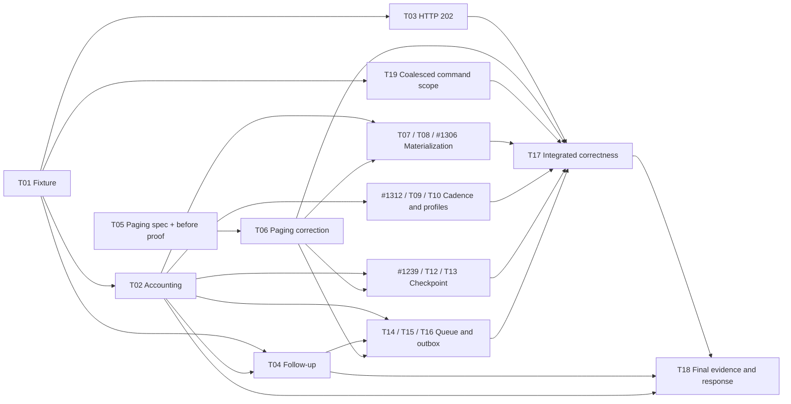

# Runtime database access reduction program

Original planning baseline: 5 October 2026; delivery checkpoint: 8 October 2026. Initial-readiness columns retain the planning baseline; the checkpoint and native Project/issue states carry current delivery status.

Program: [#2382](https://github.com/elsa-workflows/elsa-foundation/issues/2382). Scheduling: [Project 55](https://github.com/orgs/elsa-workflows/projects/55). Goal bucket: [Runtime Database Access](../program-goals/runtime-db-access.md).

## Problem and intended outcome

A supplied four-activity HTTP workflow produced 533 traced EF command events and 24 checkpoint inserts under Immediate, versus 237 events and four inserts under Coalesced. Reported low-logging Coalesced latency reached 71 ms. These are historical observations at `f97d7f614fd57115fd94916f13fa6c3e3ae7ef10`, not current acceptance results. A four-activity authoring graph expands into many runtime transitions and durable coordination operations. Source review additionally identified repeated one-row reads and repeated exhausted-source probes in the coalesced page merger.

The outcome is an explained database-access ledger and fewer avoidable operations on an explicitly Coalesced normal-host workload, while preserving correct responses and durable behavior. Immediate remains the host default and a separately reported control. Thirty milliseconds is an aspiration to reassess from remaining costs, not an adopted budget. Foundation owns runtime/provider changes, fixtures and canonical evidence. Existing Studio and inspection programs retain their own work.

Use [supplied findings](../reports/runtime-db-access/findings.md) and [historical source response](../reports/runtime-db-access/response.md) as evidence, not instructions. Planning base is `bc94b1a3694e02acefcfd4d0229cd5624a8b3a18`. Refresh code and competing claims before each implementation unit.

## Actors and complete journey

| Actor | Required outcome |
|---|---|
| Workflow author | Publish the selected computation, with verified CLR activity profiles, intrinsic classification and cadence settings |
| HTTP caller | Send valid input and receive the expected transformed body/status in the same exchange |
| Operator | Inspect committed state, incidents and effective per-run cadence; distinguish request work from follow-up work |
| Runtime/provider maintainer | Explain each command group and prove a reduction without weakening recovery or ownership |
| Program lead / QA | Review selected designs, coordinate one integration lane and publish exact-candidate evidence |

The normal-host journey is publish → trigger → durable scheduling/activation → transform → response instruction → terminal commit → transport delivery → background work settled → inspect. A unit-only in-memory reproducer cannot prove that journey. A malformed body and unexpected valid-input 202 are separate correctness controls.

## Requirements and boundaries

| ID | Requirement | Proof owner |
|---|---|---|
| R1 | Record representative fixture identity, payload, image/source, provider, host composition and effective pinned settings; historical fixture identity is optional if recoverable | T01/T02 |
| R2 | Distinguish command executions, SQL statements, round trips, transactions, checkpoints and work items; correlate execution identities | T02/T04 |
| R3 | Bound coalesced page reads by fetched pages; retain unconsumed candidates and inner exhaustion; preserve order, replacement/deletion and continuation | T05/T06 |
| R4 | Select repeated-materialization strategy from the new trace; scope any cache to execution ownership, staged changes and flush invalidation | T07/T08/#1306 |
| R5 | Verify authored/host cadence precedence and per-run readback; justify ReplaySafe across scripts, dependencies and observable effects | #1312/T09/T10 |
| R6 | Preserve atomic participant-plus-marker commit, reconciliation, rollback, fencing and partition isolation | #1239/T12/T13 |
| R7 | Preserve durable queue/outbox admission, claiming, consumption, delivery and crash/retry behavior | T14/T15/T16 |
| R8 | Demonstrate correct status/body, terminal state, inspection and changed contracts on a rebuilt normal host; publish bounded before/after evidence | T17/T18 |

Mandatory terminal/bookmark/incident/external-effect boundaries remain. Coalesced replay is bounded and does not promise exactly-once external side effects. Keep committed state and inspection truthful. PostgreSQL hosts the representative workload; any changed shared adapter contract needs the supported-provider correctness checks.

The owner requested this program after reviewing the findings and appointed this control room to deliver it end to end. This authorizes the scoped investigation and delivery units, subject to their evidence and review gates. ADR 0073 D7 still retires broad benchmark infrastructure, global timing budgets and performance CI gates. No historical benchmark suite, retired performance workflow, general telemetry platform or architecture rewrite is reinstated. Deterministic algorithm/store-call regressions belong in affected correctness tests; elapsed time is evidence, not a CI gate.

Out of scope: changing Immediate globally; relaxing durability; removing outbox crash backstops; broad cross-execution caches; index tuning without a demonstrated query-plan problem; analytics removal without causal evidence; Studio redesign; manual package publication, releases or deployment. The owner authorized existing automatic Feedz preview publication from otherwise approved program merges on 7 October 2026.

## Evidence and requirements gate

The goals, actors, first deliverables, preserved guarantees and unchanged defaults are settled. On 5 October 2026 the owner clarified that the transform details are unimportant and any suitable activity is acceptable. Preserve HttpEndpoint trigger startup as the primary scenario and compare it with a bounded REST API start control to distinguish trigger-specific from shared-runtime work. Original workflow/export/transform availability is not a gate. Later cache shapes, provider operations and ReplaySafe candidates remain explicitly unselected until their spikes conclude. Blocked implementation leaves already have outcome boundaries and acceptance criteria, but become Agent Ready only after dependencies and reviewed Speckit artifacts satisfy the gate.

Request-path tracing and low-logging timings are separate runs. Retain a pinned-image historical control if the original artifacts are recoverable, and use current-source before/after comparisons for changes. Record cold/warm identity, machine load, variation, median/p95 and exact settings. Never present a reference workflow as reproduction of the original.

The owner-approved four-activity representative workflow starts through HttpEndpoint and uses a simple deterministic activity with known input/output. Record whether compilation uses a CLR or intrinsic path. Compare bounded REST API startup using the same definition/computation where supported, documenting admission and response-transport differences. Each selected configuration uses the report's 25 warm-ups and 60 timed requests. T01 also selects a single 16-activity straight-line computation fixture and concurrency four, each bounded to 60 timed requests per control. Report sample counts and run variability; a 60-sample p95 is exploratory, not a stable latency objective. Record exact fixtures/payloads; any unavailable control needs an explicit owner and revisit trigger. No parameter sweep or global benchmark service.

The selected fixture is `RuntimeDbPaging2392Reference`: root Sequence / synchronous HttpEndpoint / SetVariable / WriteHttpResponse. POST `/workflows/http/runtime-db-paging-2392/transform` with `{"firstName":"Alice","lastName":"Smith"}`; capture ParsedContent as workflow `content`, compute `referenceText` from the two names, and expect HTTP 200 text `Alice Smith` plus a durable terminal instance. SetVariable compiles to `elsa.intrinsic.set@1`, not the historical CLR transform. These are acceptance expectations; no successful run is claimed until verified.

For that intrinsic, retain the exported `IntrinsicKind=Set` and source classification by `WorkflowIntrinsicFusion.IsFusable(Set)`. Compiler intrinsics have no `ActivityContract`; pinned `ActivityContract.SideEffectProfile` evidence applies to CLR activity nodes. T02/T05 own actual artifact identity and per-run cadence readback before accepting a trace.

The REST-start control must execute the same SetVariable computation to `referenceText = Alice Smith` and durable terminal state. A REST-started HTTP definition waiting at a trigger bookmark is not a valid control. Use a companion definition with documented admission/transport differences if necessary; if no valid control can be constructed, report an explicit deferral with owner/revisit trigger. Compare causal command categories and qualify transport latency; do not subtract unlike response paths as exact equivalents.

Response-path and total settled-instance database work are separate measurements. T02 owns request accounting; T04 reuses its taxonomy/identities for post-response attribution and independent polling. Define and bound the settled condition; report remaining durable work instead of silently ending the observation window.

## Milestones and dependency structure

| Milestone | Exit outcome | Work |
|---|---|---|
| M1: Explain | Identified fixture/settings, current causal ledger, 202 diagnosis and follow-up attribution | E1 |
| M2: Bound reads | Reviewed specification, deterministic before-fix proof, delivered pagination correction and matching normal-host evidence | F3 |
| M3: Apply selected reductions | Materialization strategy and cadence/profile decisions delivered or explicitly declined | F4, E3 |
| M4: Reduce coordination where justified | One selected checkpoint and one queue/outbox candidate delivered, or reviewed no-change dispositions | E4 |
| M5: Prove and respond | Integrated correctness, comparable bounded evidence and responses to every supplied finding | E5 |

Two entry branches are available: T01 → T02 establishes accounting; T05 → T06 establishes and corrects the independent page-merger defect. They converge at T07 → T08 → #1306. Profile/cadence work branches from T02. Checkpoint selection waits for T02 and T06; queue/outbox selection also waits for T04. T17 joins the delivered or explicitly disposed branches, and T18 publishes the response. Native GitHub blocked-by relationships are authoritative; this snapshot explains their purpose.

## Full work breakdown

Each linked issue contains its objective, scope, acceptance criteria, dependencies, validation and canonical context. This inventory contains one program, five epics, eight features and twenty-one planned leaf units. Corrective [#2488](https://github.com/elsa-workflows/elsa-foundation/issues/2488), the separately owned Linux CI prerequisite for #1312, brings the delivery queue to twenty-two leaves without adding a runtime-query workstream. Three leaves adopt existing issues; their original reports remain visible with current-scope addenda. No competing implementation issue is created for them.

### E1: [#2383](https://github.com/elsa-workflows/elsa-foundation/issues/2383) Explain request and follow-up database work

Produce a reproducible, current-source causal accounting of the successful HTTP run and its anomalies.

**F1: [#2384](https://github.com/elsa-workflows/elsa-foundation/issues/2384) Reproducible workload and causal database accounting.** An engineer can repeat the same successful workflow and identify which runtime operation caused each database command.

| Work ID | Type / deliverable | Prerequisites | Initial readiness |
|---|---|---|---|
| T01 | Spike: [#2385](https://github.com/elsa-workflows/elsa-foundation/issues/2385) Establish the HTTP-trigger workload and bounded REST-start control | None | Ready |
| T02 | Task: [#2386](https://github.com/elsa-workflows/elsa-foundation/issues/2386) Attribute current-head database commands to runtime transitions | [#2385](https://github.com/elsa-workflows/elsa-foundation/issues/2385) | Blocked |

**F2: [#2387](https://github.com/elsa-workflows/elsa-foundation/issues/2387) Explain HTTP 202 and asynchronous follow-up work.** A slow run, a faulted run, a missing committed response and unrelated background polling are distinguishable.

| Work ID | Type / deliverable | Prerequisites | Initial readiness |
|---|---|---|---|
| T03 | Spike: [#2388](https://github.com/elsa-workflows/elsa-foundation/issues/2388) Diagnose the unexpected HTTP 202 and define any correction | [#2385](https://github.com/elsa-workflows/elsa-foundation/issues/2385) | Blocked |
| T04 | Spike: [#2389](https://github.com/elsa-workflows/elsa-foundation/issues/2389) Attribute untraced post-response scheduler and outbox work | [#2385](https://github.com/elsa-workflows/elsa-foundation/issues/2385), [#2386](https://github.com/elsa-workflows/elsa-foundation/issues/2386) | Blocked |
| T19 | Bug: [#2450](https://github.com/elsa-workflows/elsa-foundation/issues/2450) Scope the default Coalesced drain factory to command persistence services | [#2385](https://github.com/elsa-workflows/elsa-foundation/issues/2385) | Added 6 October; implementation/verification active |

### E2: [#2390](https://github.com/elsa-workflows/elsa-foundation/issues/2390) Bound coalesced reads and materialization

Make database read cost follow bounded pages and required state rather than repeated overlay candidates and whole-history scans.

**F3: [#2391](https://github.com/elsa-workflows/elsa-foundation/issues/2391) Bounded coalesced runtime-state pagination.** Coalesced durable-value and activity-state pages avoid per-overlay empty probes and repeated persisted candidate fetches.

| Work ID | Type / deliverable | Prerequisites | Initial readiness |
|---|---|---|---|
| T05 | Task: [#2392](https://github.com/elsa-workflows/elsa-foundation/issues/2392) Specify and reproduce bounded coalesced page merging | None | Ready |
| T06 | Task: [#2393](https://github.com/elsa-workflows/elsa-foundation/issues/2393) Implement the reviewed bounded coalesced page merger | [#2392](https://github.com/elsa-workflows/elsa-foundation/issues/2392) | Blocked |

**F4: [#2394](https://github.com/elsa-workflows/elsa-foundation/issues/2394) Reuse or target runtime value materialization safely.** Materialization reads only the necessary runtime baseline while respecting staged changes, flushes and ownership.

| Work ID | Type / deliverable | Prerequisites | Initial readiness |
|---|---|---|---|
| T07 | Spike: [#2395](https://github.com/elsa-workflows/elsa-foundation/issues/2395) Choose a safe strategy for repeated runtime materialization | [#2386](https://github.com/elsa-workflows/elsa-foundation/issues/2386), [#2393](https://github.com/elsa-workflows/elsa-foundation/issues/2393) | Blocked |
| T08 | Task: [#2396](https://github.com/elsa-workflows/elsa-foundation/issues/2396) Specify the selected runtime materialization reduction | [#2395](https://github.com/elsa-workflows/elsa-foundation/issues/2395) | Blocked |
| A1306 | Task: [#1306](https://github.com/elsa-workflows/elsa-foundation/issues/1306) Input snapshot materialization is O(state) per activity (full paged traversals per hop) | [#2396](https://github.com/elsa-workflows/elsa-foundation/issues/2396) | Blocked |

### E3: [#2397](https://github.com/elsa-workflows/elsa-foundation/issues/2397) Apply cadence and replay safety deliberately

Make opt-in coalescing effective for appropriate computations and expose its actual durability/inspection trade.

**F5: [#2398](https://github.com/elsa-workflows/elsa-foundation/issues/2398) Verified cadence and replay-safe activity contracts.** Authors and operators can choose a documented per-workflow cadence and safely publish replayable computation contracts.

| Work ID | Type / deliverable | Prerequisites | Initial readiness |
|---|---|---|---|
| A1312 | Spike: [#1312](https://github.com/elsa-workflows/elsa-foundation/issues/1312) Fusion fast path applies to almost nothing: no ReplaySafe CLR leaves, coalescing off by default | [#2386](https://github.com/elsa-workflows/elsa-foundation/issues/2386) | Blocked |
| T09 | Task: [#2399](https://github.com/elsa-workflows/elsa-foundation/issues/2399) Verify and document effective per-workflow checkpoint cadence | [#2386](https://github.com/elsa-workflows/elsa-foundation/issues/2386) | Blocked |
| T10 | Task: [#2400](https://github.com/elsa-workflows/elsa-foundation/issues/2400) Implement approved ReplaySafe activity classifications | [#1312](https://github.com/elsa-workflows/elsa-foundation/issues/1312), [#2399](https://github.com/elsa-workflows/elsa-foundation/issues/2399) | Blocked |

### E4: [#2401](https://github.com/elsa-workflows/elsa-foundation/issues/2401) Reduce durable coordination access with equivalent guarantees

Remove proven redundant checkpoint/queue/outbox access through reviewed designs while preserving atomicity, fencing and replay.

**F6: [#2402](https://github.com/elsa-workflows/elsa-foundation/issues/2402) Efficient atomic checkpoint persistence.** Checkpoint participants and immutable commit proof persist with less avoidable access and unchanged recovery guarantees.

| Work ID | Type / deliverable | Prerequisites | Initial readiness |
|---|---|---|---|
| A1239 | Spike: [#1239](https://github.com/elsa-workflows/elsa-foundation/issues/1239) P3 (investigation): count the serialized store round-trips per run | [#2386](https://github.com/elsa-workflows/elsa-foundation/issues/2386), [#2393](https://github.com/elsa-workflows/elsa-foundation/issues/2393) | Blocked |
| T12 | Task: [#2404](https://github.com/elsa-workflows/elsa-foundation/issues/2404) Specify the selected checkpoint access reduction | [#1239](https://github.com/elsa-workflows/elsa-foundation/issues/1239) | Blocked |
| T13 | Task: [#2405](https://github.com/elsa-workflows/elsa-foundation/issues/2405) Implement the reviewed checkpoint access reduction | [#2404](https://github.com/elsa-workflows/elsa-foundation/issues/2404) | Blocked |

**F7: [#2406](https://github.com/elsa-workflows/elsa-foundation/issues/2406) Efficient durable scheduler and outbox progression.** Queue and outbox work progresses with reduced redundant queries while retaining durable crash backstops and delivery ownership.

| Work ID | Type / deliverable | Prerequisites | Initial readiness |
|---|---|---|---|
| T14 | Spike: [#2407](https://github.com/elsa-workflows/elsa-foundation/issues/2407) Choose a bounded scheduler and outbox access reduction | [#2386](https://github.com/elsa-workflows/elsa-foundation/issues/2386), [#2389](https://github.com/elsa-workflows/elsa-foundation/issues/2389), [#2393](https://github.com/elsa-workflows/elsa-foundation/issues/2393) | Blocked |
| T15 | Task: [#2408](https://github.com/elsa-workflows/elsa-foundation/issues/2408) Specify the selected scheduler or outbox reduction | [#2407](https://github.com/elsa-workflows/elsa-foundation/issues/2407) | Blocked |
| T16 | Task: [#2409](https://github.com/elsa-workflows/elsa-foundation/issues/2409) Implement the reviewed scheduler or outbox access reduction | [#2408](https://github.com/elsa-workflows/elsa-foundation/issues/2408) | Blocked |

### E5: [#2410](https://github.com/elsa-workflows/elsa-foundation/issues/2410) Prove the integrated result and publish the grounded response

Demonstrate normal-host correctness and reduced database access on the delivered candidate, then answer every finding with evidence.

**F8: [#2411](https://github.com/elsa-workflows/elsa-foundation/issues/2411) Integrated workload proof and final findings response.** The owner receives an executable proof packet and a source-grounded response covering all findings.

| Work ID | Type / deliverable | Prerequisites | Initial readiness |
|---|---|---|---|
| T17 | Task: [#2412](https://github.com/elsa-workflows/elsa-foundation/issues/2412) Verify integrated runtime correctness on the delivery candidate | [#2388](https://github.com/elsa-workflows/elsa-foundation/issues/2388), [#2393](https://github.com/elsa-workflows/elsa-foundation/issues/2393), [#1306](https://github.com/elsa-workflows/elsa-foundation/issues/1306), [#2400](https://github.com/elsa-workflows/elsa-foundation/issues/2400), [#2405](https://github.com/elsa-workflows/elsa-foundation/issues/2405), [#2409](https://github.com/elsa-workflows/elsa-foundation/issues/2409), [#2450](https://github.com/elsa-workflows/elsa-foundation/issues/2450) | Blocked |
| T18 | Task: [#2413](https://github.com/elsa-workflows/elsa-foundation/issues/2413) Publish before-after database accounting and final response | [#2412](https://github.com/elsa-workflows/elsa-foundation/issues/2412), [#2389](https://github.com/elsa-workflows/elsa-foundation/issues/2389), [#2386](https://github.com/elsa-workflows/elsa-foundation/issues/2386) | Blocked |

## Decisions, ambiguities and ownership

| Topic | Current disposition | Owner / revisit trigger |
|---|---|---|
| Workload and entry-path identity | Owner accepts any suitable deterministic activity; HttpEndpoint is primary and REST API startup is a bounded control. Original export/transform is not a gate; historical exact counts remain unproven | T01 records the chosen activity, CLR/intrinsic path and comparison limits; T02/T18 use that reviewed representative fixture |
| Historical 533/237 and 81 reads | Supplied measurements plus source-supported mechanisms; exact current caller contribution unproven | T02/T05/T06 trace before making attribution claims |
| Unexpected valid-body 202 | Separate diagnosis; do not count as a successful transform run | T03 owns capture/reproduction and any specified correction |
| Missing request trace after response | Trace absence does not establish causality | T04 correlates instance/work/checkpoint/outbox identities |
| Cache versus targeted materialization | T07 selected bounded raw durable-value page reuse; #1306 delivered it in PR #2492, with SQLite fixture savings but final primary HTTP/REST savings still owned by T18 | T08 reviewed spec → #1306 actual-EF reduction and correctness → T18 primary measurement |
| ReplaySafe candidates | [A1312 audit](../reports/runtime-db-access/replay-safety-audit.md) confirms selected Set is fusable as-is and the retained response artifact has inline/pure bindings; WriteHttpResponse is a conditional candidate, without blanket class-level approval | #1312 review → T10 full-contract and crash/replay proof, selected annotation and republishing only if justified |
| Global cadence default | Retain Immediate within this program; future change requires a separately approved work unit | #1312 records scoped disposition without claiming changed default |
| Atomic checkpoint and queue changes | Select only one bounded candidate per delivery unit; no-change is a valid reviewed decision | #1239 and T14; T12/T15 specs gate T13/T16 |
| Thirty milliseconds | Aspiration, not acceptance or an engine guarantee | T18 recommends from measured remaining cost; owner explicitly adopts any later budget |
| First request at 1–1.2 seconds | Separate cold-start identity/control; no revival of the retired cold-start measurement program | T01/T02/T18 qualify, isolate startup and transform costs |

A contingent implementation leaf may close as not planned only after the lead accepts the linked no-change rationale. Reconcile its native blockers and parent roll-up at that transition. Verification records a reviewed disposition rather than pretending code or a measured gain exists. T17 accepts delivered proof or that explicit disposition for each contingent chain. An unreproduced historical anomaly can retain capture/follow-up ownership; a reproduced unresolved valid-input correctness defect blocks integrated acceptance. T03 is diagnosis/specification only. Any discovered defect needs a reviewed specification and separately claimed correction unit before implementation; add that correction as a native blocker of T17 before completing the diagnosis.

## Coverage of the supplied findings

| Finding | Lead response / proof |
|---|---|
| Q1: 533 accesses / 24 checkpoints; W9 comparability | T02 reconciles transitions, command versus statement counts and checkpoint/work-item distinctions; T18 explains the different W9 fixture |
| Q2: 81 Coalesced durable-value reads | T05/T06 prove merger amplification; T02 attributes actual caller mix; T07/#1306 address remaining full-set materialization |
| Q3: 85 scheduler reads for 23 items | T02/T14 separate enqueue identity, FIFO claim, fenced consumption, probes and retries |
| Q4: Inspection costs / authored cadence | T09 demonstrates precedence, stamped readback and inspection granularity; #1237 retains separately owned inspection decoupling |
| Q5: ReplaySafe transform | #1312 audits whole activity/script/dependencies; T10 republishing and crash/replay evidence |
| Q6: 30 ms realism | T18 reports bounded before/after and residual costs; no retrospective budget adoption |
| Q7: Untraced after-response commands | T04 causal identity correlation and bounded settled condition |
| Valid-body 202 | T03 diagnosis; T17 normal-host response correctness |
| Faulting body | T01/T02 separate fixture and path; T17 fault control |
| SQL logging, fsync and analytics experiments | T02 separates logging overhead/trace runs and preserves environmental controls; no causal conclusion from aggregate ratios alone |
| No concurrency / larger workflow; transform cost unprofiled | T01 selects bounded controls; T02/T18 qualify workload and residual transform/serialization cost |
| First request | T02 reports cold/warm identity separately; T18 scopes the final claim |

## Scheduling, handoffs and proof

**Current delivery checkpoint, 8 October:** T02/#2386 and T04/#2389 are delivered through PR #2447 at `a6684744` after resulting-main CI/Maps/CodeQL passed. Root accepts the [finite joined handoff](../reports/runtime-db-access/joined-request-settlement-accounting.md) with 931 exact method joins and 716 owned residuals among 1,647 commands. Missing method outcomes, all row/caller attribution and the same-run response boundary remain unproven. The [qualified acceptance](https://github.com/elsa-workflows/elsa-foundation/issues/2386#issuecomment-6037855554) leaves literal gaps unchecked and owned through final T17/T18.

T07/#2395 is delivered through PR #2480 at `7bb1aaecb` after resulting-main [CI](https://github.com/elsa-workflows/elsa-foundation/actions/runs/37620919147), [Maps](https://github.com/elsa-workflows/elsa-foundation/actions/runs/37620918826) and CodeQL passed. The [accepted spike](../reports/runtime-db-access/materialization-reuse-spike.md) selects bounded raw provider-page reuse for design; its empty-state CLR repeat-read signal is not primary HTTP/REST query savings. T08/#2396 is delivered through PR #2485 at `c2dc3ac28` after resulting-main CI37631104919, Maps37631104339 and CodeQL37631103963 passed. [Spec197](../../specs/197-bounded-durable-value-page-reuse/spec.md)'s 17 tasks now have source and bounded correctness evidence in [PR #2492](https://github.com/elsa-workflows/elsa-foundation/pull/2492), which merged at `9a472affde60978cb15743fbc0e5ce22ee0581a9` after its final-head gates passed. Root passed 2,125 Runtime, 904 EF and 635 architecture tests, including 64 eligibility cases and 100% registration-class branch coverage. Actual SQLite EF page reads decrease from six to two with equivalent results. [Final live qualification](../../specs/197-bounded-durable-value-page-reuse/evidence/final-live-verification.md) records primary HTTP, valid REST, 60 exact concurrent response/settlement joins and one bookmark restart at clean candidate `9d6fd212d`. Native-required provider tests passed all 185 cases on final PR head `a66d9c5b2`, with zero skips. The separate persisted interruption-snapshot recovery test proves fresh provider reads and active stale-fence rejection. Final-head CI/Maps/filters/CodeQL and CodeRabbit review passed; resulting-main CI37690630368, Maps37690629819, Code Quality37690628584 and filters all passed. #1306 and its coordinating parents #2394/#2390 are closed for the selected read-reduction scope. Copilot provided no actual review. No primary HTTP/REST query saving, latency gain or historical #2388 causal repair is claimed.

T09/#2399 is delivered through [PR #2486](https://github.com/elsa-workflows/elsa-foundation/pull/2486) at `47615d7b5` after resulting-main CI37644389777, Maps37644389083, filters and CodeQL passed. Its accepted [normal-host cadence verification](../reports/runtime-db-access/cadence-verification.md) comprises six exact successful HTTP responses, seven preserved original-run stamps across two host reconfigurations, and persisted bookmark/incident boundaries with a saved-value resume. This verifies existing policy and operator guidance; it changes no default and claims no SQL saving.

A1312/#1312 is delivered through [PR #2487](https://github.com/elsa-workflows/elsa-foundation/pull/2487), merged at `a1e837de0`, after resulting-main CI37664693677, Maps37664693142, filters and CodeQL passed. The [ReplaySafe audit](../reports/runtime-db-access/replay-safety-audit.md) keeps Immediate and External for unproven contracts. Its conditional `WriteHttpResponse` candidate is now the active #2400 proof work, with reviewed [spec198](../../specs/198-response-replay-safety/spec.md) and [plan](../../specs/198-response-replay-safety/plan.md). No annotation safety or runtime proof is accepted before execution.

Corrective #2488 is delivered through [PR #2491](https://github.com/elsa-workflows/elsa-foundation/pull/2491) at `235c0f32a`. Its narrow Linux repair has causal regression and native proof. Resulting-main CI37659496401 attempt1 had a separate SQL locking timeout; a diagnostic and one bounded failed-job retry passed without explaining that timeout. Attempt1 remains failed evidence and #2293 stays open. The audit's earlier provider-error and Linux-failure attempts are also retained; no retry is described as a causal repair.

#1239's [bounded checkpoint no-change disposition](../reports/runtime-db-access/checkpoint-access-spike.md) merged through [PR #2493](https://github.com/elsa-workflows/elsa-foundation/pull/2493) at `cd6e2a2a7edaf3ec774c5688e9adddeee6a09d2c` after all final-head checks and root/independent/CodeRabbit review passed. The single-save trial preserved the small SQLite probe's six commands but failed two unchanged marker-order guards; baseline 45/45 and restored 2/2 checks pass. No PostgreSQL/round-trip/latency gain is claimed. Resulting-main CI37693798601, Maps37693798182, Code Quality37693797053 and filters passed. #1239/#2402 are closed; #2404/#2405 are retired as not planned.

T14/#2407 has a reviewed [scheduler/outbox no-change disposition](../reports/runtime-db-access/scheduler-outbox-access-spike.md). The source account separates admission, claims, consumption, recovery polls, retries and completion. A disposable SQLite insert-first trial reduced new-item attempts from two to one but increased duplicate attempts from one to two, including the failed INSERT. Baseline/restored each pass 13/13; the candidate passes 12/13 and fails the added duplicate-save guard. The interceptor throws before SQL and later sibling assertions do not execute, so no sibling write or data loss is demonstrated. Production and permanent tests are restored. Root and independent QA reject this candidate; a pending-change fallback remains untested, and no current post-M2 queue/outbox gain is established. The disposition is delivered through [PR #2494](https://github.com/elsa-workflows/elsa-foundation/pull/2494) at `8a2a97d4e31857779da547797eed10f478dd8874`, after resulting-main [CI](https://github.com/elsa-workflows/elsa-foundation/actions/runs/37697680372), [Maps](https://github.com/elsa-workflows/elsa-foundation/actions/runs/37697679856), Code Quality and filters passed. #2407 is closed, #2408/#2409 are retired as not planned, and #2406/#2401 are closed with M4 accepted as a reviewed no-change outcome. This does not replace final T17/T18 evidence.

T03/#2388 and F2/#2387 are accepted as a bounded diagnosis with explicit historical uncertainty, not as a repaired bug. The [current qualification](../../specs/197-bounded-durable-value-page-reuse/evidence/final-live-verification.md) includes 60/60 correct HTTP200 responses and distinct Completed/zero-incident executions; it does not explain the old failed Coalesced C4 capture or isolated valid-input 202. T18 and the control room retain the failed packet and missing decision-time joins. A current valid-input 202/500, missing execution or incident-bearing result reopens the investigation and blocks T17 on any required separately specified correction. The [accepted disposition](https://github.com/elsa-workflows/elsa-foundation/issues/2388#issuecomment-6047756284) records the precise capture and ownership boundary.

#2400 is the sole active engineering objective. Its complete-contract source preflight, specification and implementation plan passed root and independent review; the 18-task execution breakdown is reviewed and the baseline-publication/test-host slice is next. The plan requires immutable normal-publisher closure provenance, hard termination after buffered response completion, persisted-input recovery, and matched HttpEndpoint counts with exactly the intended artifact active and its pin verified. No production annotation, crash-replay pass or query reduction is accepted yet. No product-owner decision or input is outstanding. Nineteen of the 22 delivery leaves are Done, one In Progress and two dependency-blocked: #2412 waits only on open dependency #2400, and #2413 follows #2412. M1/M3/M5 and final T17/T18 remain open; M4 is accepted with the no-change outcomes above. Keep one implementation objective and one integration lane, with bounded independent work while review/CI runs. Approved program merges may trigger existing automatic Feedz preview publication; manual publication/releases and deployment remain excluded.

### Retained evidence checkpoints

The following chronology preserves exact-revision evidence and failed attempts. Historical scheduling statements below are superseded by the checkpoint above.

T01 (#2385), T05 (#2392) and T06 (#2393) are delivered through PRs #2414, #2436 and #2442. T06's exact PR gates passed; the original main932 CI failed in Persistence EF and remains retained with unresolved cause. The subsequent README-only main `1e94f719f6cb75284f6f58ca64e3b7f166d97df1` passed ordinary CI and Maps; [the current verification record](https://github.com/elsa-workflows/elsa-foundation/issues/2393#issuecomment-6013807694) moves T06 Project Verification to Passed for this revision. This is integration health for that revision, not a causal repair or retrospective pass of main932. A different program has since integrated PR #2446 at `592d6c0eb2a1ae45563ce5b234fb4e97af2867ed`; [ordinary main CI](https://github.com/elsa-workflows/elsa-foundation/actions/runs/37446506045), [Maps](https://github.com/elsa-workflows/elsa-foundation/actions/runs/37446505497), and [Windows/Linux backend-source gates](https://github.com/elsa-workflows/elsa-foundation/actions/runs/37446555911) passed for that exact revision. These results establish integration health for that exact revision and preserve the unresolved cause of the earlier failures. T03 (#2388) remains in review. Keep exactly one lead objective, isolated writer scopes and root-owned integration/QA.

T19 (#2450), the default Coalesced command-scope correction, merged in [PR #2451](https://github.com/elsa-workflows/elsa-foundation/pull/2451) at `82e10a82729a8fa94a1ca7ecb3d6e446e8e64e6f`. [Spec 196](../../specs/196-coalesced-command-scope/spec.md) is Implemented. Root and independent review accepted the default scoped registration, custom-lifetime compatibility, before/fixed/mutation/restored real-EF lifetime proof and retained 2,013 runtime / 635 architecture tests. The rebuilt sequential HTTP/REST controls remain [bounded correctness evidence](../../specs/196-coalesced-command-scope/evidence/integrated-correctness.md), not final concurrency or interruption proof. Final candidate `1daca4aee2e1b0182bb84a65509b8f97989bb150` passed [CI](https://github.com/elsa-workflows/elsa-foundation/actions/runs/37592351961), Maps, filters, CodeQL and CodeRabbit review; the lifecycle finding was directly answered and resolved. CI tested synthetic merge `64a8cbbde8a4951a07207be16ee7e3d52d992790` with parent main `ab1898ff04027599632f5e4ccde9230a017df26e`. Copilot remained unavailable after its bounded request window; no approval is claimed. Resulting-main [Maps](https://github.com/elsa-workflows/elsa-foundation/actions/runs/37597278798), filters and [CI](https://github.com/elsa-workflows/elsa-foundation/actions/runs/37597279304) passed, including Build & test, Core-only, Architecture and the selected EF suites. T19 delivery is accepted as Done / Complete / Passed. The separate failed parent-main CI and #2185/#2293 retain unresolved cause and independent diagnostic ownership; this merge is not their causal repair.

The accounting lane now includes [seven bounded before timing cases](../reports/runtime-db-access/before-timing.md): six qualified successful controls and the retained failed Coalesced C4 window, with every measured attempt preserved. The corrected private EF observer passed a fixed 58-case synthetic gate, followed by two separately owned accepted diagnostic captures on the preserved source from before the change. [Identity accounting](../reports/runtime-db-access/ef-identity-accounting.md) distinguishes runtime PostgreSQL, diagnostics/placement/IAM SQLite, EF commands, SaveChanges callbacks and exact provider-reference/lifecycle tuples. Exact repository caller, participant and settled-work associations remain explicit gaps. The first failed observer capture remains rejected. No timing or command-count gain is claimed for T19. Accounting head `90edb12dad963bccf3728508a4b4a92701bf7e95` failed its ordinary CI in another Persistence EF test with the disposed-native-handle symptom; the separate Architecture-guard and Core-only jobs were skipped; the embedded 635-test Architecture suite passed within the failed Build & test job. [That exact-head failure](https://github.com/elsa-workflows/elsa-foundation/pull/2447#issuecomment-6013594199) remains held with unresolved shared attribution, and the earlier `e790` pass does not pass `90ed`. The owner authorized automatic Feedz preview publication from approved program merges on 7 October; the publication-boundary hold is removed. Manual publication, releases and deployment remain excluded. Other selected implementation chains remain blocked behind accepted accounting and reviewed specifications. Up to two or three bounded sessions may help; root keeps local builds/hosts serial and preserves unrelated work and existing databases.

The preceding verified accounting checkpoint is draft PR #2447 at `3616df777bc1573912c0d9a3439177645711be24`: [CI including Architecture/Core and EF suites](https://github.com/elsa-workflows/elsa-foundation/actions/runs/37582175487), [Maps](https://github.com/elsa-workflows/elsa-foundation/actions/runs/37582175099), filters and CodeQL passed. It contains 92 exact durable-value method joins among 1,663 commands across two captures. The extended Coalesced checkpoint at `ba56c8e5d66b02eb133d4fd3d7d45b0f6cc3d8c5` subsequently passed [CI including Architecture/Core and EF suites](https://github.com/elsa-workflows/elsa-foundation/actions/runs/37600556631), [Maps](https://github.com/elsa-workflows/elsa-foundation/actions/runs/37600555850), filters and CodeQL. The Immediate projection added after that checkpoint requires fresh gates. Retained `90ed`, main932 and `d652f734` failures keep their unresolved attribution; skipped jobs remain skipped.

[Reviewed startup/background classification](../reports/runtime-db-access/startup-background-classification.md) reconciles all seven retained windows: 49 pre-measurement warning/error records, with two unsupported-pruning warnings, one migration warning and four migration-history read errors per window. Effective vendor provider selection and the four command-error causes remain unresolved. The measured C4-Coalesced window's 23 query errors stay separate. No timing sample or statistics changed.

The accepted finite Azure Coalesced and Immediate captures are recorded in [bounded settlement accounting](../reports/runtime-db-access/azure-settled-accounting.md). Each mode has one successful HttpEndpoint request and one valid REST companion, with expected output, Completed state, zero incidents and the authored cadence/inspection settings. The Coalesced primary snapshot has no queued or outbox items; Immediate has no queued items and 15 unique Delivered outbox rows, with all non-Delivered statuses zero. Each capture has six completed natural resumption sweeps after settlement. Root and independent review reconciled Coalesced HTTP/REST command totals of 277/101 and Immediate totals of 635/556, plus 42 commands across seven sweeps per packet. Binary/source pins and owned cleanup passed. All twelve earlier Coalesced captures remain failed/excluded. These packets establish bounded accounting, not exclusive execution ownership or exact repository/participant attribution.

[Azure M2 timing observations](../reports/runtime-db-access/azure-m2-timing.md) retain both pairs. The final canonical after-then-before pair has identical configuration bytes and 60 successful measured requests per side, with median before/after 221.72305/157.74575 ms and p95 458.2877/396.1703 ms. The earlier opposite-order pair showed the opposite direction and remains excluded by its wrapper/configuration gates. Configured Warning thresholds and retained logging observations are distinct from unavailable runtime-filter introspection. No repeatable general speedup or final integrated acceptance is claimed. All raw evidence was exported before owned Azure resource-group teardown, confirmed absent on 7 October at 00:06:28 UTC. Exact caller/participant/work-item joins, final candidate accounting and T17/T18 integrated correctness/measurements remain open. T02 is the sole active lead, Verification Running; T04 remains Blocked/Pending. Native dependencies and acceptance criteria are unchanged.

The [offline command-to-phase crosswalk](../reports/runtime-db-access/ef-identity-accounting.md#command-ancestry-by-phase-and-dispatch) reconstructs all 1,569 command pairs from the published preserved-source ledger without another capture. Root and independent review agree on the exact engine-parent chains and 44 marker tuple joins. Exported dispatch ancestry supplies handler/work-item context for 809 pairs; 760 have no dispatch ancestor. The normalized terminal-reference default is explicit. This narrows observed attribution but does not identify repository methods, checkpoint participants, queue/outbox row histories or post-M2 residual commands. T02 remains active with those specific gaps.

The 7 October [method-accounting packet](../reports/runtime-db-access/method-accounting.md) adds two reviewed captures on the preserved source from before the change, using a fresh owner-approved Azure runner. Exact durable-value page-method joins account for 65/15 Coalesced HTTP/REST commands and 7/5 Immediate commands; other callers remain unresolved. Total commands are 420 Coalesced and 1,243 Immediate, including 42 and 49 source-bound sweep commands respectively. Both successful controls, primary settlement, lifecycle conservation, immutable pins and owned process/container cleanup passed. The first T02 live attempt stays failed/excluded. This is partial attribution, not a new query reduction, timing comparison or final program acceptance. T02 remains the sole active lead / Verification Running; checkpoint participant and scheduler/outbox attribution is next. That capture reserved a new Azure VM for finite follow-up work; later extended-capture and teardown status is recorded below. The earlier runner's teardown record above is unchanged.

The [extended checkpoint/queue accounting packet](../reports/runtime-db-access/checkpoint-queue-accounting.md) adds a separately accepted Coalesced capture with the same 420 command pairs: HTTP 277, REST 101 and sweeps 42. It has 182 exact method joins across 146 operation pairs; 66 checkpoint, 25 queue and 11 outbox commands now have method attribution alongside the 80 durable-page joins. These are another capture's counts, not additional commands to add to the earlier ledger or a new query reduction. Full participant-input vectors, marker lookups and combined flush boundaries are observed, with method outcomes, affected rows and unowned poll/callback attribution explicitly limited. Both HTTP/REST controls passed; the final snapshot directly settles only the HTTP target. The first five-pin guard launch failed before host/database startup; the corrected eight-pin guard passed its controls before the accepted run. The separately accepted extended Immediate capture has 1,227 command pairs (HTTP 635 / REST 556 / six sweeps 36), 749 exact method joins, 551 operation pairs and 539 valid metadata records. Both controls passed; its HTTP snapshot has zero queued work, 15 Delivered outbox entries and zero unfinished outbox entries. Its 16 MiB collector/reader capacity was reviewed prospectively and passed the existing 42 controls; the actual 8,963,801-byte artifact passed complete pin/tail/lifecycle checks. The earlier Immediate 1,243-command packet retains its different REST/background totals without causal attribution. All method outcomes remain unobserved. Root is using these bounded captures to assess the existing #1306/#2395/#2396 materialization candidate, with conservative ownership/freshness proof; no new generic instrumentation expansion or implementation strategy is selected. All raw captures, 520 compiled host files and 958 diagnostic-tool files have been exported and hash-verified locally. The temporary Azure resource group was deleted and confirmed absent on 7 October after artifact preservation. T02 remains active and final T17/T18 gates remain open.

The [finite residual account](../reports/runtime-db-access/residual-accounting.md) reconciles every remaining command in those two extended captures: 238 Coalesced and 478 Immediate across 45 disjoint groups and 13 source-supported families. Root and independent review reproduced the raw counts and source pins. Root adopts explicit ownership under the program's existing residual-uncertainty rule: T04 owns background/settlement joins; T07 owns the relevant materialization/freshness question using the post-M2 evidence; the program lead through T18 retains other measured families and must resolve any caller boundary on which a selected change or claimed saving depends. Unknown method/row attribution remains unknown. No new generic instrumentation expansion is selected. The source-reference caller was corrected to the start dispatcher; the extended residual subset contains no hierarchy group. The joined handoff and scheduling decision above supersede the earlier pending-import checkpoint. The historical 25–695 range remains owned uncertainty, not explained polling. T18 must capture its own response boundary for any final same-run post-response claim.

The Project separates Status, Work Type, Phase, Area, Priority, Agent State and Verification. Coordination parents never enter Agent Queue. Ready means the stated discovery/specification outcome has enough context, not permission to bypass design gates for adjacent runtime work. Every unexecuted leaf starts with Verification Pending. Review/merge/deploy states and exact-head evidence are recorded on issues as well as the Project.

Worker handoff: issue and parent links → latest program decisions → refreshed graph/source evidence → competing claims → reviewed Speckit artifacts → exact permitted scope → expected evidence and escalation conditions. Context flows program requirements → bounded spike → reviewed spec → implementation → root review/QA → normal-host acceptance. Do not ask an implementation worker to decide an unresolved architecture question silently.

Runtime implementations run only the affected projects/suites, relevant REST e2e on a rebuilt server/fresh DB, architecture guard, generated-maps check and diff review as applicable. Meaningful changed behavior needs before-fix or mutation bite-proof. Reuse shared fixtures and idiomatic cleanup. Supported-provider checks follow changed adapter contracts. Existing #2293 CI and #2185 SQLite signals need reconciliation before attributing a failure; no planning-session build/test pass is claimed.

## Related ownership and integration risks

- #1237 already has a human-selected inspection-outbox direction; do not reopen its old alternatives here. #1242 owns the Studio cadence badge investigation.
- #1305 and #1308 contain historical Groundwork proposals. Removed-provider mechanisms are context to revalidate, not current instructions. #1239 is explicitly re-aimed at current EF adapters.
- #2286 owns the checkpoint root-write-lease identity defect. Any selected lease-seam change waits for its correction or an explicitly coordinated claim; no duplicated fix or unreviewed hoisting.
- Do not reintroduce retired benchmark/timing gates through instrumentation, generic helpers, pipeline checks or global budgets. Any reusable observability expansion belongs to its existing program.
- The primary checkout's pre-existing lockfile changes remain untouched. The original planning unit used the isolated `claude/runtime-db-access-program` branch; subsequent bounded units use their claimed isolated branches/worktrees.

## Completion and present validation

Complete the program when every finding has evidence or an explicitly owned residual prerequisite, the paging correction demonstrates bounded access and preserved results, selected Coalesced reductions are proven on the normal host, contingent candidates are honestly disposed, and the final response states remaining cost and release availability. Do not infer completion from child closure counts or expect an Immediate speedup as a required result.

Planning verification covered the issue hierarchy, dependency DAG, fields, queue and documentation consistency. The active control room now owns delivery, with bounded investigations running. T06 paging implementation and T19 local scope/sequential correctness proof are recorded above. Remaining selected implementations, comparable final before/after evidence, concurrent T17/T18 correctness and final delivery acceptance remain future work owned by the linked leaves; optional original/pinned recovery is not a gate. Scoped green-gate merges are authorized by the owner, including their existing automatic Feedz preview publication under the 7 October decision. Manual publication, releases and deployment remain excluded.
