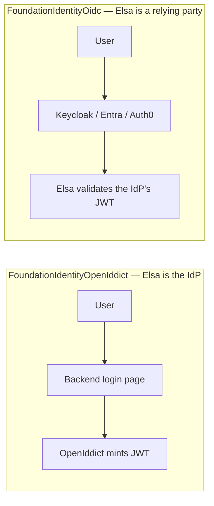
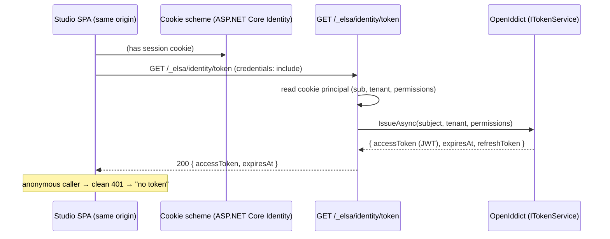
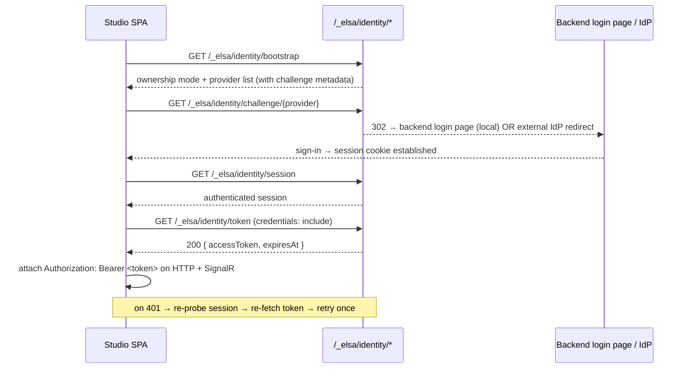

# Authentication architecture (integrator guide)

> **Audience:** developers embedding or hosting Elsa Foundation ("Elsa integrators") who need to
> decide how to compose authentication for their deployment.
> **Purpose:** explain *how auth works* and *which modules you enable* for each scenario — the
> canonical composition guide.
> **Knowledge role:** worked reference. For the operator-facing settings, keys, and go-live
> checklist see [`identity-configuration.md`](identity-configuration.md); this guide complements it
> and does not repeat it. Canonical short definitions live in [`../glossary/elsa.md`](../glossary/elsa.md).

Elsa Foundation ships a complete first-party identity stack out of the box: enable the default
shell and you get local users, roles, a login page, a seeded dev admin, and real bearer-token
issuance for the Studio SPA — no external identity provider required. This guide explains the
architecture behind that, and how to re-compose it when your deployment is different (an enterprise
IdP, a custom token issuer, or a mix).

---

## 1. Two planes: IAM domain vs auth protocol

Authentication in Elsa Foundation is split into two planes that deliberately never bleed into each
other. Keeping them separate is what lets you swap one without disturbing the other.

**The IAM domain plane — *who users are*.** Users, roles, permissions, tenant memberships, external
identity links, and the projection of all of that into a normalized `ClaimsPrincipal`. This plane
owns identity *state* and the permission model. It does not know or care how a principal proved who
they are.

**The auth protocol plane — *how principals authenticate and tokens flow*.** Cookie sign-in, OIDC
redirects, JWT minting, bearer validation, scheme selection. This plane turns a login into a
session and a session into a validated request. It does not own users or permission semantics — it
consumes and produces claims.

The seam between them lives in **`Identity/Abstractions`** (the always-on `FoundationIdentityAbstractions`
feature), which defines the contracts both planes speak:

| Contract | Plane | Role |
|---|---|---|
| `ITokenService` | protocol | Issue / refresh / validate / revoke access tokens. The seam behind which "how tokens are minted" is swappable. |
| `IAuthSessionService` | protocol | Project the current `ClaimsPrincipal` into an `AuthSession` (status, subject, roles, permissions, freshness). |
| `IAuthenticationProviderModule` / `IAuthenticationProviderResolver` | protocol | Each auth provider (local, OIDC, …) describes itself (id, kind, challenge metadata) so the API can enumerate providers. |
| `IPrincipalFactory` | seam | Turn an external principal into a provisioned, normalized Elsa principal. |
| `IClaimsNormalizer` / `IClaimMappingRule` | IAM | Map raw provider claims (roles, group memberships) into Elsa `elsa.identity.role` / `elsa.identity.permission` claims. |
| `IPermissionCatalog` / `IPermissionEvaluator` / `IPermissionAuthorizationService` | IAM | The permission model: catalog, implication expansion, and canonical policy or request-internal evaluation. |
| `IUserStore` / `IRoleStore` / `IExternalIdentityStore` / `ITenantMembershipStore` | IAM | User/role/link/tenant persistence. |
| `ISecurityDefaultGuard` | cross-cutting | Refuse weak/missing keys and non-HTTPS metadata outside development. |

Because these contracts are provider-agnostic, Minimal APIs use `RequirePermission(...)`,
`RequireAnyPermission(...)`, or `RequireAllPermissions(...)`; transitional FastEndpoints bases
translate their existing `ConfigurePermissions(...)` calls into the same ASP.NET Core policies.
Both paths reach one Foundation Identity evaluator and resource-handler pipeline.

The provider plane must put a *trusted normalized principal* onto the request. Normalization strips
incoming Elsa-internal claims, applies only mapping rules for the current tenant/provider, and then
emits exactly one `elsa.identity.normalized = v1` marker. A marker alone is insufficient: its
identity's exact runtime `AuthenticationType` must also be registered in
`FoundationIdentityOptions.NormalizedAuthenticationTypes` (ordinal comparison). Permission
authorization selects exactly one matching identity and passes only that identity to grant sources;
zero or multiple matches are challenged so tenants/providers cannot be unioned accidentally.

The built-in trusted runtime types are `Elsa.Foundation.Identity` for the normalized external
principal factory, the ASP.NET Core Identity cookie scheme for reconstructed cookie requests, and
the OpenIddict validation scheme for validated bearer requests. OpenIddict's token-construction
identity type (`openiddict`) is deliberately not trusted as an endpoint identity. Custom adapters
call `AddNormalizedAuthenticationType(...)` only after implementing the same strip-map-mark rule.

Permission keys are compared as Unicode NFC plus invariant uppercase using ordinal equality.
Implications expand from grants toward requests and terminate safely on cycles. An explicit `*`
grant satisfies an ordinary request, while requesting `*` itself requires that explicit grant.
For a member, resource denial vetoes resource grant and the general evaluator; the evaluator runs
only after every resource source abstains. Exceptions, timeouts, and HTTP request cancellation
propagate as operational failures rather than becoming `403`.

---

## 2. Module taxonomy

The stack is a set of composable CShells features. You enable them per shell in `shells.json`.

| Feature (shells.json key) | Assembly | What it is | Plane |
|---|---|---|---|
| `FoundationIdentityAbstractions` | `…Identity.Abstractions` | Contracts + default implementations: permission catalog, claims normalizer, provider resolver, security guards. **Always on** (every other identity feature registers it). | seam |
| `FoundationIdentityAspNetCoreIdentity` | `…Identity.AspNetCoreIdentity` | The provider-neutral IAM domain: contracts, user/role managers, the Elsa principal factory, the first-party sign-in service, the local provider module, and antiforgery. | IAM |
| `FoundationIdentityAspNetCoreIdentityGroundwork` | `…AspNetCoreIdentity.Groundwork` | The first-party durable Groundwork user/role store, ASP.NET Core Identity core (`SignInManager`, token providers), the **cookie sign-in scheme**, the **backend login page**, and configured admin seeding. | IAM / protocol |
| `FoundationIdentityOpenIddict` | `…Identity.OpenIddict` | **Be your own IdP:** first-party JWT issuance (`ITokenService` over the OpenIddict pipeline) + local bearer validation, plus the composite scheme selector. | protocol |
| `FoundationIdentityOidc` | `…Identity.Oidc` | **Trust an external IdP:** the external OIDC provider module + ASP.NET Core `OpenIdConnect` / `JwtBearer` handler configuration (Keycloak, Entra, Auth0, …). | protocol |
| `FoundationIdentityApi` | `…Identity.Api` | The `/_elsa/identity/*` HTTP surface (see §6) including the `GET /_elsa/identity/token` cookie→bearer exchange and shared Foundation policy enforcement. | protocol |
| `IdentityGroundworkPersistence` | `…Identity.Persistence.Groundwork` | Lower-level durable substrate: replaces the in-memory IAM stores with Groundwork-backed ones (users/roles/external identities/tenant memberships). The ASP.NET Core Identity Groundwork feature composes this with the framework services. | IAM |

> **Note on ASP.NET Core Identity split.** The domain half (`FoundationIdentityAspNetCoreIdentity`)
> is provider-neutral and store-agnostic; the first-party Groundwork integration
> (`FoundationIdentityAspNetCoreIdentityGroundwork`) adds the durable store, `SignInManager` cookie scheme,
> login page, and seeding. In practice you enable both together — the default shell does.

---

## 3. Server vs client: OpenIddict is NOT how you integrate Keycloak/Entra/Auth0

This is the distinction integrators most often get wrong, so it is worth stating flatly:

- **`FoundationIdentityOpenIddict` makes Elsa an *identity provider* (a server).** It *mints* and
  *validates* first-party tokens. Elsa is the issuer.
- **`FoundationIdentityOidc` makes Elsa a *relying party* (a client) of *someone else's* IdP.** It
  redirects users to an upstream authority and validates that authority's tokens. Elsa trusts an
  external issuer.

> **If you are integrating Keycloak, Microsoft Entra ID, Auth0, Okta, or any other external OpenID
> Connect provider, you use the `FoundationIdentityOidc` module — NOT `FoundationIdentityOpenIddict`.**
> OpenIddict here is the *first-party* issuer for the out-of-the-box, self-hosted deployment. The two
> can coexist (external humans + first-party tokens — see §5d), but they answer opposite questions.



---

## 4. Cookies vs JWTs, and the bridge between them

Two token shapes are in play, owned by two different modules:

- **ASP.NET Core Identity does *cookie* sign-in.** `SignInManager` validates a password and issues an
  `HttpOnly` session cookie on the `Elsa.Identity.Cookie` scheme. It has **no JWT issuer** — a cookie
  is a browser session, not a bearer credential an API client can carry.
- **OpenIddict mints and validates the *JWTs*.** `OpenIddictTokenService` (the `ITokenService`
  implementation) issues an RS256-signed, readable (`at+jwt`, non-encrypted) access token carrying
  `sub`, `elsa.identity.tenant_id`, `elsa.identity.provider`, and `elsa.identity.permission` claims,
  plus an opaque single-use refresh token. Both are backed by OpenIddict token-store entries so they
  can be revoked and rotated. Validation runs the full local pipeline (signature, issuer, lifetime,
  and token-entry status, so revocation is immediate).

The **cookie→bearer exchange** bridges them. `GET /_elsa/identity/token` runs under the *interactive*
schemes (cookie / external-OIDC), reads the already-authenticated principal, and calls
`ITokenService.IssueAsync` to mint a bearer for it:



The exchange is authorization-code-less and first-party by design: no `/connect/token` grant is
mounted (OpenIddict's server is registered with only a custom flow marker,
`urn:elsa:identity:first-party`, to satisfy its "at least one flow" check). The endpoint is
`AllowAnonymous` at the routing layer only so an anonymous caller reaches the handler and gets a bare
`401` (which the Studio client reads as "no token") rather than a `302` redirect to the login page —
the handler itself refuses to issue a token to an unauthenticated principal.

FastEndpoints remains available for unrelated transitional endpoints during the migration. Those
endpoints and these Minimal API routes both consume the same normalized-principal and permission
policy services; the identity protocol owner no longer installs a FastEndpoints claim-type bridge.

### The scheme selector

`FoundationIdentityOpenIddict` registers a policy ("selector") scheme, `Elsa.Identity.Selector`,
that becomes the host's default authenticate/challenge scheme (unless the host chose its own). Per
request it forwards to the right concrete handler:

| Request shape | Forwards to |
|---|---|
| `Authorization: Bearer` with a **first-party** JWT (issuer matches `OpenIddictIdentityOptions.Issuer`, or unparseable) | OpenIddict validation handler |
| `Authorization: Bearer` with a **foreign** issuer | the external OIDC JwtBearer scheme (`Elsa.Identity.Oidc.Jwt`), if registered |
| No bearer, but the identity cookie is present | the cookie scheme (`Elsa.Identity.Cookie`), if registered |
| Anything else | OpenIddict validation handler (its challenge is a clean `401`) |

Forward targets from the cookie and OIDC modules are referenced **by name only** and checked against
the scheme provider before use, so the OpenIddict module composes with — but never depends on — them.

---

## 5. The composition matrix

Enable these feature sets per shell. All scenarios also require `FoundationIdentityAbstractions`
(pulled in automatically) and `FoundationIdentityApi`.

### (a) Self-hosted, out of the box (the default shell)

```jsonc
"FoundationIdentityAbstractions": {},
"FoundationIdentityApi": {},
"FoundationIdentityAspNetCoreIdentity": {},
"FoundationIdentityAspNetCoreIdentityGroundwork": { "IsDevelopmentOrDemo": true },
"FoundationIdentityOpenIddict": { "IsDevelopmentOrDemo": true }
```

Local users and roles, the backend login page, a seeded dev admin (`admin` / `Password123!`, sourced from the
`SeedAdmin*` settings in `shells.json` under `IsDevelopmentOrDemo` only — no credential constants in code),
cookie sign-in, and first-party JWT issuance. This is exactly what the
checked-in `src/Apps/Elsa.Workbench/shells.json` enables. **`FoundationIdentityOidc` is also enabled in
the default shell but is inert until you configure an `Authority`/`ClientId`** — with no provider
configured, its interactive OpenID Connect handler is not even registered, and bearer validation
stays the default so unauthenticated API calls return `401`.

For production, flip both `IsDevelopmentOrDemo` flags off and supply keys + a durable connection
string — see [`identity-configuration.md`](identity-configuration.md) and §7 below.

### (b) Enterprise / external IdP

Users live in the IdP (Keycloak, Entra, Auth0, …); you do not run the local user store or login
page. Enable the OIDC module and drop the ASP.NET Core Identity + OpenIddict features:

```jsonc
"FoundationIdentityAbstractions": {},
"FoundationIdentityApi": {},
"FoundationIdentityOidc": {
  "Authority": "https://idp.example.com/realms/elsa",
  "ClientId": "elsa-server",
  "ClientSecret": "…from a secret store…"
}
```

The OIDC module registers a `JwtBearer` scheme (for API bearer validation against the IdP) and — once
a `ClientId` is present — an interactive `OpenIdConnect` scheme (for the browser redirect flow).
See §8 for per-IdP recipes.

> **The claims-normalization / permission-mapping seam still applies — and today you must wire it.**
> Elsa's authorization reads `elsa.identity.permission` claims (§1). An external IdP emits *its own*
> claims (roles, groups, scopes), which are meaningless to Elsa's permission catalog until mapped.
> The `IClaimsNormalizer` + `ClaimMappingRule` seam exists to do exactly this mapping, and the
> `IPrincipalFactory` provisions/links the external user and runs the normalizer. **However, the Oidc
> module does not currently invoke that seam** — see the honest gap in §8. Until it does, an external
> OIDC principal carries the IdP's raw claims and no Elsa permissions, so permission-gated endpoints
> will deny it. Plan to supply an `OnTokenValidated`/`OnUserInformationReceived` hook (or a claims
> transformation) that runs `IClaimsNormalizer` / `IPrincipalFactory` for external logins.

### (c) Custom token issuer

Keep local users (ASP.NET Core Identity) but replace the JWT issuer. `ITokenService` is the seam:
drop `FoundationIdentityOpenIddict` and register your own `ITokenService` implementation (HashiCorp
Vault, an internal STS, a different library). The `GET /_elsa/identity/token` exchange, the `refresh`
endpoint, and the whole cookie→bearer bridge keep working unchanged because they only depend on
`ITokenService`. You are responsible for registering a matching bearer *validation* scheme (and, if
you want the selector's per-request routing, a compatible selector scheme).

### (d) Mixed: external IdP for humans + first-party tokens

Enable **both** `FoundationIdentityOidc` (humans redirect to the enterprise IdP) and
`FoundationIdentityOpenIddict` (first-party tokens for service-to-service or Studio). The scheme
selector already routes bearer tokens by issuer: first-party JWTs go to the OpenIddict validator,
foreign-issuer JWTs to the OIDC `JwtBearer` scheme (`OpenIddictIdentityOptions.ExternalBearerScheme`,
default `Elsa.Identity.Oidc.Jwt`). This is a natural composition, not a special mode.

---

## 6. How Studio consumes it (end to end)

Studio **never renders login UI** — that is a locked product decision. It drives the backend surface
and the backend owns every login screen. The full flow:



The `/_elsa/identity/*` surface (`FoundationIdentityApi`):

| Route | Method | Purpose | Auth |
|---|---|---|---|
| `_elsa/identity/bootstrap` | GET | Ownership mode + enumerated providers (id, kind, display name, challenge metadata). | anonymous |
| `_elsa/identity/capabilities` | GET | Provider/capability discovery. | requires `identity.providers.read` |
| `_elsa/identity/challenge/{provider}` | GET | Redirect into the provider's challenge (backend login page for local; IdP redirect for OIDC). | anonymous |
| `_elsa/identity/session` | GET | The current `AuthSession` (status/subject/roles/permissions/freshness) for the caller. | anonymous (reports "anonymous" when no session) |
| `_elsa/identity/token` | GET | **Cookie→bearer exchange.** Mints a JWT for the cookie principal; bare `401` when anonymous. | interactive schemes only |
| `_elsa/identity/refresh` | POST | Token-based refresh (`ITokenService.RefreshAsync`) for first-party/API clients. | anonymous (validates the refresh token) |
| `_elsa/identity/logout/{provider}` | POST | Clears the session / provider sign-out. | anonymous |
| `_elsa/identity/login` | GET / POST | The backend-served login page (GET) and credential post (POST) — from the ASP.NET Core Identity Groundwork feature. | anonymous |

The Studio cookie-refresh loop **re-probes `GET /_elsa/identity/session`** and, on a live cookie,
re-fetches `GET /_elsa/identity/token`; it does not use the token-based `POST /refresh` (that endpoint
serves API/first-party token clients). The same bearer is attached to both HTTP requests and the
ConsoleStream SignalR hub via an access-token factory.

---

## 7. Security posture

**Everything requires auth by default.** The selector/JwtBearer scheme is the default challenge
scheme, so an unauthenticated API call is rejected with `401`. A host-chosen `DefaultScheme` always
wins if you want to override.

**The `ApiSecurity.AllowAnonymous` kill-switch is Development-only.** Setting it disables endpoint
security for the remaining FastEndpoints surface in a shell — but this is honored **only when the host
environment is `Development`**. Outside Development the flag is **ignored** (the shell stays secure) and
a prominent warning is logged naming the shell and telling you to remove it. This is a locked product
decision: there is no auth off-switch in production. Transitional FastEndpoints routes enforce the flag
through `ApiSecurityFastEndpointsConfigurator`; migrated Minimal API routes use their standard ASP.NET Core
authorization metadata and Foundation Identity policies and are not governed by that configurator.

**Antiforgery on the login form.** The backend login page embeds an antiforgery token (form field
`__csrf`) and the paired cookie; the `POST /_elsa/identity/login` HTML-form flow validates it before
checking credentials. JSON API callers never carry the field/cookie and are unaffected.

**Cookie policy.** The sign-in cookie is `HttpOnly`, `SameSite=Lax`, sliding-expiration, and — outside
`IsDevelopmentOrDemo` — `SecurePolicy=Always` (HTTPS-only). Serve over HTTPS in production or the
browser drops the cookie. Host the Studio SPA **same-origin** so the cookie flows with
`credentials: include`; cross-origin needs CORS + `SameSite=None; Secure`.

**Production key requirements.** Outside `IsDevelopmentOrDemo`, startup **fails fast** if the
OpenIddict signing/encryption key is missing — a missing key never silently degrades to an insecure
default. The `SigningKey` must be a base64-encoded PKCS#8 RSA private key (RS256). The `SecurityDefaultGuard`s
additionally reject short or well-known weak keys, and non-HTTPS provider metadata when HTTPS metadata
is required. **Recommendation: set a distinct `EncryptionKey` from `SigningKey` in production** — the
encryption key otherwise defaults to a value domain-separated from the signing key, and separating them
is stronger.

For the exact settings, generation command, and the full **go-live checklist**, see
[`identity-configuration.md`](identity-configuration.md).

---

## 8. Per-IdP recipes for the Oidc module

The Oidc module binds `OidcAuthenticationOptions` from the `FoundationIdentityOidc` feature. It
configures the standard ASP.NET Core `OpenIdConnect` handler (`ResponseType = "code"`, `SaveTokens`)
and a `JwtBearer` handler for API validation. The options it actually exposes:

| Option | Meaning | Default |
|---|---|---|
| `Authority` | The IdP's issuer / discovery authority (`.well-known/openid-configuration` base). | — (required) |
| `ClientId` | The OAuth client id registered with the IdP; also the JwtBearer audience. | — (required to enable the interactive handler) |
| `ClientSecret` | Client secret for the confidential code flow. | — |
| `RequireHttpsMetadata` | Require HTTPS for IdP metadata. Keep `true` in production. | `true` |
| `AuthenticationScheme` | The interactive OpenIdConnect scheme name. | `Elsa.Identity.Oidc` |
| `JwtBearerScheme` | The API bearer-validation scheme name. | `Elsa.Identity.Oidc.Jwt` |
| `ProviderId` / `DisplayName` | Identity of the provider in `bootstrap`/`capabilities`. | `oidc` / `External OIDC` |
| `ChallengePath` | The challenge redirect path. | `/_elsa/identity/challenge/oidc` |
| `TenantId` / `Enabled` / `IsDefault` | Tenant scoping, enablement, default-scheme election. | `null` / `true` / `true` |

### Keycloak

```jsonc
"FoundationIdentityOidc": {
  "Authority": "https://keycloak.example.com/realms/elsa",
  "ClientId": "elsa-server",
  "ClientSecret": "…from a secret store…",
  "RequireHttpsMetadata": true
}
```

The realm URL is the authority; discovery resolves at `{Authority}/.well-known/openid-configuration`.
Map Keycloak realm/client roles to Elsa permissions via the claim-mapping seam (see the gap below).

### Microsoft Entra ID

```jsonc
"FoundationIdentityOidc": {
  "Authority": "https://login.microsoftonline.com/<tenant-guid>/v2.0",
  "ClientId": "<application-client-id>",
  "ClientSecret": "…from a secret store…",
  "RequireHttpsMetadata": true
}
```

Use the v2.0 authority so the discovery document and issuer line up with the validated `aud`
(`ClientId`). App roles or group claims from Entra become Elsa permissions via claim mapping.

### Auth0

```jsonc
"FoundationIdentityOidc": {
  "Authority": "https://<your-tenant>.auth0.com/",
  "ClientId": "<auth0-client-id>",
  "ClientSecret": "…from a secret store…",
  "RequireHttpsMetadata": true
}
```

The trailing slash on the Auth0 authority matters (it must match the token `iss`). For API bearer
validation you will typically also configure an Auth0 API audience — see the gap below.

### Honest gaps in the Oidc recipes

The Oidc module is intentionally thin, and two things a full IdP integration usually wants are **not
yet options on the module** — do not expect them to work from configuration alone:

1. **No `Scopes` option.** The module does not surface a scopes setting; the OpenIdConnect handler
   uses ASP.NET Core's defaults (`openid`, `profile`). If your IdP requires additional scopes (e.g.
   an Auth0/Entra API audience/scope, or `email`/`groups`), there is currently no config key for it —
   you would configure the handler yourself via `AddFoundationIdentityOidc(configure)` or a
   `PostConfigure<OpenIdConnectOptions>`/`PostConfigure<JwtBearerOptions>`. The `JwtBearer` audience
   is fixed to `ClientId`; setting a separate API audience (common with Auth0/Entra APIs) likewise has
   no config key today.

2. **No claim-mapping / user-provisioning wiring on the external path.** The IAM plane has a complete
   claims-normalization and provisioning seam — `IClaimsNormalizer`, `ClaimMappingRule`, and
   `IPrincipalFactory` (which links the external identity, provisions the user, and runs the
   normalizer). But the **Oidc module does not invoke it**: `ConfigureOidcOptions` sets `SaveTokens`
   and standard options and adds **no** `OnTokenValidated` / `OnUserInformationReceived` event that
   runs the principal factory or normalizer. Consequently an external OIDC login yields a principal
   with the IdP's **raw** claims and **no** `elsa.identity.permission` claims, so permission-gated
   endpoints deny it. Integrators using scenario (b) must bridge this themselves today (a claims
   transformation or an OIDC handler event that calls `IClaimsNormalizer` / `IPrincipalFactory` with
   the applicable `ClaimMappingRule`s). This is the single biggest external-IdP integration gap; the
   first-party (ASP.NET Core Identity) path *does* run the normalizer via its principal factory.

---

## Related docs

- [`identity-configuration.md`](identity-configuration.md) — operator settings, keys, cookie/CSRF hardening, dev defaults, and the production go-live checklist.
- [`../plans/studio-bearer-token-issuance.md`](../plans/studio-bearer-token-issuance.md) — the design rationale for the bearer-issuance stack (now implemented).
- [`../glossary/elsa.md`](../glossary/elsa.md) — canonical short definitions.
</content>
</invoke>
