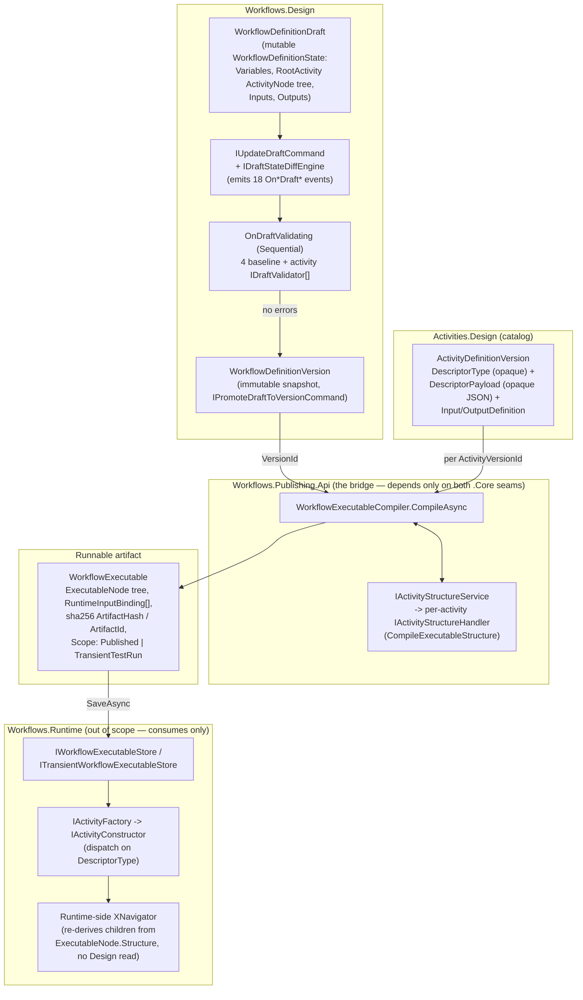

# Elsa 4 Workflow-Authoring Review — Design, Publishing, Activities, Expressions, HTTP

**Scope reviewed:** `src/Elsa/Workflows/Design/**`, `src/Elsa/Workflows/Publishing/**`, `src/Elsa/Activities/**`,
`src/Elsa/Expressions/**` (incl. JavaScript/Jint, Liquid), `src/Elsa/Http/**` (excl. `bin/`, `obj/`).
~750 source files / ~30.6k LOC. All `EXTENSION_POINTS.md`/`README.md` in scope were read, plus `docs/seams.md`.
Elsa 3 reference repo (`/Users/sipke/Projects/Elsa/elsa-core`) used for the activity-inventory comparison.

---

## Executive summary

Elsa 4's authoring stack is a **ground-up rewrite that is architecturally more disciplined than Elsa 3 but
functionally much shallower today**. The team has clearly invested first in *seams* — the Design ↔ Runtime
split (§E2.2), the artifact-only-runtime rule (§E2.6.2), the "one contributor interface + one aggregating
handler" convention (§2.6.1), and per-domain `EXTENSION_POINTS.md` catalogs — before building out breadth of
features. The result:

- **The activity *model*** (`IActivity`, `InputArgument<T>`/`OutputArgument<T>`, `IActivityConstructor`,
  descriptor-based construction) is a clean, smaller-surface descendant of Elsa 3's `Input<T>`/`Output<T>`
  model, and the Design ↔ Runtime split it sits inside is real and enforced by project references, not just
  convention.
- **The activity *library*** is a fraction of Elsa 3's: 7 control-flow activities, 2 structural
  activities (Sequence, Flowchart), 1 workflow-composition activity (construct-only, cannot execute), and
  12 primitives. There is **no HTTP activity, no scheduling/timer activity, no email, no scripting-activity
  (RunCSharp/RunPython), no event/messaging activity** anywhere in the repository yet (see Finding DS‑16 and
  the inventory table).
- **The Design → Publish → Runtime seam** is the strongest part of the review: it is genuinely clean at the
  type level (Publishing depends only on the two `.Core` contract sets, never on Runtime or Design
  implementations), and the content-addressed `WorkflowExecutable` artifact model (immutable, hashed,
  versioned, scoped Published/TransientTestRun) is a good design. But the *feature completeness* behind that
  seam is thin: the Publishing domain has no `.Core` project of its own (everything lives in one `.Api`
  project), the production publish path persists into an **in-memory** artifact store, and the Draft
  mutation API that the Design domain's own event catalog documents in detail (18 distinct mutation events)
  has **no HTTP endpoints** exposing it — several endpoint files are literally empty stub classes.
- **Expressions** are the most mature subsystem: a real descriptor-registry/handler-dispatch architecture,
  a proper visible-scope-chain model for container/loop variables (`VariableScope`, ADR 0027), and working
  Jint (JavaScript) and Fluid (Liquid) integrations with AST/template caching. The main technical risk here
  is **no sandboxing** of the JavaScript engine (no timeout, no statement/recursion limits, the
  `CancellationToken` passed into engine creation is discarded) and **no engine reuse** (a fresh Jint
  `Engine` plus the full pre-processor pipeline runs on every single expression evaluation).
- **HTTP** in scope is *only* content/routing/download infrastructure (content parsers, downloadable-content
  handlers, ZIP caching, route matching) — there is no `SendHttpRequest`, `HttpEndpoint`, `WriteHttpResponse`
  or webhook activity in the codebase at all. Elsa 3's HTTP module is materially richer.
- **DRY**: the biggest, cleanest violation found is eight near-identical "Navigator" classes (one per
  control-flow activity) that differ only by renamed types — ~900 lines that could be one generic helper.
  A second is a genuine duplicate/dead `ExpressionDescriptor` class. A third is an unintentional name
  collision: two different pairs of types both named `ArgumentValue`/`ArgumentState` with different shapes
  living in sibling `.Design.Core` projects.
- **Maturity signal, not just quality signal:** this is best read as a *very early* rewrite. Docs
  self-describe steps as "construct-only" (#006), features as "Unit C", "Model X", "deferred to the
  consumer/pinning unit". Reviewers evaluating "is this production ready" should read every finding below
  through that lens — most gaps are acknowledged in-repo, not hidden.

Severity legend: **Critical** (breaks correctness/production use) · **High** (real DX/architecture cost) ·
**Medium** (worth fixing, not urgent) · **Low** (polish).

---

## 1. Per-domain assessment

### 1.1 `Workflows/Design`

Owns authoring + persisted definitions: `WorkflowDefinitionState` (the canonical authored document —
variables, root `ActivityNode` tree, workflow inputs/outputs, activity/strategy options — see
`src/Elsa/Workflows/Design/Core/Models/WorkflowDefinitionState.cs:43-57`), the Draft→Version lifecycle
(`ICreateDraftCommand`/`IUpdateDraftCommand`/`IPromoteDraftToVersionCommand`/…, all in
`Persistence/Core/Contracts`), a rich mutation-event catalog (18 `On*Draft*` events, one per CRUD case for
activities/inputs/outputs/variables — `Api/EXTENSION_POINTS.md:80-196`), a Draft validation pipeline
(`Validations/*`, 4 baseline validators + activity-contributed validators), and the
`IActivityStructureHandler` contract that lets composite activities (Sequence, Flowchart, If, Switch, …) own
their own child-slot projection without the Design core knowing what a "branch" or "loop body" is
(`Core/Contracts/IActivityStructureHandler.cs`, `Core/Services/DefaultActivityStructureService.cs`).

The Core/Persistence/Validations split is followed consistently, and the code itself (e.g.
`DefaultActivityStructureService.cs`, `ScopedVariableResolver.cs`) is small, well-commented, and reads like
it was written to be read. The scoped-variable model (ADR 0027: container scopes chained to workflow scope,
nearest-scope-wins shadowing) is a genuinely nice piece of design shared cleanly between Design (
`ScopedVariableResolver`) and Runtime (`VariableScope`, out of scope but referenced consistently).

The weak point is the **API surface**: `Api/Endpoints/Definitions/{Get,Update,Delete}.cs` are empty stub
classes (DS‑5), and the entire Draft mutation lifecycle that Core/Persistence/Validations were clearly built
to support has **no endpoint at all** in `Elsa.Workflows.Design.Api` (DS‑6) — only
list/get/add/submit-definition and list/get/add-version endpoints exist. An author cannot yet add an
activity to a Draft, wire an input, or discard a Draft over HTTP; the entire event catalog in
`Api/EXTENSION_POINTS.md` describes machinery that nothing outside tests currently drives end-to-end.

### 1.2 `Workflows/Publishing`

This domain is a single project, `Elsa.Workflows.Publishing.Api` — there is no
`Elsa.Workflows.Publishing.Core` (DS‑1), unlike every sibling domain in scope. `docs/seams.md` frames this
honestly as "today a single bridge…tomorrow the seed of the compile-and-publish domain"
(`WorkflowsPublishingApiFeature.cs:16-22`), so the shape is deliberate-for-now, but it means the load-bearing
contracts (`IWorkflowExecutableCompiler`, `WorkflowExecutableCompileRequest/Source`) live inside an
endpoint-hosting project rather than a referenceable `.Core`.

Functionally, this is the most interesting code in the review: `WorkflowExecutableCompiler`
(`Api/Services/WorkflowExecutableCompiler.cs`) walks the authored `ActivityNode` tree, resolves each node's
`ActivityDefinitionVersion` from the Design/Activities catalog, compiles per-input `RuntimeInputBinding`s
(literal / variable-reference / arbitrary-expression, `CompileLiteralInput`/`CompileVariableInput`/
`CompileExpressionInput`), asks each activity's `IActivityStructureHandler` to compile its child structure,
and produces a `WorkflowExecutable` identified by a `sha256:`-prefixed content hash
(`ComputeHash`/`CreateArtifactId`, lines 316-365). Three scopes are modelled (`Published`,
`TransientTestRun`, and an implicit Draft-preview scope used by the two Test-Run endpoints), which is a
sound way to let designers "run what I'm looking at" without touching the published artifact.

The seam itself is clean: `ConstructActivityRequestHandler` is a 3-step bridge (read Design row → invoke
`IActivityFactory` → project both sides into one view) that references only the two `.Core` contract sets,
never a Runtime or Design *implementation* project — exactly what `docs/seams.md` promises. That said, the
compiled artifact's *storage* undercuts the "publish" story: `PublishWorkflow` — the production publish
endpoint — saves into `InMemoryWorkflowExecutableStore`
(`WorkflowsPublishingApiFeature.cs:40`), so a published workflow does not survive a process restart today
(DS‑2).

### 1.3 `Activities/*`

This is the activity *model* plus the activity *library*.

**Model.** `IActivity` (`Runtime/Core/Contracts/IActivity.cs`) is intentionally thin (Id/NodeId/Name/Type/
Version/property bags + `CanExecuteAsync`/`ExecuteAsync`). `ActivityBase`/`CodeActivity`/
`CodeActivity<T>` (`Runtime/Core/Abstractions/`) mirror Elsa 3's `Activity`/`CodeActivity<T>` almost exactly,
down to the commented-out `CanStartWorkflow`/`RunAsynchronously` properties and an author's own
self-critical comment about `CustomProperties` being "a way to abuse collecting values"
(`Abstractions/ActivityBase.cs:20-22`). `InputArgument<T>`/`OutputArgument<T>`
(`Runtime/Core/Models/InputArgument.cs`, `OutputArgument.cs`) are a rename of Elsa 3's `Input<T>`/
`Output<T>` with the same delegate/expression/variable constructors. Construction is descriptor-driven:
`IActivityFactory` → `IActivityConstructor<TDescriptor>` (one per descriptor **kind**, dispatched on
`DescriptorType.FullName`, not a magic string) → `ClrActivityConstructor` (CLR leaf activities) or
`WorkflowActivityConstructor` (workflow-as-activity). Binding author values onto typed properties is a
small, well-isolated reflection binder (`Primitives/Binding/ActivityArgumentBinder.cs`) that is explicitly
*not* promoted to a `.Core` (good judgment call, documented in its own doc comment).

**Composite/branching activities** (If, Switch, For, ForEach, While, Do, Parallel, Sequence, Flowchart) each
split cleanly across the Design/Runtime line: the runtime activity class references only
`Elsa.Activities.Runtime.Core`; an `Internal/XStructureHandler` (Design-side) projects/compiles child slots;
an `Internal/XNavigator` (Runtime-side) re-derives the compiled child from `ExecutableNode.Structure` +
`ChildSlots` at execution time. This is a real, working implementation of "activity-owned structure,"
including fault-aware fork/join (`Parallel`, `Flowchart`, #308) and `Break`-outcome propagation through
nested composites (#299/#304). **Flowchart in particular is materially richer than a minimal port**: 9
pluggable `IFlowchartPolicy` gateway kinds (direct continuation, implicit-activation join, decision,
parallel fork/join, inclusive fork/join, first-wins, merge), scoped execution paths for loopback safety, and
diagnostics recording. The downside is that the 8 Navigator classes are near-line-for-line copies of each
other (DS‑7), and `FlowchartExecutionEngine` is an 864-line class doing scheduling + join evaluation +
diagnostics + persistence in one place (DS‑13).

**Library breadth is the headline gap.** Primitives ships 12 activities (WriteLine/WriteLines, ReadLine,
SetVariable/SetVariables, SetName, SetOutput, Correlate, Fault, Finish, Break, Inline). There is no HTTP,
scheduling/timer, email, file, scripting (RunCSharp/RunJavaScript/RunPython-as-activity), or
event/messaging activity anywhere in the reviewed tree (or the repo at large — verified by repo-wide grep).
Workflow-as-activity (`Composition/*`) is present at the catalog/reconciliation level but its runtime body
is `throw new NotSupportedException(...)` (`Composition/Runtime/Activities/WorkflowDefinitionActivity.cs:24-26`)
— composing a published workflow as a callable activity cannot execute yet (DS‑9). See the inventory table
in §4 for the full comparison.

### 1.4 `Expressions/*` (Core, JavaScript/Jint, Liquid, Rendering)

The expression subsystem is the most mature part of the review. `ExpressionEvaluator`
(`Services/ExpressionEvaluator.cs`) dispatches by expression-type string to a registered
`IExpressionHandler` via a small `IExpressionDescriptorRegistry`; `VariableExpressionHandler`,
`JavaScriptExpressionHandler` and `LiquidExpressionHandler` are peers behind that dispatch, each registered
by its own `IExpressionDescriptorProvider`. `VariableScope`
(`Core/Models/VariableScope.cs`) implements the ADR‑0027 visible-scope chain (nearest-scope resolution,
by-reference-key and by-name lookup, shadowing, completed-scope rejection) cleanly and is shared by
container activities, loop iteration scopes, and the JavaScript `getVariable`/`setVariable` bridge.

**JavaScript = Jint** (a pure-.NET ECMAScript interpreter, same engine family Elsa 3 uses). Parsed scripts
are cached by SHA‑256 of source text with a sliding expiration (`Jint/Services/PreparedScriptFactory.cs`),
which is good hygiene. Two real risks:

- **No sandboxing.** `FeatureOptions` (`Jint/Options/FeatureOptions.cs`) only exposes `AllowClrAccess` and
  `ScriptCacheTimeout` — there is no statement-count limit, no recursion-depth limit, and no execution
  timeout wired into `Engine` construction (`Jint/Services/JintEngineFactory.cs:12-24`). The
  `CancellationToken` parameter passed into `IJintEngineFactory.Create` is explicitly discarded
  (parameter named `_`, line 12) rather than wired to a Jint `CancellationConstraint`. A pathological or
  malicious script (`while(true){}`) can hang the executing thread indefinitely (DS‑10).
- **No engine reuse.** `JintJavaScriptEvaluator.EvaluateAsync` constructs a brand-new `Engine` on every
  single expression evaluation (`Jint/Services/JintJavaScriptEvaluator.cs:28`), then republishes
  `OnEvaluatingScript` through the mediator, which walks every registered `IScriptPreProcessor` (9+ known
  implementations across two domains: type registration, common/argument/args-object functions, library
  resources, variable/workflow/input/output function bridges, materialization accessors) before the script
  runs, and `OnScriptEvaluated` after. For a workflow with many small JS-bound inputs this is a real,
  compounding per-evaluation cost with no pooling option today (DS‑11).

**Liquid = Fluid.** Parsed templates are also `IMemoryCache`-cached, but keyed by the **raw template
string** rather than a hash (`Liquid/Services/LiquidTemplateManager.cs:33-53`), unlike the JS side's
SHA‑256 keying — an inconsistency in an otherwise-parallel caching strategy, and a minor memory-key-size
concern for large templates (DS‑12).

**Pre/PostProcessor contributor pattern — justified, but the mediator hop is ceremony.** The
`IScriptPreProcessor`/`IScriptPostProcessor` *extension point* is well justified: activities and the
runtime genuinely need to inject different globals depending on execution context (workflow functions vs.
materialization-only accessors). What's questionable is the mechanism: every one of these "contributor list"
extension points in this review (`OnEvaluatingScript`, `OnScriptEvaluated`, `OnDeclarationsDocumentGenerating`,
`OnDraftValidating`, `OnActivityConstructorsInitializing`, `OnActivityVersionsReconciling`,
`OnWorkflowVersionsReconciling`) is documented as having **"Expected handler: exactly one"** — i.e. it is not
actually a fan-out pub/sub scenario, it is always "inject `IEnumerable<TContributor>` into one aggregator and
call it," dressed up as a domain event round-tripped through `IEventPublisher`/mediator. `DefaultActivityStructureService`
in the very same codebase shows the simpler alternative (inject `IEnumerable<IActivityStructureHandler>`
directly into a plain service, no event). See DS‑14.

### 1.5 `Http/*`

In scope, `Elsa.Http` is **content and transport infrastructure only**: HTTP content parsers (JSON/XML/plain
text/HTML/file), HTTP content factories (form-urlencoded/JSON/XML/text), a `MultiDownloadableContentHandler`
+ 7 `IDownloadableContentHandler` implementations (URL/string/stream/HttpFile/FormFile/Downloadable/binary),
route matching (`RouteMatcher` wraps ASP.NET Core's `TemplateMatcher`), and a ZIP-file caching/archival
subsystem (`ZipArchiveManager`, `FileSystemZipFileCacheStorage(Provider)`). All of it is competent, small,
single-responsibility code with a consistent `IDownloadableContentHandler`/`IHttpContentParser` extension
pattern (`HttpFeature.cs`).

There is, however, **no workflow activity in this subsystem at all** — no `SendHttpRequest`, no
`HttpEndpoint` trigger, no `WriteHttpResponse`, no webhook signature-verification activity. A repo-wide grep
confirms the only "HTTP endpoint" code that exists anywhere is generic runtime plumbing
(`src/Elsa/Workflows/Runtime/Http/*`: an `IHttpEndpointRoutesResolver`, an `IHttpEndpointAuthorizationHandler`,
an `IHttpEndpointFaultHandler`) with no concrete activity wired to it. Compared to Elsa 3's `Elsa.Http`
module (`SendHttpRequest`, `FlowSendHttpRequest`, `HttpEndpoint`, `WriteHttpResponse`,
`WriteFileHttpResponse`, `DownloadHttpFile`), this is a full module's worth of authoring capability not yet
present (DS‑16, and see the inventory table).

One structural nit: every built-in `IDownloadableContentHandler`/`IHttpContentParser` reports the *same*
`Priority` (`0`, or `-100` only for `FileHttpContentParser`) — see DS‑15 — so the "first matching handler by
priority" resolution in `MultiDownloadableContentHandler`/content-parser selection is, for all shipped
handlers, actually resolved by DI registration order in `HttpFeature.ConfigureServices`, not by any
meaningful priority signal.

---

## 2. The Design → Publish → Runtime flow

**Prose.** An author edits a `WorkflowDefinitionDraft` (a mutable `WorkflowDefinitionState`: variables, one
root `ActivityNode` tree, workflow inputs/outputs). Every mutation goes through `IUpdateDraftCommand`, which
diffs desired vs. stored state (`IDraftStateDiffEngine`), emits one fine-grained event per change (activity
added/removed/moved, input/output/variable added/updated/removed — 18 event types total), and — inside the
same per-Draft lock — synchronously publishes `OnDraftValidating` so every registered `IDraftValidator` can
add `ValidationError`s before the transaction commits. `IPromoteDraftToVersionCommand` freezes the Draft's
state into an immutable `WorkflowDefinitionVersion`, refusing to promote while validation errors are on
record (`DraftHasValidationErrorsException`).

Publishing is a separate step, performed by `Elsa.Workflows.Publishing.Api` against a chosen
`WorkflowDefinitionVersion`. `WorkflowExecutableCompiler.CompileAsync` loads that version, flattens its
`ActivityNode` tree, resolves each node's `ActivityDefinitionVersion` row from the (separate) Activities
catalog by `ActivityVersionId`, and compiles it into an `ExecutableNode` tree: each input becomes a
`RuntimeInputBinding` (literal / `Variable`-typed reference / arbitrary expression binding), each composite's
children become `ExecutableChildSlot`s via that activity's own `IActivityStructureHandler
.CompileExecutableStructure`, and the whole tree is wrapped in a `WorkflowExecutable` identified by a
`sha256:`-content hash (`WorkflowExecutableIdentity`). Three scopes exist for this artifact —
`Published` (durable, via `PublishWorkflow`), `TransientTestRun` (ephemeral, via the two Test-Run endpoints,
supporting both a promoted version and a raw in-editor Draft snapshot) — and the artifact is handed to
`IWorkflowExecutableStore`/`ITransientWorkflowExecutableStore` for the Runtime domain to load and execute.
Runtime never reads a Design document directly; the compiled `WorkflowExecutable` is self-contained (the
"artifact-only runtime" rule, §E2.6.2), and `ExecutableNode.Structure` lets a composite activity's
*Runtime*-side `Navigator` re-derive its children without asking the Design domain anything at
execution time.



This is architecturally clean. The gaps are all about *what's wired up around* the clean core: no
`Publishing.Core` to depend on from outside an endpoint-hosting assembly (DS‑1), no durable store behind the
production publish path (DS‑2), and no HTTP surface for the Draft-mutation half of the story at all (DS‑6).

---

## 3. Findings (DS‑1 … DS‑16)

### DS‑1 — Publishing domain has no `.Core`; contracts live inside the endpoint-hosting `.Api` project
**Severity:** High (architecture consistency / reusability)
**Evidence:** `src/Elsa/Workflows/Publishing/Api/Elsa.Workflows.Publishing.Api.csproj` is the *only* project
under `src/Elsa/Workflows/Publishing/`. Contracts that in every other reviewed domain live in a `.Core`
(`IWorkflowExecutableCompiler` — `Api/Contracts/IWorkflowExecutableCompiler.cs`; compile request/source
records — `Api/Models/WorkflowExecutableCompileModels.cs`) instead live inside
`Elsa.Workflows.Publishing.Api`, which also hosts FastEndpoints HTTP endpoints and depends on
`Elsa.Api.FastEndpoints`.
**Impact:** anything that wants to compile a workflow programmatically (a CLI, a batch republish job, a
test) must reference an ASP.NET/FastEndpoints-flavoured assembly to get `IWorkflowExecutableCompiler`.
**Recommendation:** extract `Elsa.Workflows.Publishing.Core` (compiler contract + compile
request/source/exception types) now, before more consumers accrete on the `.Api` assembly; keep
`Elsa.Workflows.Publishing.Api` as the thin FastEndpoints shell, matching the pattern already used by every
other domain in scope (`Design.Core`/`Design.Api`, `Activities.Runtime.Core`/`Activities.Runtime`, etc.).

### DS‑2 — Production "publish" persists to an in-memory artifact store
**Severity:** Critical for any real deployment (currently mitigated only by this being a WIP slice)
**Evidence:** `WorkflowsPublishingApiFeature.cs:40`: `services.TryAddSingleton<IWorkflowExecutableStore,
InMemoryWorkflowExecutableStore>();` — registered by the *production* `PublishWorkflow` endpoint's feature,
not just the test-run path. `InMemoryWorkflowExecutableStore` is defined in
`src/Elsa/Workflows/Runtime/Core/Services/InMemoryWorkflowExecutableStore.cs` (out of scope, but confirms the
default is an in-process dictionary).
**Impact:** a published workflow artifact does not survive an app restart, a scale-out to a second node, or
a deploy — i.e. "publish" is not durable today.
**Recommendation:** ship (or clearly require) a durable `IWorkflowExecutableStore` before this endpoint is
considered anything but a demo/dev default; `TryAddSingleton` is the right shape (replaceable), but the
*default* for a "publish" verb should not silently be volatile.

### DS‑3 — Dead, duplicate `ExpressionDescriptor` class
**Severity:** Medium (confusion risk, dead code)
**Evidence:** `src/Elsa/Expressions/Models/ExpressionDescriptor.cs` (namespace `Elsa.Expressions.Models`) is
structurally identical to `src/Elsa/Expressions/Core/Models/ExpressionDescriptor.cs` (namespace
`Elsa.Expressions.Core.Models`, implements `IExpressionDescriptor`) except it implements no interface. Repo-
wide grep shows only the `Core.Models` version is ever constructed or derived from (e.g.
`JavaScriptExpressionDescriptor : ExpressionDescriptor` resolves to the `Core.Models` one via its `using`).
The `Elsa.Expressions.Models` namespace is otherwise legitimately used by `VariableMapper.cs`/
`VariableFactory.cs` for *other* types in that folder (`Variable`, `MemoryBlock`, `MemoryBlockReference`) —
only the `ExpressionDescriptor` file in that folder is orphaned.
**Recommendation:** delete `src/Elsa/Expressions/Models/ExpressionDescriptor.cs`.

### DS‑4 — `ArgumentValue`/`ArgumentState` name collision across two `.Design.Core` projects
**Severity:** High (DX / correctness risk — same name, different shape, sibling projects)
**Evidence:**
- `Elsa.Expressions.Core.Models.ArgumentValue(object? Value, string? ExpressionType = null)` —
  `src/Elsa/Expressions/Core/Models/ArgumentValue.cs`. `ExpressionType` optional.
- `Elsa.Activities.Design.Core.Models.ArgumentValue(object? Value, string ExpressionType)` —
  `src/Elsa/Activities/Design/Core/Models/ArgumentValue.cs`. `ExpressionType` **required**.
- `Elsa.Workflows.Design.Core.Models.ArgumentState(string ReferenceKey, ArgumentValue Value, bool?
  AutoEvaluate, string? EvaluatorType, string? StorageDriverType, bool? IsSensitive)` —
  `src/Elsa/Workflows/Design/Core/Models/ArgumentState.cs` (6 fields; `Value` is the *Expressions.Core*
  `ArgumentValue`).
- `Elsa.Activities.Design.Core.Models.ArgumentState(string ReferenceKey, ArgumentValue Value)` —
  `src/Elsa/Activities/Design/Core/Models/ArgumentState.cs` (2 fields; base record of `InputState`/
  `OutputState`; `Value` here is the *Activities.Design.Core* `ArgumentValue`).
**Impact:** four types, two pairs of identical short names, resolved only by which `using` is in scope —
IDE "Go to definition"/autocomplete cannot disambiguate by name alone, and a copy-pasted helper method moved
between the two `Design.Core` layers will silently bind to the wrong `ArgumentValue`/`ArgumentState` if both
happen to be in scope (or fail to compile with a confusing "cannot convert" error otherwise).
**Recommendation:** rename one pair — e.g. `Elsa.Activities.Design.Core.Models.ArgumentValue` →
`ActivityArgumentValue` / `ArgumentState` → `ActivityArgumentState` (they are, per their own doc comments,
specifically "filled-in argument state on a design-time **canvas**" for the *activity catalog*, as distinct
from a *workflow* Draft's node-level state) — or collapse the Activities.Design.Core pair down to reuse the
Expressions.Core `ArgumentValue` the way `Workflows.Design.Core.ArgumentState` already does.

### DS‑5 — Empty stub endpoint classes checked into two Design `.Api` projects
**Severity:** High (dead/misleading code in a shipped assembly)
**Evidence (Workflows.Design.Api):**
- `src/Elsa/Workflows/Design/Api/Endpoints/Definitions/Update.cs:1-5` — `internal class Update { }`
- `src/Elsa/Workflows/Design/Api/Endpoints/Definitions/Delete.cs:1-5` — `internal class Delete { }`
- `src/Elsa/Workflows/Design/Api/Endpoints/Definitions/Get.cs:1-5` — `internal class Get { }`

**Evidence (Activities.Design.Api):**
- `src/Elsa/Activities/Design/Api/Endpoints/Definitions/Update.cs:1-5` — `internal class Update { }`
- `src/Elsa/Activities/Design/Api/Endpoints/Definitions/Delete.cs:1-5` — `internal class Delete { }`
- `src/Elsa/Activities/Design/Api/Endpoints/Versions/Delete.cs:1-5` — `internal class Delete { }`

None of these derive from `ElsaCommandHandlerEndpoint<>`/`ElsaRequestHandlerEndpoint<>` or implement
`Configure()`; FastEndpoints' assembly scan will not register them as routes. They exist only as filenames
in the same folders as real, working sibling endpoints (`Add.cs`, `List.cs`, `Submit.cs`), which makes them
easy to mistake for "already implemented, just needs wiring" rather than "not started."
**Recommendation:** either implement these (Get/Update/Delete are exactly the missing CRUD verbs — see
DS‑6) or delete the placeholder files and track the gap in an issue instead of in dead source.

### DS‑6 — The documented Draft-mutation lifecycle has no HTTP surface
**Severity:** High (feature gap masquerading as "done" because the domain model is fully built)
**Evidence:** `Elsa.Workflows.Design.Api/EXTENSION_POINTS.md` documents 18 fine-grained mutation events
(`OnActivityAddedToDraft` … `OnWorkflowOutputRemovedFromDraft`) all published by `IUpdateDraftCommand`. The
full command set exists and has EF Core + Groundwork implementations (`IUpdateDraftCommand`,
`ICreateDraftCommand`, `IDiscardDraftCommand`, `IPromoteDraftToVersionCommand`, `ICloneDraftFromVersionCommand`
— all under `Persistence/Core/Contracts`, with `EFCore/Commands/*` and `Groundwork/Services/*`
implementations). A repo-wide grep for `IUpdateDraftCommand` shows it referenced only by its own
interface/records/EF/Groundwork implementations and DI registration — **zero** references from
`Elsa.Workflows.Design.Api`.
**Impact:** there is currently no way, over HTTP, to add an activity to a Draft, wire an input, declare a
variable, or discard/promote a Draft. Everything the event catalog describes as "the mutation gate" is only
reachable from tests or direct service injection.
**Recommendation:** either scope the `EXTENSION_POINTS.md`/README claims down to "implemented, not yet
exposed" explicitly, or prioritize the Draft CRUD endpoints — they are the actual authoring surface a
designer UI needs, and are conspicuously the one thing missing next to a fully-built persistence/validation/
eventing stack.

### DS‑7 — Eight near-duplicate "Navigator" classes (control-flow activities)
**Severity:** Medium (DRY; ~900 LOC of copy-paste)
**Evidence:** `IfNavigator` (106 lines), `WhileNavigator` (96), `DoNavigator` (100), `ForNavigator` (98),
`ForEachNavigator` (98), `SwitchNavigator`/`ParallelNavigator` (158 each, multi-slot variant),
`SequenceNavigator` (94) — under `src/Elsa/Activities/ControlFlow/*/Internal/*Navigator.cs` and
`src/Elsa/Activities/Sequence/Internal/SequenceNavigator.cs`. Comparing
`src/Elsa/Activities/ControlFlow/If/Internal/IfNavigator.cs` and
`src/Elsa/Activities/ControlFlow/While/Internal/WhileNavigator.cs` line-by-line: the `ResolveSingleSlotChild`,
`MatchBranch`, and `ReadStructure`-with-kind/schema-version-guard-and-exception-wrapping methods are
identical apart from renamed types and exception classes; the file docstrings even say so explicitly
("Mirrors `IfNavigator`", While README).
**Impact:** any bug fix or behavior change to "how a single-slot composite resolves its compiled child" (e.g.
a future structure-schema-version migration policy) must be applied by hand to 6+ files.
**Recommendation:** extract a generic `SingleSlotNavigator<TStructure>`/`ExecutableStructureReader<T>` helper
(kind/schema-version validation + JSON deserialize + exception wrapping) parameterized by the activity's
structure-kind constants and a slot-name→structure-field mapping; keep the multi-slot
`Switch`/`Parallel` navigators as a second, smaller generic shape. This would cut ~900 LOC to an estimated
~150–200 LOC plus small per-activity adapters.

### DS‑8 — Workflow-as-activity (Composition) cannot execute
**Severity:** Medium (acknowledged gap, but worth surfacing outside code comments)
**Evidence:** `src/Elsa/Activities/Composition/Runtime/Activities/WorkflowDefinitionActivity.cs:24-26`:
```csharp
protected override void Execute(IActivityExecutionContext context)
    => throw new NotSupportedException(
        "WorkflowDefinitionActivity execution (load-and-run the referenced workflow version) is deferred to the consumer/pinning unit; Unit 006 is construct-only.");
```
The catalog/reconciliation/construction machinery around it (`WorkflowActivityReconciliationSource`,
`WorkflowActivityConstructor`) is fully built — only the actual "run the referenced workflow" body is
missing.
**Recommendation:** none needed beyond visibility — this is exactly the kind of gap that should be called
out in the top-level `README.md`/roadmap so it isn't discovered by a consumer at runtime via an unhandled
exception.

### DS‑9 — No JavaScript sandboxing (timeout / recursion / statement limits); `CancellationToken` discarded
**Severity:** High (stability / DoS risk once user-authored scripts are exposed to less-trusted authors)
**Evidence:** `src/Elsa/Expressions/JavaScript/Jint/Options/FeatureOptions.cs` — only `AllowClrAccess` and
`ScriptCacheTimeout`. `src/Elsa/Expressions/JavaScript/Jint/Services/JintEngineFactory.cs:12`:
`public async ValueTask<Engine> Create(IExpressionEvaluatorOptions? options, CancellationToken _)` — the
token parameter is named `_` and never used; no `Engine.Constraints.Add(new CancellationConstraint(...))`,
`RecursionDepth`, `TimeoutInterval`, or `MaxStatements` is configured anywhere in
`src/Elsa/Expressions/JavaScript/Jint/**`.
**Impact:** a workflow whose JS expression contains an infinite loop or unbounded recursion will hang the
executing thread indefinitely; there is no engine-level circuit breaker today.
**Recommendation:** wire the existing `CancellationToken` into a Jint `CancellationConstraint`, and expose
`FeatureOptions.MaxStatements`/`TimeoutInterval`/`RecursionDepth` as configurable engine constraints with
sane non-null defaults.

### DS‑10 — No JS engine reuse; full pre-processor pipeline re-runs on every single evaluation
**Severity:** Medium (performance, compounding with expression count)
**Evidence:** `src/Elsa/Expressions/JavaScript/Jint/Services/JintJavaScriptEvaluator.cs:28`:
`var engine = await jintEngineFactory.Create(options, cancellationToken);` runs unconditionally per call;
`JintEngineFactory.Create` (`Services/JintEngineFactory.cs:12-24`) allocates `new Engine(jintOptions)` fresh
every time. Every evaluation also republishes `OnEvaluatingScript`/`OnScriptEvaluated` through the mediator
(`Handlers/PreProcessScript.cs`, `PostProcessScript.cs`), which iterates every registered
`IScriptPreProcessor` — per `Elsa.Expressions.JavaScript/EXTENSION_POINTS.md`, at least 9 known
implementations across two assemblies (type registration, common/argument/args-object functions, library
resources, variable/workflow/input/output function bridges, materialization accessors).
**Impact:** a workflow with many small JS-bound inputs pays this setup cost once *per input, per
execution*, not once per workflow run.
**Recommendation:** investigate Jint engine pooling/reuse scoped to one activity execution (or one workflow
execution) rather than one expression evaluation, now that the AST itself is already cached; at minimum,
measure and document the expected per-evaluation overhead so operators can budget for it.

### DS‑11 — Liquid template cache uses the raw template string as key; JS cache hashes first
**Severity:** Low (inconsistency + minor memory-key bloat)
**Evidence:** `src/Elsa/Expressions/Liquid/Services/LiquidTemplateManager.cs:33-53`:
`memoryCache.GetOrCreate(source, …)` — `source` is the literal template text. Contrast
`src/Elsa/Expressions/JavaScript/Jint/Services/PreparedScriptFactory.cs:14-16`: `var cacheKey = "jint:script:"
+ Hash(expression);` (SHA‑256).
**Recommendation:** hash the Liquid template the same way for consistency and to bound cache-key memory for
large templates.

### DS‑12 — Hand-rolled artifact hash uses unescaped delimiter-joined strings
**Severity:** Medium (correctness risk in a content-addressing scheme)
**Evidence:** `src/Elsa/Workflows/Publishing/Api/Services/WorkflowExecutableCompiler.cs:316-365`
(`ComputeHash`/`FormatInputBinding`/`FormatNode`) builds the hash input by `string.Join` with `'\n'`, `'|'`,
`':'`, `';'`, `','`, `'='` separators over raw node ids, expression text, and `JsonElement.GetRawText()`
dumps, with no escaping of those characters inside the joined values.
**Impact:** two structurally different compiled trees could in principle serialize to the same joined string
if a node id, expression, or JSON payload text happens to contain the separator characters used elsewhere in
the format (e.g. an expression literal containing a `|` or `:`), producing a matching `ArtifactHash`/
`ArtifactId` for non-identical artifacts, or vice versa.
**Recommendation:** hash a canonical, escaping-safe serialization instead (e.g. a stable JSON serialization
of the full compiled tree, or length-prefixed field encoding) rather than ad hoc delimiter joins.

### DS‑13 — `FlowchartExecutionEngine` is an 864-line single-responsibility-adjacent class
**Severity:** Low–Medium (maintainability; explicitly justified in-repo)
**Evidence:** `src/Elsa/Activities/Flowchart/Internal/FlowchartExecutionEngine.cs` (864 lines) owns state
mutation, node scheduling, implicit/parallel join evaluation, loop/race scope creation, diagnostics
recording, and persistence orchestration in one class. `Flowchart/EXTENSION_POINTS.md:1-7` explicitly
documents this as deliberate ("the activity-owned scoped execution seam…intentionally not an extension point
directly").
**Recommendation:** the design intent (don't make this an extension point) is sound; the *size* is still a
standalone maintainability risk. Consider splitting internal collaborators (a scheduler, a join evaluator, a
diagnostics recorder) behind package-private seams within the same assembly, without exposing them as public
extension points.

### DS‑14 — "Sequential event, exactly one expected handler" used where a direct aggregator would do
**Severity:** Low (ceremony, not a bug)
**Evidence:** Every one of the following is documented with **"Expected handler: Exactly one"**:
`OnEvaluatingScript`→`PreProcessScript` (`Expressions.JavaScript/EXTENSION_POINTS.md:59`),
`OnScriptEvaluated`→`PostProcessScript` (same file, line 72), `OnDeclarationsDocumentGenerating`→
`BuildDeclarationsDocument` (`Expressions.JavaScript.Rendering/EXTENSION_POINTS.md:43`), `OnDraftValidating`→
`ExecuteValidations` (`Workflows.Design.Validations/EXTENSION_POINTS.md:59`),
`OnActivityConstructorsInitializing`→`RegisterActivityConstructors`
(`Activities.Runtime/EXTENSION_POINTS.md:71`), `OnActivityVersionsReconciling`→
`ActivityVersionsReconcilingHandler` (`Activities.Design.Reconciliation/EXTENSION_POINTS.md:41`),
`OnWorkflowVersionsReconciling`→`WorkflowVersionsReconcilingHandler`
(`Workflows.Design.Reconciliation/EXTENSION_POINTS.md:41`). Each real extension point is actually the
*contributor list* (`IScriptPreProcessor`, `IDraftValidator`, `IActivityConstructor`, `I*ReconciliationSource`),
which is always resolved as `IEnumerable<T>` inside that one handler — see e.g.
`src/Elsa/Workflows/Design/Validations/Handlers/ExecuteValidations.cs:13-24`. Compare
`src/Elsa/Workflows/Design/Core/Services/DefaultActivityStructureService.cs`, which achieves the same
"aggregate all registered `IActivityStructureHandler`s" goal with a plain injected `IEnumerable<>` and no
event/mediator hop at all.
**Impact:** every evaluation/validation/declaration-build pays an `IEventPublisher.Publish` dispatch (and, for
the JS pre/post processors, per-single-expression-evaluation) for a relationship that is 1:1 by construction
and documented as such — extra indirection and allocation with no realized fan-out benefit, and nothing
actually stops a second accidental handler registration from violating the documented "exactly one"
invariant at compile time.
**Recommendation:** for the paths on the hot path (JS pre/post-process in particular, DS‑9/DS‑10's neighbor),
consider replacing the event round-trip with direct injection of the aggregator, matching
`DefaultActivityStructureService`'s pattern; reserve the event+aggregating-handler convention for seams that
genuinely need to be swapped or observed by unrelated features.

### DS‑15 — Downloadable-content/HTTP-content-parser `Priority` is a no-op among shipped handlers
**Severity:** Low
**Evidence:** every built-in `IDownloadableContentHandler` reports `Priority => 0`
(`BinaryDownloadableContentHandler.cs:11`, `DownloadableDownloadableContentHandler.cs:11`,
`FormFileDownloadableContentHandler.cs:12`, `HttpFileDownloadableContentHandler.cs:11`,
`StreamDownloadableContentHandler.cs:11`, `StringDownloadableContentHandler.cs:12`,
`UrlDownloadableContentHandler.cs:13`, `MultiDownloadableContentHandler.cs:13`); only
`FileHttpContentParser.Priority => -100` differs among the `IHttpContentParser` family.
**Impact:** with all built-in priorities tied, first-match resolution among overlapping `SupportsContent`
predicates is actually determined by DI registration order in `HttpFeature.cs` — an implementation detail a
new handler author has no principled value to anchor their own `Priority` against.
**Recommendation:** either assign distinct, documented default priorities to the shipped handlers (so
"append after the built-ins" has a concrete meaning) or drop `Priority` in favor of an explicit ordered list
if ties are always intended to be broken by registration order anyway.

### DS‑16 — No HTTP-triggered or HTTP-calling activity anywhere in the repository
**Severity:** High (major authoring-capability gap vs. Elsa 3)
**Evidence:** repo-wide search for `HttpEndpoint`/`SendHttpRequest`/`WriteHttpResponse`/`Webhook` activity
classes returns nothing outside `node_modules` icon assets. The only "HTTP endpoint" code that exists is
generic runtime plumbing with no concrete activity attached:
`src/Elsa/Workflows/Runtime/Http/Contracts/IHttpEndpointRoutesResolver.cs`,
`IHttpEndpointAuthorizationHandler.cs`, `IHttpEndpointFaultHandler.cs`, and their default implementations
under `Services/`.
**Recommendation:** tracked in the inventory table (§4); this is the single largest concrete authoring-DX gap
identified in the review, since HTTP trigger/request activities are typically the first thing a new workflow
project needs.

---

## 4. Activity inventory — Elsa 4 built-ins vs. Elsa 3 equivalents

| Category | Elsa 4 (this repo, in scope) | Elsa 3 equivalent(s) | Gap |
|---|---|---|---|
| Sequencing | `Sequence` (`Activities/Sequence/Activities/`) | `Sequence` | Parity |
| Structural / gateway | `Flowchart` (9 pluggable `IFlowchartPolicy` kinds) | `Flowchart` (`FlowNode`/`FlowDecision`/`FlowFork`/`FlowJoin`/`FlowSwitch`) | Elsa 4's policy model is arguably richer/more explicit than Elsa 3's fixed node kinds |
| Branch | `If`, `Switch` | `If`, `Switch`/`FlowSwitch` | Parity |
| Loop | `For`, `ForEach`, `While`, `Do` (post-test) | `For`, `ForEach`/`ForEachT`/`ParallelForEach`/`ParallelForEachT` | Elsa 4 lacks a parallel-foreach variant |
| Fork/Join | `Parallel` (fault-aware join, #308) | `Parallel`, `Fork`/`Join` | Parity (arguably Elsa 4's fault-aware join is stronger) |
| Composition (workflow-of-workflows) | `WorkflowDefinitionActivity` (construct-only — **cannot execute**, DS‑8) | `WorkflowDefinitionActivity`, `ExecuteWorkflow`, `DispatchWorkflow`, `BulkDispatchWorkflows`, `Composite`/`Container` | **Major gap** — nothing in Elsa 4 can currently run a nested/child workflow |
| State machine | — | `StateMachine` + `StateMachineState`/`Transition` | **Gap** |
| Variables / data | `SetVariable`, `SetVariables`, `SetName`, `SetOutput` | `SetVariable`, `SetOutput`, `SetName` | Parity |
| Console / debug | `WriteLine`, `WriteLines`, `ReadLine` | `WriteLine`, `ReadLine` | Parity |
| Control | `Break`, `Finish`, `Fault`, `Correlate`, `Inline` | `Break`, `Finish`/`Complete`/`End`, `Fault`, `Correlate`, `Inline` | Parity |
| HTTP (trigger) | — | `HttpEndpoint`, `HttpEndpointBase` | **Gap** (only routing/auth *plumbing* exists, DS‑16) |
| HTTP (outbound) | — | `SendHttpRequest`, `FlowSendHttpRequest`, `DownloadHttpFile` | **Gap** |
| HTTP (response) | — | `WriteHttpResponse`, `WriteFileHttpResponse` | **Gap** |
| Scheduling | — | `Timer`, `Cron`, `Delay`, `StartAt` | **Gap** |
| Scripting-as-activity | `Inline` (evaluates an expression, not a full script activity) | `RunCSharp`, `RunJavaScript`, `RunPython` | **Gap** |
| Eventing / messaging | — | `Event`, `PublishEvent`, `NotificationPublishingMiddleware` | **Gap** |
| Alterations / ops tooling | — | `AlterationPlanCompleted`, `CompleteAlterationPlan`, `GenerateAlterationJobs`, `DispatchAlterationJobs`, `SubmitAlterationPlan` | **Gap** (Elsa 3 feature with no Elsa 4 counterpart in scope) |
| Host interop | — | `HostMethodActivity` | **Gap** |
| Dynamic/late-bound activity | — | `DynamicActivity`, `NotFoundActivity` | **Gap** |
| Activity descriptors/registry for designer UIs | Catalog rows (`ActivityDefinitionVersion` + reconciliation sources), no live "descriptor" reflection API in scope | `ActivitiesSearchTool`, `ActivityDescriptorTool`, activity provider/registry with rich UI metadata (icons, categories, property editors) baked into descriptors | Elsa 4's *reconciliation* model is arguably cleaner (content-addressed catalog rows vs. reflection-at-runtime), but ships materially less UI-facing descriptor metadata today (CLR source deliberately leaves `DisplayName`/`Description` null — see `Design/Reconciliation/Clr/README.md`) |

**Net:** Elsa 4's *primitive* and *control-flow* activity sets are functionally close to parity with Elsa 3
(and the Flowchart policy model is a genuine improvement). Everything Elsa 3 ships as a separate *module*
(HTTP, Scheduling, scripting-as-activity, state machines, alterations) has **no Elsa 4 counterpart yet** in
this scope — consistent with this being an early rewrite that has prioritized the core engine/model over
module breadth.

---

## 5. Naming table

| Name(s) | Where | Issue | Proposal |
|---|---|---|---|
| `ArgumentValue` ×2, `ArgumentState` ×2 | `Elsa.Expressions.Core.Models` / `Elsa.Activities.Design.Core.Models` / `Elsa.Workflows.Design.Core.Models` | Same short name, four different shapes, across sibling `.Design.Core` projects (DS‑4) | Rename the Activities.Design.Core pair to `ActivityArgumentValue`/`ActivityArgumentState`, or unify on the Expressions.Core `ArgumentValue` everywhere |
| `Argument` (base), `ArgumentDefinition`, `ArgumentValue`, `ArgumentState`, `InputDefinition`, `OutputDefinition`, `InputState`, `OutputState`, `InputArgument<T>`, `OutputArgument<T>` | `Expressions.Core.Models` / `Activities.Design.Core.Models` / `Workflows.Design.Core.Models` / `Activities.Runtime.Core.Models` | 12 distinct "argument-family" types spread across 4 namespaces; `InputDefinition`/`OutputDefinition`/`ArgumentDefinition` are *intentionally* structurally identical ("signature-clarity duplication", per their own doc comments) | Keep the duplication (it's a deliberate, documented FR‑030 decision) but add a short glossary table/diagram in `Expressions/README.md` mapping "authoring-time shape" → "compiled/runtime shape" for these 10+ names — the single biggest ramp-up cost in this codebase for a newcomer |
| `ExpressionDescriptor` (dead) vs. `ExpressionDescriptor` (live) | `Elsa.Expressions.Models` vs. `Elsa.Expressions.Core.Models` | Exact duplicate name, one dead (DS‑3) | Delete the dead one |
| `Constructable` vs. `Constructed` (`ConstructableActivityView`, `ConstructedActivityView`, `ConstructActivity` request, `ConstructActivityRequestHandler`, `Construct` endpoint) | `Workflows.Publishing.Api.Models`/`Requests`/`Handlers`/`Endpoints` | 5 very similar tokens ("Construct-able" = listing candidates, "Construct-ed" = the result) in one small feature; a two-letter typo (`Constructed`↔`Constructable`) silently compiles to the wrong type in call sites that only differ by that suffix | Keep, but call out explicitly in a doc-comment on both view types cross-referencing each other (not currently present) |
| `WorkflowExecutableCompileRequest`/`…CompileSource` vs. `WorkflowExecutableCompilationException` | `Workflows.Publishing.Api.Models` | "Compile" (adjective/verb) vs. "Compilation" (noun) inconsistency within the same feature | Standardize on one, e.g. `WorkflowExecutableCompilationRequest`/`…CompilationSource` |
| `WorkflowDefinitionActivity` | `Elsa.Activities.Composition.Runtime.Activities` | Reads like it wraps a `WorkflowDefinition` (the Design-time entity, `IWorkflowDefinition`/`WorkflowDefinitionModel`), but it actually wraps a **specific version** (`WorkflowIdentity`) used *as an activity*; ported verbatim from Elsa 3 where the same ambiguity exists | `WorkflowActivity` or `SubWorkflowActivity`/`WorkflowReferenceActivity` |
| `Endpoints/PublishWorkflow.cs` → class `PublishWorkflowEndpoint` (aliasing `Requests.PublishWorkflow` as `PublishWorkflowRequest`) | `Workflows.Publishing.Api.Endpoints` | Every sibling endpoint (`Construct`, `List`, `Start`, `StartDraft`) keeps endpoint-class-name == request-name with no suffix/alias; this one breaks the pattern purely to dodge a self-inflicted name collision (DS mentioned in §1.2) | Rename the endpoint file/class to `Publish.cs`/`Publish` (matching the `Definitions/{Add,List,Submit}` convention already used one folder over), no alias needed |
| `IActivityStructureHandler.SupportsScopedVariables` (property) but `ProjectScopedVariables` (method) alongside `ProjectChildren`/`ReplaceChildren`/`CompileExecutableStructure` | `Workflows.Design.Core.Contracts.IActivityStructureHandler` | Minor: "Supports…" reads like a capability *query*, "Project…" reads like a *side-effect-free projection* — both are actually pure queries; naming is fine but easy to assume `SupportsScopedVariables` gates whether `ProjectScopedVariables` is safe to call (it does, but nothing enforces it) | No rename needed; consider a doc-comment cross-reference (`ProjectScopedVariables` should note it is only meaningful when `SupportsScopedVariables` is true) |
| `Elsa.Activities.Design.Reconciliation` / `Elsa.Workflows.Design.Reconciliation` (feature name) vs. historical `Provisioning` | `Design/Reconciliation/README.md` | Already renamed once (`Provisioning` → `Reconciliation`, "2026-05-28 (Unit B)") and documented as a deliberate NuGet-identity-breaking rename | Positive example — flagged here only as evidence the team is willing to pay real churn cost for naming clarity; no further action |

---

## 6. Cross-cutting DRY / open-closed observations (beyond §3)

- **Positive pattern worth keeping:** the `X AuthoredStructure` / `X ExecutableStructure` naming convention
  (`IfAuthoredStructure`/`IfExecutableStructure`, `FlowchartAuthoredStructure`/`FlowchartStructure`, etc.) is
  consistent across every composite activity and makes the Design/Runtime split legible at a glance — this
  is a good counter-example to the `ArgumentValue`/`ArgumentState` collision in DS‑4/naming table.
- **Positive pattern:** `IActivityConstructor<TDescriptor>` dispatch on `DescriptorType.FullName` (never a
  free-text "kind" string) plus a Runtime-side resolver registry (`IActivityImplementationResolverRegistry`)
  means adding a new activity "kind" (CLR, Workflow, and presumably future Remote/Dynamic kinds) never
  requires touching a central switch statement — a genuinely open/closed extension point, unlike Elsa 3's
  activity-provider model which leans more on reflection scanning at startup.
- **Consistent but debatable convention:** the "Source (returns items) + single aggregating handler" shape
  recurs for every reconciliation feature (`Activities.Design.Reconciliation`, `Activities.Design.Reconciliation
  .Clr`, `.Json`, `Workflows.Design.Reconciliation`) and is well documented, but it means every new source
  module ships its own `IShellFeature`, its own options class, and its own README/EXTENSION_POINTS.md pair —
  a lot of ceremony for "read some rows and hand them to one reconciler." This is likely intentional (keeps
  each source's failure mode/resilience story — e.g. `ClrAssemblyScanner`'s reflection-only, skip-on-failure
  design — isolated), but it is a real authoring-time cost for anyone adding, say, a fifth reconciliation
  source.

---

## 7. Open questions

1. **Is `Elsa.Workflows.Publishing.Api` intentionally going to stay a single project**, or is a `.Core` split
   already planned (§E2.2/§E2.6 language elsewhere in the constitution suggests it should be)? If planned,
   what's blocking it from happening now, before more consumers accrete on the `.Api` assembly (DS‑1)?
2. **What is the intended durable store for `IWorkflowExecutableStore` in production**, and is there a
   tracked item to replace the `InMemoryWorkflowExecutableStore` default registered by
   `WorkflowsPublishingApiFeature` (DS‑2)? Today nothing in-repo signals "you must swap this before going to
   production" other than the type name itself.
3. **Is the Draft-mutation HTTP surface (DS‑6) simply not built yet, or deliberately deferred** in favor of a
   different authoring transport (e.g. a signalling/real-time channel instead of REST CRUD)? The extensive
   event catalog (18 mutation events) reads like it was built for a REST CRUD surface, so this looks like a
   sequencing gap rather than a deliberate architectural choice, but it's worth confirming.
4. **What is the actual plan for JS engine sandboxing (DS‑9)?** Is script authorship expected to remain
   restricted to trusted workflow designers indefinitely (in which case the risk is lower), or is there a
   roadmap item for exposing workflow authoring to less-trusted users where a timeout/statement-limit would
   become a hard requirement rather than a hardening nice-to-have?
5. **Is there a tracked epic for the missing modules** (HTTP trigger/request activities, scheduling/timer,
   scripting-as-activity, state machine, workflow-of-workflows execution) or are they expected to be
   community/downstream modules the way some are in Elsa 3? This materially changes how "complete" the
   authoring story should be judged to be at this snapshot.
6. **Should the eight Navigator classes (DS‑7) be unified now, or is the duplication considered temporary
   scaffolding** while the composite-activity shape is still being finalized (the per-activity README files
   suggest more loop activities — e.g. a parallel-foreach — may still be added, which would mean a ninth
   near-copy before any refactor)?

