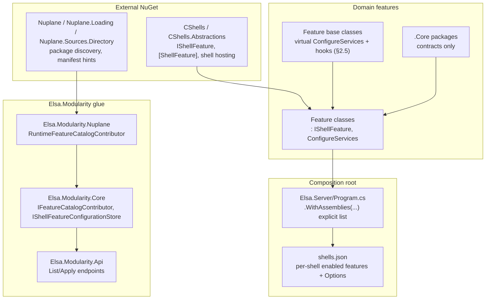

# Elsa 4 Modularity & Layering Review

**Scope:** `src/Elsa/Modularity`, `src/Elsa/Features`, `src/Elsa/Foundation`, `src/Apps`, `src/elsa3`, dependency envelope (109 source `.csproj`, 84,338 LoC in `src`), `.specify/memory/constitution*.md`, `tests/Elsa/Architecture/*`.

## Executive Summary

Elsa 4's modularity is **not home-grown** — it is built on two external, versioned NuGet packages (`CShells`/`CShells.Abstractions` for the feature/shell activation model, `Nuplane` for package discovery/manifest-driven catalog composition), glued into the app via a thin `Elsa.Modularity.{Core,Nuplane,Api}` layer. The Elsa-specific value-add is disciplined *domain decomposition*: every domain is split into `.Core` (contracts) / helper / implementation layers (constitution-framework §2.1), composed only through `.Core`-to-`.Core` references, feature-inheritance (§2.5), or contributor interfaces (§2.6). This discipline is enforced by a genuinely sophisticated, code-based architecture-fitness-test suite (`tests/Elsa/Architecture/ArchitectureGuardTests.cs`, `RuntimeExecutionSliceDependencyTests.cs`), not just documentation.

The system is **mostly clean** on the dependency envelope: `.Core` projects don't reference implementations, provider packages (Sqlite/Mongo/Groundwork) are correctly isolated to leaf projects, and the one known Runtime→Design boundary violation is explicitly tracked and allow-listed rather than silently present. However, I found **two currently-failing tests in the checked-out tree right now** (a live, un-tracked drift, not a hypothetical), a documented-but-still-violated "no `InternalsVisibleTo`" gate in 5 projects, a constitution domain-tree table that has fallen well behind the actual code (roughly half the real domains aren't listed), and a fragmentation profile where a two-file, 32-LoC project gets the same ceremony (own `.csproj`, own bin/obj, own place in the reference graph, own potential `EXTENSION_POINTS.md`) as a 15,000-LoC one. That fragmentation is not an accident — it's the direct, intended consequence of two constitutional gates (§2.1 per-feature three-layer separation + §2.16 refactor-cost/NuGet-identity preservation) — so it is best read as a deliberate governance trade-off under active tension with day-to-day DX, not as an oversight.

---

## How the Module System Works

**Layers, outside-in:**

1. **CShells** (external package) — defines `IShellFeature`, the `[ShellFeature(name:, DisplayName:, Description:)]` attribute, `[ManifestSetting]`/`[ManifestRuntimeKind]`/`[ManifestFeatureCategory]` attributes, and shell hosting (`AddCShellsAspNetCore`, `MapShells()`). A "shell" is a named, independently configurable composition of enabled features (multi-tenant-shaped).
2. **Nuplane** (external package) — package/assembly discovery: `AddNuplane(...)`, `AutoloadPackages(...)`, directory feeds, and manifest-hint reading, so features can ship as droppable packages rather than compiled-in references.
3. **`Elsa.Modularity.Core`** — Elsa-owned contracts for the modularity domain itself: `IFeatureManagementService`, `IFeatureCatalogContributor`, `IShellFeatureConfigurationStore`, catalog item/change models. Zero project references (`src/Elsa/Modularity/Core/Elsa.Modularity.Core.csproj`).
4. **`Elsa.Modularity.Nuplane`** — bridges CShells/Nuplane into Elsa's catalog contracts (`RuntimeFeatureCatalogContributor.cs`, `PackageManifestFeatureCatalogContributor.cs`, `ManifestHintReader.cs`).
5. **`Elsa.Modularity.Api`** — FastEndpoints surface to list/apply feature configuration (`Endpoints/List.cs`, `Endpoints/Apply.cs`), plus a JSON-file-backed `IShellFeatureConfigurationStore` and `ShellReloader`.
6. **Per-domain feature classes** (65 discovered by the generated feature-map, 70 by direct grep) — each a small `public class XFeature : IShellFeature` (or a base-derived class) with a `ConfigureServices(IServiceCollection)` method, decorated with manifest attributes for the admin UI.
7. **`src/Apps/Elsa.Server`** — the composition root. `Program.cs` (`src/Apps/Elsa.Server/Program.cs:121-193`) hand-lists every feature assembly via `.WithAssemblies(typeof(XFeature).Assembly, ...)`, then `shells.json` (`src/Apps/Elsa.Server/shells.json:1-30`) declares which features are *enabled* for the `"default"` shell, keyed by feature `name` (§2.19) with per-feature `Options`.

**Feature inheritance** (§2.5) is the sanctioned structural-coupling mechanism: a base feature exposes a `virtual ConfigureServices` plus narrower `protected virtual` hooks; a derived feature calls `base.ConfigureServices` and overrides only the hooks it needs. Concrete example, a real 3-tier chain:

```
EFCorePersistenceShellFeatureBase<TDbContext>          (Elsa.Persistence.EFCore)
  └─ EFCoreWorkflowsPersistenceFeatureBase              (Elsa.Workflows.Design.Persistence.EFCore)
       └─ SqliteWorkflowsDesignPersistenceShellFeature  (Elsa.Workflows.Design.Persistence.EFCore.Sqlite)
```
(`src/Elsa/Persistence/EFCore/EFCorePersistenceShellFeatureBase.cs:23-191`, `src/Elsa/Workflows/Design/Persistence/EFCore/EFCoreWorkflowsPersistenceFeatureBase.cs:16-22`, `src/Elsa/Workflows/Design/Persistence/EFCore/Sqlite/SqliteWorkflowsDesignPersistenceShellFeature.cs:28-45`)



---

## Findings

### MD-1 — Two architecture-guard tests are **currently failing** on the checked-out tree (High)
`dotnet test tests/Elsa/Architecture/Elsa.Architecture.Tests.csproj` run live during this review: **2 failed / 33 passed / 35 total.**

```
Solution_folders_collapse_leaf_project_segments [FAIL]
  src/elsa3/Mapping/Elsa3.Mapping.csproj: expected /src/elsa3/, actual /src/Elsa3/
  src/elsa3/Models/Elsa3.Models.csproj: expected /src/elsa3/, actual /src/Elsa3/
  src/elsa3/Activities/Design/Import/Elsa3.Activities.Design.Import.csproj: expected /src/elsa3/Activities/Design/, actual /src/Elsa3/Activities/Design/

Project_paths_match_domain_tree_convention [FAIL]
  Elsa3.Mapping: expected src/Elsa3/Mapping/Elsa3.Mapping.csproj, actual src/elsa3/Mapping/Elsa3.Mapping.csproj
  Elsa3.Models: expected src/Elsa3/Models/Elsa3.Models.csproj, actual src/elsa3/Models/Elsa3.Models.csproj
  Elsa3.Activities.Design.Import: expected src/Elsa3/Activities/Design/Import/Elsa3.Activities.Design.Import.csproj, actual src/elsa3/Activities/Design/Import/Elsa3.Activities.Design.Import.csproj
```
Evidence: the on-disk directory is genuinely `src/elsa3` (lowercase — confirmed via `ls -la src`), but `ArchitectureGuardTests.ExpectedProjectPath()` (`tests/Elsa/Architecture/ArchitectureGuardTests.cs:559-560`) derives the expected path from the project name `Elsa3.*`, i.e. `src/Elsa3/...` (capital E). Git history shows a recent, deliberate attempt to fix exactly this class of drift two days before this review (`db9b57bb "Fix #315: align architecture guard with physical tree..."`, `de1f96bf "Fix architecture-guard drift for Serialization/Expressions/Elsa3.Mapping..."`) — but the `elsa3` casing itself was missed and is not mentioned in `docs/reports/unfinished-work.md`.
**Recommendation:** rename `src/elsa3` → `src/Elsa3` (or adjust `ExpectedProjectPath`/`ExpectedSolutionFolder` if lowercase is actually intended) and add this exact case to the elsa3-migration-boundary follow-up so it doesn't regress again. On a case-insensitive filesystem (default macOS/Windows) this class of drift is invisible locally and only surfaces in case-sensitive CI/Linux — worth a repo-root `.gitattributes`/lint check.

### MD-2 — `Elsa.Workflows.Runtime.JavaScript → Elsa.Workflows.Design.Core` violates the constitution's stated "Hard rule," but is a *tracked* exception (Medium)
`.specify/memory/constitution.md:107` states: *"There **must be no direct dependency from `Elsa.Workflows.Runtime.*` to `Elsa.Workflows.Design.*`.**"* Yet `src/Elsa/Workflows/Runtime/JavaScript/Elsa.Workflows.Runtime.JavaScript.csproj:18` has `<ProjectReference Include="..\..\Design\Core\Elsa.Workflows.Design.Core.csproj" />`.
This is caught, not hidden: `ArchitectureGuardTests.cs:15-18` hard-codes a `DeferredRuntimeDesignReferences` allow-list containing exactly this one pair, and `docs/reports/unfinished-work.md:50` documents the reason ("JavaScript function declarations contributed across designer and runtime surfaces while ownership is unstable") plus `docs/program-goals/runtime-execution-seam.md` tracks the follow-up. `RuntimeExecutionSliceDependencyTests.cs` independently reflection-checks that `Elsa.Workflows.Runtime.Core` and `.Runtime.Api` assemblies carry no Design/Publishing references — this narrower project is not covered by that stricter check, only by the allow-listed guard test.
**Recommendation:** this is good governance (tracked debt beats silent drift), but the constitution text should say "with one tracked exception, see §E2.2 follow-up" rather than an unqualified "must" — as written, the constitution and the shipped code disagree on the letter of a "hard rule," which is exactly the kind of ambiguity the "Critical Constitution Review" skill is meant to catch.

### MD-3 — `InternalsVisibleTo` used in 5 projects despite an explicit constitutional ban (Medium)
`.specify/memory/constitution-framework.md:798-805` (§2.23.3, "Visibility rule"): logic-bearing implementations must be `public sealed` specifically so tests construct them directly, "**replac[ing] the historical `internal sealed` convention, which forced tests to use reflection or `[InternalsVisibleTo]` — both code smells**." Yet:
- `src/Elsa/Activities/Runtime/Elsa.Activities.Runtime.csproj:17` — `InternalsVisibleTo Include="Elsa.Activities.Design.Tests"` (cross-*domain*: Runtime exposing internals to a Design test project, comment cites §2.23 as if compliant)
- `src/Elsa/Activities/ControlFlow/Elsa.Activities.ControlFlow.csproj:16-17` — same pattern, "counted-loop range arithmetic"
- `src/Elsa/Agent/Api/Elsa.Agent.Api.csproj:10`
- `src/Elsa/Diagnostics/OpenTelemetry/Elsa.Diagnostics.OpenTelemetry.csproj:17`
- `src/Elsa/Diagnostics/ConsoleLogStreaming/Elsa.Diagnostics.ConsoleLogStreaming.csproj:22`

None of these is caught by `ArchitectureGuardTests` — that suite only inspects `<ProjectReference>`, never `<InternalsVisibleTo>`, so this class of coupling is a **blind spot in the guard-test suite itself**, not just a code violation.
**Recommendation:** either (a) refactor the 5 internal seams to `public sealed` per §2.23.3, or (b) add an explicit, narrow allow-list mirroring `DeferredRuntimeDesignReferences` and soften the constitution wording the same way as MD-2, plus add an `ArchitectureGuardTests` check that fails on any undeclared `InternalsVisibleTo`.

### MD-4 — Constitution's pinned domain tree (§E2.1) has fallen well behind actual code (Medium/High)
`.specify/memory/constitution.md:83-99` pins 13 root domains: `Workflows.Design`, `Workflows.Runtime`, `Tasks`, `Scheduling`, `Serialization`, `Api`, `Persistence`, `Locking`, `Modularity`, `Expressions`, `Messaging`, `Http`, `Notifications`. Cross-checked against the generated `docs/maps/project-reference-map.md:153-177` domain-group table, the actual codebase has **22 domains**, and roughly half of the constitution's list is either missing or aspirational:
- **Real, substantial domains absent from §E2.1:** `Elsa.Activities` (17 source projects — the single biggest domain in the repo), `Elsa.Agent` (5), `Elsa.Foundation` (5, covers Identity + Agent-adjacent), `Elsa.Diagnostics` (9), `Elsa.Events` (3), `Elsa.Mediator` (2), `Elsa.Pipelines` (1), `Elsa.Primitives` (2, though charter is covered by §E2.3), `Elsa.Secrets` (4), `Elsa3` (3, covered separately by §E2.7).
- **Constitution-listed domains that don't exist in code yet:** `Elsa.Scheduling`, `Elsa.Messaging`, `Elsa.Notifications` (0 projects each).
**Recommendation:** this table needs a refresh pass. Either fold the missing domains in (most already have `.Core`/`.Api`/README patterns matching §2.1-3, so this should be low-risk documentation work), or mark the table explicitly as "illustrative, not exhaustive" so readers don't mistake it for ground truth. Given `docs/maps/domain-map.md` is a *generated*, always-fresh replacement for this exact information, consider whether §E2.1's static table should be trimmed to genuinely load-bearing entries (the Design/Runtime split, Primitives charter) and defer enumeration entirely to the map.

### MD-5 — Extreme micro-fragmentation is real, but constitutionally *intentional* (Medium, DX cost)
11 source projects sit under 100 LoC; the smallest, `Elsa.Workflows.Design.Reconciliation.Core` (`src/Elsa/Workflows/Design/Reconciliation/Core/`), is **32 LoC across 2 files** (one interface, one delegate type) yet carries its own `.csproj`, its own place in the 109-project solution, its own bin/obj, and is a first-class node in the dependency graph. This is not accidental: `.specify/memory/constitution-framework.md:560-564` (§2.16, "Refactor-cost test") explicitly instructs *"when in doubt about a grouping, prefer the finer-grained split. Merging two packages later is easier than separating one that has consumers"* — i.e. the fragmentation is the direct, intended output of following this gate combined with §2.1's "one `.Core`/impl split per feature, always." See the size table below for the full list of sub-100-LoC projects.
**Recommendation:** this is the single most valuable DX lever available: reread §2.16/§2.18.4 with the specific question "does NuGet-identity preservation still pay for itself below N LoC / below M actual external consumers?" A pragmatic threshold (e.g. "domains under ~150 LoC or with a single consumer may skip the `.Core` split until a second consumer appears") would materially cut the 109-project count without weakening the composition discipline that matters (cross-`.Core` references, provider isolation).

### MD-6 — Inverse fragmentation: `Elsa.Workflows.Runtime.Core` is a 15,042-LoC outlier (Low/Medium)
While 11 projects sit under 100 LoC, `Elsa.Workflows.Runtime.Core` (`src/Elsa/Workflows/Runtime/Core/`) is **15,042 LoC** — more than double the next-largest project (`Elsa.Server` at 6,827) and ~3.6x the third largest (`Elsa.Activities.Runtime` at 4,500). It contains `Middleware`, `Builders`, `Contracts`, `Models`, `Exceptions`, `Resolvers`, `Validators`, `Services` — i.e. it looks like a full runtime engine living inside what the naming convention (§2.2) frames as a thin contracts-only `.Core` layer.
**Recommendation:** worth an explicit sizing/scope audit of this one project against §2.1's `.Core` "contains: interfaces, abstract classes, models, thin utility implementations" charter — if a meaningful chunk is logic-bearing implementation rather than contract, it may want splitting into a sibling implementation package, consistent with how every other domain in the repo is split.

### MD-7 — Duplicate `ProjectReference` entries (Low, hygiene)
`src/Elsa/Workflows/Runtime/JavaScript/Elsa.Workflows.Runtime.JavaScript.csproj:15` and `:22` both reference `Elsa.Expressions.JavaScript.Core.csproj` verbatim. Harmless to MSBuild (de-duped at restore) but signals the file was hand-edited without cleanup, and is exactly the sort of file this repo's own `ArchitectureGuardTests` machinery could catch with one more assertion.
**Recommendation:** dedupe; consider a guard test for duplicate `ProjectReference` includes per project.

### MD-8 — Provider/package isolation is clean (Positive finding)
No `.Core` project references a provider-specific package (`Sqlite`, `Npgsql`, `MongoDB.Driver`, `Groundwork.*`) — verified by grepping every `*.Core.csproj` for `PackageReference` matches against those names (zero hits). All Sqlite-flavored persistence lives in dedicated `*.EFCore.Sqlite` / `*.Groundwork.Sqlite` leaf projects (7 found). This matches `ArchitectureGuardTests.Core_projects_do_not_reference_heavy_packages` (`ArchitectureGuardTests.cs:80-91`) and its `IsCoreSafePackage` allow-list (`*.Abstractions` + `Microsoft.Extensions.Primitives`/`Options`). One minor loose end: `MongoDB.Driver` is version-pinned in `Directory.Packages.props:56` but referenced by **zero** `.csproj` in the repo — dead package-version pin, presumably reserved for a not-yet-built provider.

### MD-9 — Extension-point catalog discipline is clean (Positive finding)
45 per-domain `EXTENSION_POINTS.md` files exist under `src/`, all indexed by the root `EXTENSION_POINTS.md`, and the generated `docs/maps/extension-point-map.md:13` reports **"Root-indexed catalogs missing on disk: 0."** No drift found here — this is the best-governed layer of the whole system.

### MD-10 — §2.23.1 (feature registration test) compliance looks partial (~58%), not verified further (Medium, needs follow-up)
Of 65 feature classes discovered by the generated feature-map, only 38 are directly instantiated (`new XFeature()`) anywhere under `tests/` (measured by grep, not a build-verified count — some features may be exercised through host-level DI wiring tests instead, which would still satisfy §2.23.1 in spirit if not in this exact literal form). Roughly 27 feature classes have no directly-visible registration test. `docs/reports/test-maturity-and-weak-implementation-report.md` is cited by the team's own skill catalog as the place this exact question is meant to be tracked.
**Recommendation:** treat the 38/65 figure as an approximate lower bound; a proper audit (matching feature classes to their `*RegistrationTests.cs`-or-equivalent coverage) would sharpen this into an actionable list, one file at a time.

---

## Project-Size Distribution

84,338 LoC across 109 source projects (excluding `bin`/`obj`; excludes 5 gitignored `extension-builder` scratch projects already carved out by `ArchitectureGuardTests.IsGeneratedScratchProject`). Median project size is roughly 335 LoC; the distribution is heavily right-skewed by one outlier (MD-6).

**Smallest 15 real (non-scratch) source projects — merge candidates for MD-5:**

| LoC | Project | Files | Contents |
|---:|---|---:|---|
| 32 | `Elsa.Workflows.Design.Reconciliation.Core` | 2 | 1 interface + 1 delegate type |
| 41 | `Elsa.Serialization.Newtonsoft` | 2 | Feature class + 1 service |
| 47 | `Elsa.Workflows.Primitives` | 4 | Constants + 1 model |
| 49 | `Elsa.Locking.Core` | 2 | 2 interfaces |
| 61 | `Elsa.Expressions.JavaScript.Primitives` | 3 | Constants only |
| 64 | `Elsa3.Activities.Design.Import` | — | (elsa3 boundary, see MD-1) |
| 70 | `Elsa.Caching.Core` | 3 | 3 interfaces |
| 83 | `Elsa.Expressions.JavaScript.Libraries` | — | |
| 89 | `Elsa.Locking.FileSystem` | 4 | Options + feature + 2 adaptors |
| 91 | `Elsa.Http.JavaScript` | 3 | Constants + contributor + feature |
| 95 | `Elsa.Events.Strategies` | 5 | 4 dispatch strategies + helper |
| 102 | `Elsa.Activities.Design.Reconciliation.Core` | — | |
| 104 | `Elsa.Persistence.EFCore.Sqlite` | — | |
| 110 | `Elsa.Activities.Composition.Runtime` | — | |
| 115 | `Elsa.Pipelines.Core` | — | |

**Largest 5 (the other end of the distribution):**

| LoC | Project |
|---:|---|
| 15,042 | `Elsa.Workflows.Runtime.Core` (MD-6 outlier) |
| 6,827 | `Elsa.Server` (expected — the host) |
| 4,500 | `Elsa.Activities.Runtime` |
| 4,474 | `Elsa.Expressions` |
| 4,205 | `Elsa.Diagnostics.OpenTelemetry` |

**Domain project-count distribution** (source, per `docs/maps/project-reference-map.md:153-177`): Activities 17, Workflows 17, Expressions 10, Diagnostics 9, Persistence 7, Agent 5, Foundation 5, Secrets 4, Modularity 3, Serialization 3, Tasks 3, Events 3, Elsa3 3, Http 3, Caching 2, Locking 2, Mediator 2, Primitives 2, Api 1, Pipelines 1, Server 1 → 103 total (matches `docs/maps/manifest.json`).

---

## Constitution-Drift Table

| Gate | Source | Status | Evidence |
|---|---|---|---|
| No `Elsa.Workflows.Runtime.*` → `.Design.*` dependency | constitution.md:107 (§E2.2, "Hard rule") | **Violated, but tracked** | `Elsa.Workflows.Runtime.JavaScript.csproj:18`; allow-listed in `ArchitectureGuardTests.cs:15-18`; documented in `unfinished-work.md:50` (MD-2) |
| Logic implementations `public sealed`, no `[InternalsVisibleTo]` | constitution-framework.md:798-805 (§2.23.3) | **Violated, untracked by tests** | 5 csproj files use `InternalsVisibleTo` (MD-3); no guard test checks this |
| `.Core` projects never reference implementation projects | constitution-framework.md:134-138 (§2.1) | **Compliant** | Verified by direct grep + `ArchitectureGuardTests.Core_projects_do_not_reference_implementation_projects` (passing) |
| `.Core` projects carry no heavy external packages | constitution-framework.md §2.1 | **Compliant** | `ArchitectureGuardTests.Core_projects_do_not_reference_heavy_packages` (passing); zero Sqlite/Mongo/Npgsql/Groundwork refs in any `.Core` |
| `Elsa.Primitives` has zero external NuGet deps | constitution.md:147-148 (§E2.3) | **Compliant** | `ArchitectureGuardTests.Elsa_primitives_has_no_external_package_references` (passing) |
| Project path matches domain-tree naming convention | constitution-framework.md:140-184 (§2.2); test at `ArchitectureGuardTests.cs:34-43` | **Currently FAILING** | `src/elsa3` vs expected `src/Elsa3` (MD-1) — live test failure, not hypothetical |
| Solution folders collapse leaf project segments | `ArchitectureGuardTests.cs:46-65` | **Currently FAILING** | Same elsa3 casing mismatch (MD-1) |
| Every `src/**/EXTENSION_POINTS.md` indexed at root | EXTENSION_POINTS.md root-indexing policy | **Compliant** | `extension-point-map.md:13` reports 0 missing catalogs |
| Feature-class registration test (§2.23.1) | constitution-framework.md:775-784 | **Partial (~58% by direct-construction grep)** | 38/65 discovered feature classes directly instantiated in tests (MD-10) |
| Pinned root-domain tree reflects actual domains | constitution.md:83-99 (§E2.1) | **Stale / incomplete both directions** | ~9 real domains absent (Activities, Agent, Foundation, Diagnostics, Events, Mediator, Pipelines, Secrets, Elsa3); 3 listed domains (Scheduling, Messaging, Notifications) don't exist in code (MD-4) |
| Elsa3 import-only boundary (§E2.7) enforced | constitution.md:211-226; `RuntimeExecutionSliceDependencyTests.cs`, `ArchitectureGuardTests.Runtime_projects_do_not_reference_elsa3_compatibility_projects` | **Compliant (mechanically enforced)** | Reflection-based assembly check + project-reference check, both passing; see elsa3 section below |
| Refactor-cost test / "prefer finer-grained split" | constitution-framework.md:558-565 (§2.16), §2.18.4 | **Gate arguably over-prescriptive relative to code reality** | Directly produces the sub-100-LoC micro-projects in the size table (MD-5) — a case of the gate working exactly as designed, at a real DX cost |

---

## DX Cost Analysis: Adding One New Feature

Walking the sanctioned path (`docs/skills/catalog.md:129-183`, "Create Feature Or Module" / "Add Feature Registration Tests") plus what the code actually requires end-to-end:

1. **Pick/confirm the owning domain** and decide if it needs a new `.Core` (§2.1) — if the domain is brand-new, that's a *second* new project (contracts-only) before the feature project itself.
2. **Create the `.csproj`** by hand, following the exact naming/path convention enforced by `ArchitectureGuardTests.ExpectedProjectPath`/`ExpectedSolutionFolder` — miss it and CI fails (as MD-1 demonstrates, this is easy to get wrong even for maintainers).
3. **Write the feature class**: `public class XFeature : IShellFeature` (or inherit a base), `[ShellFeature(name:, DisplayName:, Description:)]`, `[ManifestRuntimeKind]`, `[ManifestFeatureCategory]` per public setting `[ManifestSetting(...)]`, and a `ConfigureServices(IServiceCollection)` — `virtual` if any inheritance is anticipated (§2.5's two mandatory disciplines: virtual `ConfigureServices` + contract-typed internal registrations).
4. **§2.23.1 registration test**: construct the feature, call `ConfigureServices`, build an `IServiceProvider`, assert every registered service resolves.
5. **§2.23.2 per-implementation tests**: every logic-bearing class inside the feature needs its own branch-covered unit test with stubbed dependencies — this is proportional to feature complexity, not a fixed cost, but it's mandatory and independent of step 4.
6. **`EXTENSION_POINTS.md`** entry if the feature exposes/implements any overridable contract, contributor interface, or event — plus a README "Cross-domain contributions" note if it implements another domain's contract.
7. **Wire it into the host**: add `typeof(XFeature).Assembly` to `Elsa.Server/Program.cs`'s `.WithAssemblies(...)` call (`Program.cs:127-185`) — a single, hand-maintained list that grows by one line per feature and is easy to forget (nothing fails loudly if you skip this; the feature is simply undiscoverable).
8. **Enable it** in `shells.json`/`shells.baseline.json` under `CShells.Shells.default.Features` if it should be on by default — and there's a live architecture test (`ArchitectureGuardTests.Server_default_shell_enables_flowchart_runtime_feature`) proving this file's content is itself load-bearing enough to be pinned by a test.
9. **Refresh generated maps** (`tools/maps/generate-*.sh`) if the change affects project references, packages, features, or extension points, so `docs/maps/*` don't drift from the manifest fingerprint.

**Net assessment:** for a *simple* feature (one service, no persistence), the ceremony (steps 2, 3, 4, 6, 7, 8, 9) plausibly outweighs the actual logic by 5-10x, which tracks with the 32-95 LoC projects in the size table. For a feature with real logic and multiple collaborators, the ceremony is proportionally smaller and the discipline (contract-first registration, forced registration test, forced per-class test) pays for itself in long-term safety. **Feature inheritance itself is a well-designed mechanism, not a fragility trap** — the observed 3-tier `EFCorePersistenceShellFeatureBase → EFCoreWorkflowsPersistenceFeatureBase → SqliteWorkflowsDesignPersistenceShellFeature` chain uses narrow, well-named `protected virtual` hooks (`OnBeforeConfiguring`, `OnAfterConfigured`, `ConfigureProvider`) rather than one enormous overridable method, which keeps each override's blast radius small. The risk is depth, not the pattern: a 4th or 5th tier would start making `base.ConfigureServices()` call-order reasoning genuinely hard to hold in your head, and nothing in the codebase currently guards against inheritance depth.

---

## The elsa3 Migration Boundary

`src/elsa3/` (3 projects: `Elsa3.Models`, `Elsa3.Mapping`, `Elsa3.Activities.Design.Import`) implements the "import-only, one-way, one-time" compatibility surface mandated by constitution §E2.7 (`constitution.md:211-226`): map Elsa 3 workflow/activity JSON into Elsa 4 entities, then run natively — explicitly **no** dual-run, no round-trip, no ongoing viewmodel mapping.

Enforcement is real and multi-layered:
- `tests/Elsa/Architecture/ArchitectureGuardTests.cs:117-128` (`Runtime_projects_do_not_reference_elsa3_compatibility_projects`) fails if any `Elsa.Workflows.Runtime.*`/`Elsa.Activities.Runtime.*` project references `Elsa3.*` — verified passing.
- `tests/Elsa/Architecture/Elsa3MigrationBoundaryTests.cs` (283 lines, all passing) is a **behavioral** test suite, not a boundary-shape test: it asserts which `Elsa3MigrationInputKind`s are accepted (`WorkflowDefinitionExportJson`, `OriginalSource`, `StringDataRoot`), that `WorkflowInstanceState` inputs are explicitly rejected for live-instance resume (`Elsa3MigrationCompatibility.RejectLiveInstanceResume`), and that diagnostic metadata can't be spoofed via reserved keys — i.e. it enforces the "import-only" *semantics* in code, not just the dependency direction.
- The one known naming/layout violation in this exact area is the currently-failing `src/elsa3` vs `src/Elsa3` casing mismatch (MD-1) — ironically, the elsa3 boundary is behaviorally well-tested but is the one place the *layout* gate is red right now.

---

## Open Questions

1. **Is the §2.16/§2.18.4 "prefer finer-grained split" gate still calibrated correctly** now that the codebase has ~40 sub-150-LoC projects? Was a LoC/consumer-count threshold ever debated, or is "always split" treated as absolute?
2. **Should `Elsa.Workflows.Runtime.Core`'s 15K LoC be audited against the `.Core` charter** (contracts/thin-utility only), or has "Runtime.Core" implicitly become the de-facto runtime-engine implementation package with no sibling `.Runtime.<Provider>` split yet?
3. **Why did the June 30 "align architecture guard with physical tree" fix (`db9b57bb`, `de1f96bf`) miss the `elsa3` casing case** — was it scoped narrowly to specific projects, or is there a gap in how that fix was verified before merge?
4. **Is `InternalsVisibleTo` (MD-3) an accepted, undocumented exception to §2.23.3, or active drift that should be refactored?** The two commented instances cite §2.23 as if in compliance, suggesting a possible misreading of the rule by whoever wrote them.
5. **Should the constitution's §E2.1 domain table be pruned to only load-bearing entries** (Design/Runtime split, Primitives charter) and defer full enumeration to `docs/maps/domain-map.md`, given the generated map is demonstrably kept fresher than the static table?
6. **What is the actual plan/timeline for the Runtime-execution-seam follow-up** that the MD-2 exception depends on (`docs/program-goals/runtime-execution-seam.md`) — is `Elsa.Workflows.Runtime.JavaScript`'s Design.Core reference expected to be resolved before or after the elsa3 import work lands?
7. **Is the `MongoDB.Driver` package-version pin** (`Directory.Packages.props:56`) reserved for near-term work, or should it be removed until a Mongo provider actually exists (to avoid Directory.Packages.props drift)?