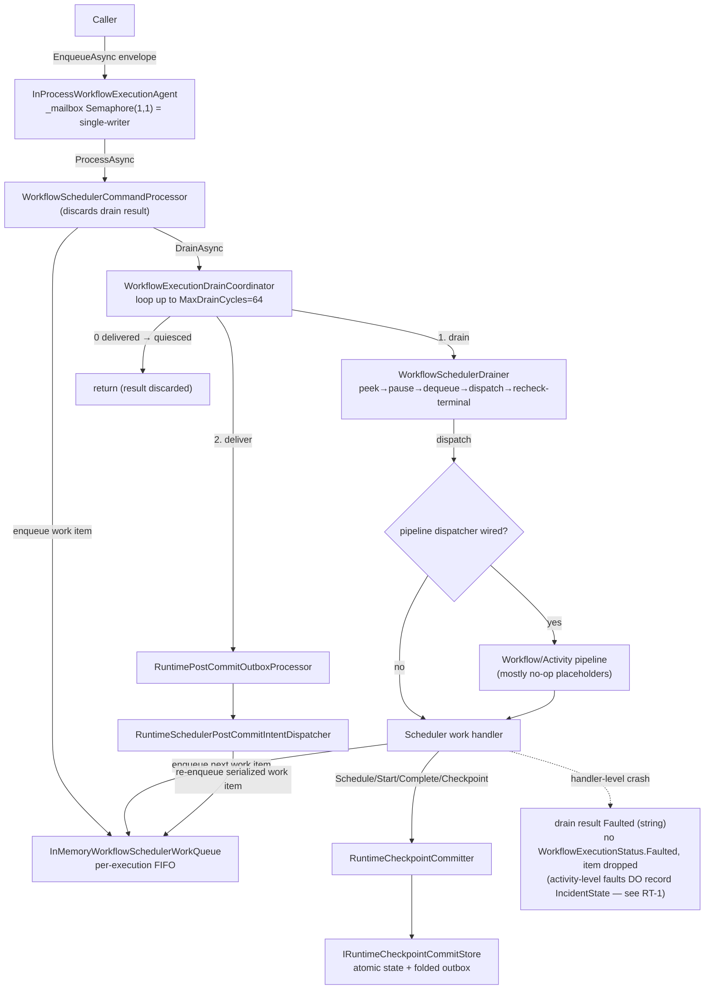

# Elsa 4 Workflow Runtime — Architecture Review

Scope: `src/Elsa/Workflows/Runtime/**` (Core, Api, and the drainer/scheduler/checkpoint spine),
`src/Elsa/Workflows/Primitives/**`, cross-referenced with `docs/adr/0020`, `docs/adr/0029`,
`specs/082-runtime-pipeline-execution-spine`, `specs/083-runtime-checkpoint-slot-decomposition`.
The real activity-invocation handler (`WorkflowInvokeActivitySchedulerWorkHandler`, ~970 lines) lives in
`src/Elsa/Activities/Runtime/Services/` and is *out of scope*; the runtime Core ships a faulting fallback for it.

---

## Executive summary

The runtime is a **command → work-item queue → per-execution drainer → checkpoint-commit → post-commit-outbox** loop,
and the core mechanics (queue, drain coordinator, outbox retry, checkpoint atomicity contract) are thoughtfully
designed and heavily commented. But three things undercut it. (1) **Fault semantics are incomplete**: activity-level
faults *are* recorded (`ActivityFaultIncidentRecorder` in the Activities domain commits `IncidentState` + faulted
`ActivityExecutionState` for all three fault arms — see the RT-1 correction below), but no code path anywhere assigns
`WorkflowExecutionStatus.Faulted`, a *handler-level* crash is captured as a string in an in-memory drain result that
the command processor then discards, and the crashed work item is dropped with no retry/poison handling — so at the
workflow level, faults remain unobservable. (2) The **single-writer guarantee is unstated and
unenforced** below the agent mailbox; the drainer's peek→pause→dequeue and terminal-status re-check are correct only
under an assumption nothing documents or asserts. (3) The **pipeline spine (ADR 0029) and checkpoint-slot
decomposition (specs/083) are half-built**: all activity-pipeline slots and 3/4 workflow slots are empty pass-throughs,
exactly one handler (Cancel) uses the new staging path, and the phase behavior it is supposed to replace still lives
inline — a transitional state the ADR predicted but which is now a live inconsistency and a double-commit foot-gun.
Code quality is dragged down by telescoping constructors (7 on the drainer, 7 on the commit store), ambient
service-locators (`IWorkflowExecutionAmbientServicesAccessor`, AsyncLocal pipeline-context hand-off), heavy per-activity
overhead (~9 work items and 4–5 full checkpoint commits per single activity), and near-duplicate ~250-line scheduler
handlers. Naming is systematically over-qualified. The composition root for the entire runtime lives inside the *API*
feature. None of this is unrecoverable — the bones are good — but the fault story and the single-writer contract are
must-fix before this is trustworthy.

---

## Architecture map: command arrives → workflow quiesced

**Prose walk-through (happy path, one activity):**

1. A caller obtains an agent from `InProcessWorkflowExecutionAgentProvider.GetAgentAsync` (per-execution
   `SemaphoreSlim` lifecycle lock) and calls `agent.EnqueueAsync(envelope)`
   (`InProcessWorkflowExecutionAgentProvider.cs:133`). The agent's `_mailbox` semaphore (1,1) **serializes all commands
   for one execution** and does idempotency-key de-dup (`:146-161`). *This mailbox is the only thing that makes the
   whole downstream stack single-writer.*
2. `WorkflowSchedulerCommandProcessor.ProcessAsync` wraps the command into a `RuntimeSchedulerWorkItem`, enqueues it,
   asks `IWorkflowSchedulerDrainPolicy` for a drain request, and calls the drain coordinator
   (`WorkflowSchedulerCommandProcessor.cs:51-77`). **It discards the returned `RuntimeSchedulerDrainResult`.**
3. `WorkflowExecutionDrainCoordinator.DrainSchedulerAndPostCommitWorkAsync` loops up to `MaxDrainCycles` (default 64):
   each cycle drains the scheduler queue to empty, then delivers one batch of `EnqueueSchedulerWork` outbox intents; it
   stops when a cycle delivers 0 outbox items (quiesced) or a drain stopped on fault/pause
   (`WorkflowExecutionDrainCoordinator.cs:59-92`).
4. `WorkflowSchedulerDrainer.DrainAsync` reads terminal status once on entry, then per item does **peek → pause-gate
   evaluate → dequeue → dispatch → re-check terminal status** (`WorkflowSchedulerDrainer.cs:111-142`). Dispatch either
   calls the handler directly or, when wired, routes through the runtime execution pipeline
   (`RuntimeExecutionPipelineDispatcher`).
5. Handlers advance a **micro-state-machine per activity**: `ScheduleActivity` → commit `ActivityScheduled` +
   post-commit intent to enqueue `StartActivity` → `StartActivity` → commit `ActivityStarted` + intent to enqueue
   `InvokeActivity` → (`InvokeActivity` handled in the Activities domain) → `CompleteActivity(ActivityCompleted)` →
   `CompleteActivity(ParentCompletionEvaluation)` → `CompleteActivity(ContinuationScheduling)` →
   `Checkpoint(ActivityCompleted|WorkflowCompleted)`.
6. Each commit goes through `RuntimeCheckpointCommitter` → persistence policy → `IRuntimeCheckpointCommitStore`
   (`InMemoryRuntimeCheckpointCommitStore`), which applies all typed state changes and **folds post-commit intents into
   the same atomic change set** (ADR 0020), returning pending outbox IDs.
7. The coordinator's outbox step (`RuntimePostCommitOutboxProcessor`) reads deliverable items and calls
   `RuntimeSchedulerPostCommitIntentDispatcher`, which **re-enqueues the serialized scheduler work item**, feeding the
   next drain cycle. At-least-once with retry/backoff/poison in `InMemoryRuntimeCheckpointCommitStore`.
8. When a drain cycle enqueues nothing new, the loop quiesces; control returns (result discarded) and the mailbox is
   released for the next command.

---

## Findings

### RT-1 — Critical — Fault semantics are incomplete: no workflow-level Faulted transition, drain results discarded, handler crashes dropped

> **Verification correction (2026-07-02):** this finding originally claimed "there is no fault path; no code ever
> constructs an `IncidentState`." That was wrong — an artifact of this report's scope excluding
> `src/Elsa/Activities/Runtime/` (see scope note). Consolidated-review verification confirmed that
> `ActivityFaultIncidentRecorder` (`src/Elsa/Activities/Runtime/Services/ActivityFaultIncidentRecorder.cs`) **does**
> commit `IncidentState` + a faulted `ActivityExecutionState` for all three activity fault arms (input
> materialization, construction, execution — `WorkflowInvokeActivitySchedulerWorkHandler.cs:178,221,362`), including
> child-fault parent/join evaluation (#308) via `ChildFaultParentEvaluation` and
> `WorkflowParentActivityCompletionSchedulerWorkHandler`. The finding below is recalibrated to what is *actually*
> missing. The consolidated report (§3.1) is the authoritative wording.

**Evidence:** grep across the full `src/` tree: **zero** writes of `WorkflowExecutionStatus.Faulted` (activity-level
incidents are recorded, but no workflow-status transition follows); `WorkflowSchedulerDrainer.cs:201-212` (handler
crash → `error: exception.ToString()` in an in-memory result, item already dequeued at `:128`);
`WorkflowSchedulerCommandProcessor.cs:77` (drain result discarded).

**Explanation:** Three genuine gaps remain. (a) **No workflow-level fault policy:** a workflow whose activity has a
blocking incident stays `Running` forever — `IsTerminal()` never fires for faults, so observers cannot distinguish a
faulted workflow from a healthy suspended one. (b) **Handler-level crashes are dropped:** when a scheduler work
handler itself throws, the drainer converts it to a `Faulted` `RuntimeSchedulerWorkItemResult`, breaks the loop, and
returns — but the work item was already dequeued (`:128`), so it is gone: no poison queue, no requeue, no retry, no
incident (the incident recorder only covers the activity fault arms, not drainer/handler crashes). (c) **Drain
outcomes are invisible:** the command processor discards the drain result, so `agent.EnqueueAsync` returns `Accepted`
even when execution faulted (see RT-14). On the next command, `IsWorkflowTerminatedAsync` reads `Running` and resumes
with whatever is left in the queue.

**Recommendation:** (1) define the workflow-level fault policy — blocking incident → `WorkflowExecutionStatus.Faulted`
transition, or a documented "incident-paused" status an operator can query; (2) record handler-level crashes to a
poison/retry store honoring `IRuntimeDomainRetryPolicy` (currently `Noop`) instead of dropping the item; (3) surface
the terminal drain outcome to dispatch callers (RT-14); (4) unify fault capture as structured incident data rather
than `exception.ToString()` strings (RT-12). Add a guardrail test that a throwing *handler* leaves the workflow
observable as faulted with a recorded incident.

### RT-2 — Critical — Single-writer / single-drainer-per-execution is assumed, never enforced
**Evidence:** `WorkflowSchedulerDrainer.cs:105-141` (the correctness argument in the comment relies on "the workflow can
only become terminal as a result of work dispatched inside this loop"); `InMemoryWorkflowSchedulerWorkQueue.cs`
(no ownership/lease, no per-execution drain claim); all runtime services registered **Singleton**
(`WorkflowsRuntimeApiFeature.cs:35-136`); the only serialization point is `InProcessWorkflowExecutionAgent._mailbox`
(`InProcessWorkflowExecutionAgentProvider.cs:96,146`).

**Explanation:** The drainer's design (peek at :117, evaluate pause on the *peeked* item at :121, dequeue a *separate*
call at :128, terminal re-check at :111/:141) is only safe if exactly one drainer runs per execution at a time. That
guarantee exists **solely** because callers go through the agent mailbox. Nothing in the drainer, queue, coordinator, or
stores claims ownership or detects a second concurrent drainer. Two consequences: (1) the peek→dequeue TOCTOU (nothing
asserts the dequeued `WorkItemId` equals the peeked one, so a pause decision computed for item A could gate the dequeue
of item B if a second writer interleaves); (2) the "read terminal status once, re-check only after dispatch"
optimization becomes a lost-update/double-dispatch hazard the moment a durable queue provider or a second host drains
the same execution. Also, "cancel while draining" cannot actually interrupt an in-flight drain — the Cancel envelope
queues behind the mailbox and is only observed at command boundaries, so a long burst is uncancellable mid-flight.

**Recommendation:** Make the single-writer contract explicit and enforced at the drain layer (a per-execution drain
lease/claim in `IWorkflowSchedulerWorkQueue` or the drainer), independent of the in-process mailbox, so durable/
distributed providers inherit it. Assert `dequeued.WorkItemId == peeked.WorkItemId` (or fold peek+pause into an atomic
"dequeue-if-not-paused"). Document the assumption on `IWorkflowSchedulerDrainer`. Define cancel semantics
(cooperative-at-boundary vs. cancellation token threaded into the burst).

### RT-3 — High — Outbox retry has no pump; failed post-commit work can stall indefinitely
**Evidence:** retry/backoff/poison implemented in `InMemoryRuntimeCheckpointCommitStore.cs:579-613`
(`FailedRetryable` items get `AvailableAt = now + delay`); the **only** driver of the outbox is the coordinator loop
during synchronous command processing (`WorkflowExecutionDrainCoordinator.cs:75-91`); grep confirms **no**
`IHostedService`/`BackgroundService`/`PeriodicTimer` in the runtime.

**Explanation:** A transiently failing `EnqueueSchedulerWork` intent is marked `FailedRetryable` with a future
`AvailableAt`. The coordinator stops the current drain when a cycle delivers 0 items. Nothing re-drives the outbox
later; the next attempt only happens if a *new external command* arrives for that execution. For a workflow that has
otherwise quiesced, its continuation is stranded until (and unless) someone sends another command — a liveness bug for
the durability story the outbox exists to provide.

**Recommendation:** Add a background outbox pump (hosted service / recovery scanner tick) that periodically selects
deliverable items across executions and re-drives them, re-activating the owning agent. `IRuntimeRecoveryScanner`
already exists as a seam; wire it.

### RT-4 — High — The entire runtime composition root lives in the *API* feature, all as singletons
**Evidence:** `WorkflowsRuntimeApiFeature.ConfigureServices` registers stores, drainer, coordinator, command processor,
pipeline, selector, dispatcher, all handlers, agent provider, checkpoint committer, etc. — ~90 registrations
(`WorkflowsRuntimeApiFeature.cs:28-138`), every one `TryAddSingleton`.

**Explanation:** A domain's `.Core` is supposed to be host-agnostic, but the only place the runtime is actually wired is
a FastEndpoints API feature. A non-HTTP host (worker, test harness, another module) cannot compose the runtime without
copying this method. Singleton-only means the in-memory stores are process-global (fine for the reference impl, but it
bakes lifetime assumptions into contracts — e.g. handlers can't take scoped dependencies), and it invites captive-
dependency bugs when a durable provider needs a scoped `DbContext`. The comment at `:41` already works around one
captive-scope hazard, evidence the lifetime model is fragile.

**Recommendation:** Move the runtime wiring into a Core-owned `AddWorkflowRuntimeCore()` registration (or a non-API
runtime feature) that the API feature composes on top of. Decide the lifetime story deliberately (scoped drain scope vs.
singleton stores) rather than defaulting everything to singleton.

### RT-5 — High — The Incident subsystem is written but never read (dead-end affordance)

> **Verification correction (2026-07-02):** originally claimed "never populated / no `new IncidentState(`" — wrong
> for the same scope reason as RT-1. `ActivityFaultIncidentRecorder.cs:179` constructs `IncidentState`, and incidents
> are committed through the checkpoint pipeline for all activity fault arms. Recalibrated below.

**Evidence:** `IncidentState.cs` (156 lines), `IIncidentStateStore`, `InMemoryIncidentStateStore.cs`, incident change
validation + apply path in `InMemoryRuntimeCheckpointCommitStore.cs:367-383,515-529`, `RuntimeStateCategory.Incident`;
incidents are *written* by `ActivityFaultIncidentRecorder` — but grep finds no consumer: nothing queries
`IIncidentStateStore` to drive a workflow-status transition, no operator/HTTP surface exposes incidents, and no
policy (halt/continue/compensate, à la Elsa 3's incident strategies) reads them.

**Explanation:** The write side is real; the read side dead-ends. An incident is durably recorded and then nothing
ever acts on it — the workflow stays `Running` (RT-1 gap a), and no API lets an operator discover the incident short
of querying the store by hand.

**Recommendation:** Build the consumption half as part of the RT-1 fault policy: blocking-incident → workflow status
transition, an incident query/list surface for operators, and (later) an Elsa-3-style incident-handling policy
(fault-and-halt vs. fault-and-continue).

### RT-6 — High — ADR 0029 Move 2 / specs/083 is half-applied; inconsistent and double-commit-prone
**Evidence:** `RuntimeWorkflowCheckpointMiddleware.cs` commits `context.Workspace.PendingCheckpointCommit` on unwind;
**only** `WorkflowCancelSchedulerWorkHandler.cs:140-143` stages to the workspace; every other handler
(`WorkflowCheckpointSchedulerWorkHandler.cs:59`, `WorkflowScheduleActivitySchedulerWorkHandler.cs:86`,
`WorkflowStartActivitySchedulerWorkHandler.cs:90`) commits **inline**; all seven activity-pipeline slots and 3/4
workflow slots are empty placeholders (`RuntimeActivityMiddlewarePlaceholders.cs`, `RuntimeWorkflowMiddlewarePlaceholders.cs`);
DI registers the placeholders + the one real checkpoint middleware (`WorkflowsRuntimeApiFeature.cs:73-83`).

**Explanation:** The transitional shape is *predicted* by ADR 0029 ("behavior remains duplicated in concept between the
handlers and the empty slots"), but as it stands the mental model is actively misleading: the workflow Checkpoint slot
is real, the activity Checkpoint slot is a no-op, and whether a commit happens in the slot or inline depends on the one
handler that opted in. The foot-gun: any future handler that both stages `PendingCheckpointCommit` **and** calls
`CommitAsync` inline will double-commit (the committer is idempotent by `CommitId`, so it would be masked — until a
handler builds a different `CommitId`). The activity-pipeline checkpoint slot being a placeholder while
`WorkflowScheduleActivitySchedulerWorkHandler`/`WorkflowStartActivitySchedulerWorkHandler` commit inline means the
activity pipeline provides no checkpoint extension point at all yet.

**Recommendation:** Sequence Move 2 so that within a pipeline kind, *all* checkpoint commits go through the slot before
the slot is advertised as the extension point — or gate the checkpoint middleware to assert "handler either staged or
committed inline, never both." Track the per-handler conversion status somewhere discoverable (the plan Debug log at
`:157` helps, but the inline/staged split is invisible there).

### RT-7 — High — Ambient service-locators hide two core dependencies
**Evidence:** `IWorkflowExecutionAmbientServicesAccessor` + `WorkflowSchedulerDrainer.cs:168-169`
(`_ambientServicesAccessor.Current?.GetService<IWorkflowExecutionStateStore>() ?? _workflowExecutionStateStore`);
`IRuntimePipelineContextAccessor` (AsyncLocal) used to hand the mutable `RuntimePipelineWorkspace` to a terminal handler
that receives no context parameter (`RuntimeExecutionPipelineDispatcher.cs:43-53`, consumed in
`WorkflowCancelSchedulerWorkHandler.cs:140`).

**Explanation:** Two service-locator patterns. (1) The drainer resolves its state store either from an
AsyncLocal-pushed `IServiceProvider` or a fallback field — a request-scoped service pulled from ambient state instead of
injected, which makes the dependency invisible and the two-source fallback a subtle source of "which store am I
writing?" bugs. (2) Move 2 threads the pipeline workspace through AsyncLocal because `IWorkflowSchedulerWorkHandler.
HandleAsync(workItem, ct)` has no context parameter; the handler reaches back through a singleton AsyncLocal accessor to
mutate shared state. Both are hard to test, hard to trace, and AsyncLocal is fragile across un-awaited continuations /
`Task.Run` boundaries.

**Recommendation:** Inject the state store directly (it is a registered service; the ambient indirection buys nothing
here). For Move 2, evolve the handler contract to receive the pipeline context/workspace as a parameter rather than
smuggling it via AsyncLocal — this is the right time, since Move 2 is already reshaping handlers.

### RT-8 — Medium — Telescoping constructors (production types carrying test-only ctors)
**Evidence:** `WorkflowSchedulerDrainer.cs:18-94` — **7** public constructors, only the widest (`:71`) used by DI
(`WorkflowsRuntimeApiFeature.cs:106-114`); `InMemoryRuntimeCheckpointCommitStore.cs:22-90` — **7** constructors, DI uses
the widest 8-arg one. `WorkflowCompleteActivitySchedulerWorkHandler.cs:18-40` and `WorkflowSchedulerPauseGate.cs:17-31`
and `WorkflowSchedulerCommandProcessor.cs:13-36` add more of the same (a `TimeProvider.System` default overload each).

**Explanation:** The extra ctors exist only so tests can construct these types with fewer collaborators. They bloat the
public surface, obscure the real dependency set, and let a caller accidentally construct a half-wired drainer (e.g. one
with no pause gate and no state store, silently disabling the terminal-status guard — see `IsWorkflowTerminatedAsync`
returning `false` when the store is null, `:161-162`).

**Recommendation:** Collapse to one primary constructor with required dependencies; give tests a builder/factory or use
`TimeProvider.System` as a defaulted parameter on the single ctor. Make `IWorkflowExecutionStateStore` non-optional on
the drainer so the terminal guard cannot be silently disabled.

### RT-9 — Medium — Near-duplicate ~250-line scheduler handlers
**Evidence:** `WorkflowScheduleActivitySchedulerWorkHandler.cs` and `WorkflowStartActivitySchedulerWorkHandler.cs` are
~80% identical: `DeserializeXPayload` (`:89`/`:93`), `IsXPayloadValidationException` (`:107`/`:111`), `NewCommitAsync`
(`:157`/`:135`), `NewEnqueueSchedulerWorkIntent` (`:251`/`:229`), the metadata-dictionary construction, and the
checkpoint-commit shape are copy-paste variants. `WorkflowCheckpointSchedulerWorkHandler` and
`WorkflowCancelSchedulerWorkHandler` repeat the same commit-assembly boilerplate again. The five `New*WorkItem` builders
across handlers repeat the same 12-field `RuntimeSchedulerWorkItem` construction with a `:suffix` id convention.

**Explanation:** Every state transition re-implements payload deserialize + validation-exception predicate + metadata
dict + inspection projection + checkpoint commit + post-commit intent. This is exactly the duplication ADR 0029 Move 2
is meant to remove by relocating phases into shared slot middleware; until then it is a maintenance multiplier (a change
to checkpoint metadata keys must be made in ~6 places).

**Recommendation:** Extract the shared commit-assembly, work-item-builder, and payload-deserialize helpers now (a
`SchedulerWorkHandlerHelpers` already exists — grow it) even before Move 2, so the eventual slot extraction has one
source to move.

### RT-10 — Medium — Per-activity execution overhead is very high
**Evidence:** the chain in `WorkflowScheduleActivitySchedulerWorkHandler` → `WorkflowStartActivitySchedulerWorkHandler`
→ (Activities-domain invoke) → `WorkflowCompleteActivitySchedulerWorkHandler` (4 sub-kinds, `:73-99`) →
`WorkflowCheckpointSchedulerWorkHandler`. A single activity traverses **~9 scheduler work items** and **4–5 full
checkpoint commits**, each of which JSON-serializes a payload (`JsonSerializer.SerializeToElement`), builds an
inspection projection (`BuildProjectionAsync`), folds the outbox, and round-trips through the coordinator's drain+outbox
cycle.

**Explanation:** Schedule, Start, and Invoke are three separately-checkpointed durable transitions per activity, and
completion propagation is a further three-hop work-item relay (`ActivityCompleted` → `ParentCompletionEvaluation` →
`ContinuationScheduling` → `Checkpoint`). elsa-core runs scheduling/starting in-memory inside a burst and checkpoints at
suspension points; here every micro-transition is a durable checkpoint + queue round-trip. For a workflow of N
activities this is ~9N work items and O(N) JSON (de)serializations and inspection projections — a substantial constant
factor on the hot path.

**Recommendation:** Decide explicitly which transitions *need* durable checkpoints. Consider collapsing
Schedule+Start (and the three completion hops) into fewer checkpoints, or making intermediate transitions
persistence-policy `Skip`-able so the `ImmediateRuntimeCheckpointPersistencePolicy` isn't forced to persist every
micro-step. Benchmark a trivial 3-activity workflow to quantify.

### RT-11 — Medium — `CompleteActivity` payload is deserialized up to 4× per dispatch
**Evidence:** `RuntimeSchedulerPipelineSelector.cs:39-48` reads the payload once as a raw property
(`ReadsAsParentCompletionKind`) then again via full `Deserialize` (`DeserializesAsParentCompletion`);
`WorkflowCompleteActivitySchedulerWorkHandler.CanHandle` deserializes it again (`:56`); `HandleAsync` deserializes it a
fourth time (`:72`, `DeserializeCompletePayload`).

**Explanation:** The same `JsonElement` is parsed up to four times on every `CompleteActivity` dispatch (the most
frequent kind, since it fires 3× per activity). This is CPU + allocation on the hottest path, driven by the selector
needing to mirror the handler's `CanHandle` discriminator.

**Recommendation:** Deserialize the payload once per dispatch and pass the typed payload (or the derived
`CompletionKind`) through the selector → handler path. If the handler contract can't carry it yet, at least have the
selector reuse a single parse.

### RT-12 — Medium — Inconsistent fault-string capture policy
**Evidence:** drainer stores `exception.ToString()` (full type + message + stack)
(`WorkflowSchedulerDrainer.cs:211`); the outbox stores `exception.Message` only (via `RuntimeFailureMessages.For`,
`RuntimePostCommitOutboxProcessor.cs:71`, `RuntimeFailureMessages.cs:5`).

**Explanation:** Two different fault-serialization conventions for two adjacent subsystems. `ToString()` on the hot path
allocates a full stack string (and may leak sensitive data / be huge); `Message` may be empty. There is no single
policy, and neither is structured (no exception type/code field for programmatic handling — see RT-1).

**Recommendation:** Define one fault-capture policy (structured: type, message, optional stack behind a diagnostics
flag) and use it in both the drainer and the outbox. Avoid unconditional `ToString()` on the hot path.

### RT-13 — Medium — At-least-once redelivery can double-execute because the dedup key is dropped on dequeue
**Evidence:** `InMemoryWorkflowSchedulerWorkQueue.EnqueueAsync` de-dups by `(WorkflowExecutionId, WorkItemId)` **only
while the item is still queued** (`:19-30`); `DequeueAsync` removes the key on dequeue (`:65`). The outbox is
at-least-once (`RuntimePostCommitOutboxProcessor` records `Delivered` *after* dispatch, `:63-88`).

**Explanation:** If intent dispatch (re-enqueue) succeeds but recording `Delivered` fails, the item stays deliverable
and is re-dispatched. Because the dedup key was removed when the item was first dequeued and processed, the re-enqueue
is **not** de-duplicated and the work item runs a second time. Today this is masked by handler status guards
(`StartActivity` checks `Running`/`Scheduled` at `:72-79`, `ScheduleActivity` checks existing state at `:66`), i.e.
correctness relies on every handler being idempotent rather than on the queue. That is a fragile invariant to leave
undocumented.

**Recommendation:** Keep a processed-work-item ledger (or tombstone) in the queue so redelivery of an already-processed
`WorkItemId` is a no-op, and/or document "all scheduler handlers MUST be idempotent" as a hard contract with a
conformance test.

### RT-14 — Medium — Drain outcome (fault / outbox-failure) is invisible to the caller
**Evidence:** `WorkflowSchedulerCommandProcessor.cs:77` awaits `DrainAsync` and discards the result;
`InProcessWorkflowExecutionAgent.EnqueueAsync` returns `Accepted` regardless (`:158-161`); stop reasons
`Faulted`/`OutboxDeliveryFailed` are computed (`WorkflowExecutionDrainCoordinator.cs:66-90`) but never propagated.

**Explanation:** Because processing is synchronous under the mailbox, the caller *could* be told the workflow faulted or
that outbox delivery failed — but the result is thrown away and the dispatch status is always `Accepted`. Combined with
RT-1, a fault is unobservable end-to-end.

**Recommendation:** Propagate a terminal drain summary into `WorkflowExecutionCommandDispatchResult` (e.g.
`AcceptedButFaulted`, or surface stop reason), or at minimum log at Warning/Error when a drain stops on
`Faulted`/`OutboxDeliveryFailed`.

### RT-15 — Low — Dead enum value `CycleCapExhausted`
**Evidence:** `RuntimeSchedulerDrain.cs:87` defines `RuntimeSchedulerDrainStopReason.CycleCapExhausted`; the coordinator
**throws** `WorkflowExecutionDrainCycleLimitExceededException` instead of returning it
(`WorkflowExecutionDrainCoordinator.cs:97-98`). No code assigns the value.

**Recommendation:** Remove the enum member or switch the coordinator to return it (returning is arguably better than
throwing for a policy limit).

### RT-16 — Low — Allocation-heavy lookups in `WorkflowExecutionContext`
**Evidence:** `WorkflowExecutionContext.GetOutput(string)` does `.Values.Where(...).ToArray()` over all activity outputs
per call for an ambiguity check (`:91-100`); `GetVariables()` / `GetWorkflowInputs()` allocate fresh copies per call
(`:127-130`). The output map is keyed by string concatenation `"$id:$name"` (`:188-189`).

**Recommendation:** Index outputs by name for the common single-match case; avoid per-call LINQ materialization. Low
priority unless this context is on the activity hot path.

### RT-17 — Low — Peek/List allocates per drain iteration
**Evidence:** `WorkflowSchedulerDrainer.PeekAsync` calls `ListAsync(limit:1)` which allocates an array + does
`FirstOrDefault` every iteration (`:215-218`); `DrainAsync` allocates a `List<RuntimeSchedulerWorkItemResult>` even when
the queue is empty/terminal on entry (`:102`).

**Recommendation:** Add a `TryPeekAsync` to `IWorkflowSchedulerWorkQueue` (the in-memory `Queue<T>` supports O(1)
`TryPeek`); lazily allocate the results list.

### RT-18 — Low — Empty placeholder middleware are a standing re-orphaning risk
**Evidence:** 3/4 workflow slots and 7/7 activity slots are empty pass-throughs
(`RuntimeWorkflowMiddlewarePlaceholders.cs`, `RuntimeActivityMiddlewarePlaceholders.cs`), all DI-registered
(`WorkflowsRuntimeApiFeature.cs:73-83`). ADR 0029 added a guardrail test for *invocation*, but there is nothing
asserting a slot's *behavior* is implemented before it is advertised.

**Recommendation:** Keep the ADR-0029 invocation guardrail, and add per-slot "behavior present" markers or tests as
Move 2 fills each slot, so an empty slot is never mistaken for a wired one (this is the exact failure class ADR 0029
called out).

---

## Naming table

| Current name | Proposed name | Rationale |
|---|---|---|
| `IWorkflowExecutionAmbientServicesAccessor` | `IWorkflowExecutionServiceScope` (or remove — RT-7) | "AmbientServicesAccessor" names a mechanism (ambient) not a role; it's a per-execution service scope. |
| `RuntimePostCommitOutboxProcessResult` | `OutboxDeliveryResult` | Four qualifiers ("Runtime/PostCommit/Outbox/Process") for what is a delivery result; `Outbox` already implies post-commit. |
| `RuntimePostCommitOutboxProcessRequest` | `OutboxDeliveryRequest` | Same over-qualification. |
| `RuntimePostCommitOutboxProcessedItem` | `OutboxDeliveryOutcome` | "ProcessedItem" is vague; it records a per-item delivery outcome. |
| `RuntimePostCommitIntentDispatcher` / `RuntimeSchedulerPostCommitIntentDispatcher` | `OutboxIntentDispatcher` / `SchedulerWorkOutboxDispatcher` | The `PostCommitIntent` + `Outbox` + `Dispatcher` stack is redundant; only one concept (deliver a queued intent). |
| `IRuntimeActivityExecutionInspectionAccumulator` | `IActivityInspectionProjector` | Five words; it projects/builds inspection snapshots, "Accumulator" misdescribes it (it builds one projection per call). |
| `WorkflowScheduleActivitySchedulerWorkHandler` | `ScheduleActivityHandler` | `Workflow…SchedulerWorkHandler` wraps `ScheduleActivity` in 3 redundant qualifiers; the interface already says handler. |
| `WorkflowStartActivitySchedulerWorkHandler` | `StartActivityHandler` | As above. |
| `WorkflowCompleteActivitySchedulerWorkHandler` | `CompleteActivityHandler` | As above. |
| `MissingActivityInvocationSchedulerWorkHandler` | `UnconfiguredInvokeActivityHandler` | "Missing…Handler" reads like the handler is missing; it's the fallback when the invoker is unconfigured. |
| `RuntimeCheckpointInconsistentDurabilityException` | `CheckpointPartialPersistException` | "InconsistentDurability" is jargon; the condition is a partial persist between state and outbox. |
| `WorkflowExecutionDrainCycleLimitExceededException` | `DrainCycleLimitExceededException` | `WorkflowExecution` prefix is implicit in the runtime namespace. |
| `RuntimeSchedulerWorkItem` / `RuntimeSchedulerWorkItemResult` / `IWorkflowSchedulerWorkHandler` / `IWorkflowSchedulerWorkQueue` | drop one of `Scheduler`/`Work` | The paired `Scheduler`+`Work` qualifiers are on nearly every scheduler type; pick one (`SchedulerItem`, `ISchedulerHandler`, `ISchedulerQueue`). |
| `RuntimeWorkflowCheckpointMiddleware` vs `RuntimeWorkflowLoadStateMiddleware` (placeholders) | keep, but mark placeholders | Real and placeholder middleware share a naming scheme with no way to tell them apart (RT-6/RT-18). Suffix placeholders `…SlotPlaceholder`. |
| `IWorkflowExecutionDrainCoordinator` | `IWorkflowDrainLoop` (optional) | "Coordinator" is a low-information suffix; it *is* the drain+outbox loop. Minor. |

(General rule surfaced by this scope: the runtime over-qualifies. `Runtime*`, `Workflow*`, `Scheduler*`, `Work*`,
`PostCommit*` are stacked 3–5 deep on many types even though the namespace already establishes the context.)

---

## Open questions (could not resolve from code alone)

1. **Where does downstream continuation graph traversal actually happen?**
   `WorkflowCompleteActivitySchedulerWorkHandler.CreateDownstreamSchedulingAsync` validates the executable node but
   returns `DownstreamSchedulingResult.Terminal()` whenever there are outcomes (`:178-193`) — it never schedules the
   *next* activity. Is next-node scheduling entirely delegated to the out-of-scope
   `Activities/Runtime/…WorkflowInvokeActivitySchedulerWorkHandler`? If so, the Core completion handler's
   "ContinuationScheduling" step looks like it does nothing but rename the work item — is that intentional, or an
   incomplete slice?
2. **Is there any background driver for the outbox / recovery, outside synchronous command processing?**
   None found in scope (RT-3). `IRuntimeRecoveryScanner` exists (`InMemoryRuntimeRecoveryScanner`) — is a hosted pump
   planned, or is re-drive expected to be provider-supplied?
3. **State versioning / schema migration.** `WorkflowExecutionState`, `RuntimeCheckpoint`, and the change sets carry no
   schema-version field. How are persisted-state format changes migrated across engine versions on durable providers?
4. **Intended single-writer enforcement for durable/distributed providers.** The in-process mailbox provides it today
   (RT-2). Is there a planned lease/ownership contract (the outbox query has an unused `OwnerId` filter that the
   in-memory store rejects, `InMemoryRuntimeCheckpointCommitStore.cs:175-176`) that will also gate drains?
5. **Fault propagation policy.** `RuntimeWaitDependentIntentFailurePolicy` enumerates FaultWorkflow/Compensate/etc.
   (`RuntimeCheckpointCommit.cs:191-198`) but no code consumes it. Is the fault path (RT-1) intended to honor these, and
   where would `Compensate` be implemented?
6. **Pause/cancel semantics during a burst.** Is "cancel is only observed at command boundaries" (RT-2) the intended
   contract, or should a cancellation token be threaded into an in-flight drain?
