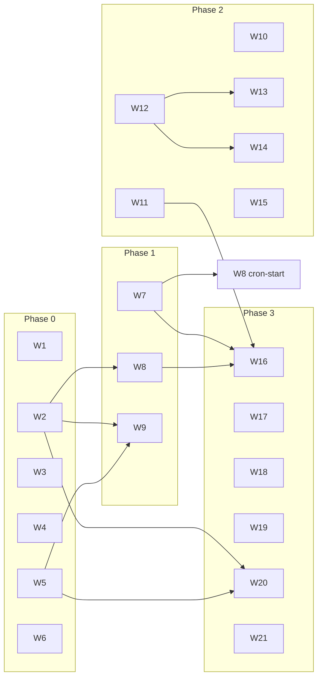

# Elsa 4 Improvement Roadmap — Work-Unit Implementation Briefs (W1–W21)

Companion to [the consolidated review](../elsa-4-architecture-review-2026-07.md) (§7 lists the same
units in summary form). This document expands each work unit into an implementation brief suitable
for hand-off to a dedicated coding agent or engineer. Finding IDs (RT-n, PS-n, IN-n, DS-n, MS-n,
MD-n, NM-n, TS-n, E3-n) reference the [sub-reports in this folder](README.md), which carry the full
file:line evidence.

Review baseline: working tree at commit `ffafa32f` (2026-07-02). Re-verify evidence lines against
the current tree before implementing; line numbers drift.

## How to execute a work unit

1. Read the brief below, then the referenced findings in the sub-reports for evidence and rationale.
2. Follow the repo's Speckit flow for feature-sized units (`speckit-specify` → `speckit-plan` →
   `speckit-tasks` → `speckit-implement`); small hygiene units (W6) can go straight to a work branch.
3. Respect the constitution gates: feature-registration tests (§2.23.1), `public sealed`
   logic-bearing implementations, unit tests for new/changed behavior, no new `InternalsVisibleTo`.
4. When project references, features, or extension points change: refresh the generated maps
   (`bash tools/maps/generate-maps.sh` + the specific layer scripts) and update
   `EXTENSION_POINTS.md` / extension-point catalogs.
5. One work unit per branch/PR unless the brief says otherwise. Reference the finding IDs in the
   PR description.

Sizes: **S** ≤ 1 day, **M** ≈ 2–4 days, **L** ≈ 1–2 weeks, **XL** > 2 weeks (agent-adjusted; treat
as relative effort).

---

## Phase 0 — Safety & correctness

Do these first. W1–W6 are independent of each other and parallelizable.

### W1. Fault semantics end-to-end

- **Findings:** RT-1 (recalibrated — read the correction note in `review-runtime.md`), RT-12, RT-14, RT-5. Size: **L**.
- **Goal:** A faulting workflow becomes *observable* and handler crashes stop being dropped work.
- **Current state (verified):** activity-level faults DO commit `IncidentState` + faulted
  `ActivityExecutionState` via `ActivityFaultIncidentRecorder`
  (`src/Elsa/Activities/Runtime/Services/`, all three fault arms, incl. parent/join evaluation #308).
  What's missing: (a) no code path assigns `WorkflowExecutionStatus.Faulted` — workflows with
  blocking incidents stay `Running` forever; (b) handler-level drainer crashes become
  `exception.ToString()` in an in-memory drain result and the dequeued item is dropped (no
  retry/poison) — `WorkflowSchedulerDrainer.cs:201-212`; (c)
  `WorkflowSchedulerCommandProcessor.ProcessAsync` discards the drain result, so enqueue callers
  always observe success.
- **Scope:**
  1. Define the workflow-level fault policy: blocking incident → `Faulted` status transition (or a
     deliberate, documented "incident-paused" status) committed through the checkpoint pipeline.
  2. Propagate `RuntimeSchedulerDrainResult` from the drainer through the command processor to
     dispatch callers (RT-14).
  3. Handler-level crash handling: poison/retry store honoring `IRuntimeDomainRetryPolicy`
     (currently `Noop`) instead of dropping the item.
  4. Structured fault capture: replace `exception.ToString()` strings with incident data; unify the
     two divergent capture policies (RT-12).
  5. Incident *consumption* surface: status transition driven by incidents + an operator query
     endpoint (RT-5).
- **Acceptance:** a throwing activity leaves the workflow queryable as faulted with an incident; a
  throwing *handler* leaves a poison/retry record and a non-success dispatch outcome; guardrail
  tests for both; no drain result is silently discarded anywhere.

### W2. Durable resumption chain

- **Findings:** PS-2, RT-3; closes test gap TS "crash injection". Size: **L**.
- **Goal:** Groundwork-backed hosts survive a crash between commit and dispatch.
- **Current state (verified):** `AddGroundworkRuntimeStores()` swaps 10 store contracts but NOT
  `IWorkflowSchedulerWorkQueue` — `WorkflowsRuntimeApiFeature.cs:64` registers
  `InMemoryWorkflowSchedulerWorkQueue` unconditionally and no Groundwork implementation exists.
  `IRuntimeRecoveryScanner` and the system-wide outbox sweep are registered but never invoked:
  there are **zero** `IHostedService`/`BackgroundService` registrations in the runtime. Outbox
  delivery only happens inline per-execution; `FailedRetryable` items with future `AvailableAt`
  wait for an unrelated command to arrive (RT-3).
- **Scope:**
  1. Durable `IWorkflowSchedulerWorkQueue` implementation for Groundwork; wire into
     `AddGroundworkRuntimeStores()`.
  2. Hosted background pump (feature-gated): system-wide outbox sweep + recovery-scanner
     invocation with sane intervals/backoff.
  3. Crash-injection integration test: start a workflow, interrupt between `CommitAsync` and
     outbox delivery, restart, assert recovery converges to the same terminal state as an
     uninterrupted run (closes TS-5 / gap 1 in `review-tests.md`).
- **Acceptance:** kill-between-commit-and-dispatch test passes on the Groundwork profile; no
  `IHostedService`-free runtime when durable stores are selected; docs state the durability
  contract explicitly.

### W3. State versioning contract

- **Findings:** PS-1, PS-3. Size: **M**.
- **Goal:** Persisted runtime state can evolve without silently breaking suspended workflows.
- **Current state (verified):** `ElsaRuntimeStorageManifest.SchemaVersion = "1.0.0"` is written on
  every document and read by nothing; no state record carries a version; no upcaster mechanism;
  13 files under `src/Elsa/Persistence/Groundwork/Stores/` hand-roll STJ (`GroundworkRuntimeJson.cs`)
  bypassing `IPayloadSerializer` and the sanctioned-exception list in `docs/serialization.md`.
- **Scope:**
  1. Per-document-kind version stamp, read and enforced on deserialize.
  2. Upcaster registry (per document kind, chained version steps).
  3. CI fixture suite that round-trips historical serialized documents; a state-record field
     change without a version bump must fail a test.
  4. Reconcile the Groundwork bridge with the single-serializer policy: route through
     `IPayloadSerializer` or formally document the exception in `docs/serialization.md` — and host
     the version envelope in whichever layer wins (PS-3).
- **Acceptance:** deserializing an old-version fixture succeeds through an upcaster; an
  unknown-future-version document fails loudly; `docs/serialization.md` documents evolution.

### W4. Endpoint security model

- **Findings:** MS-12, MS-13, MS-16. Size: **M**.
- **Goal:** Kill the process-wide security switch; make the reference app secure by default.
- **Current state (verified):** `EndpointSecurityOptions.SecurityIsEnabled` is a static mutable
  flag consulted by every `ElsaEndpoint*` base
  (`src/Elsa/Api/FastEndpoints/Constants/EndpointSecurityOptions.cs:9-11`);
  `src/Apps/Elsa.Server/Program.cs:73` calls `DisableSecurity()` unconditionally; the app wires no
  `UseAuthentication`/`UseAuthorization` and composes no Identity feature — the authn/authz story
  is unproven in the only runnable app.
- **Scope:**
  1. Replace the static flag with per-shell `IOptions`-bound configuration.
  2. Insecure mode only via explicit configuration + prominent startup warning log.
  3. `Elsa.Server` demonstrates the secured default: Identity feature composed,
     authentication/authorization middleware wired, smoke test for a 401 on an unauthenticated
     call.
- **Acceptance:** no static security state; reference app rejects unauthenticated requests by
  default; registration + integration tests cover both modes.

### W5. Ownership enforcement (single-writer)

- **Findings:** RT-2; closes test gap TS "stale fencing". Size: **M**.
- **Goal:** The single-drainer-per-execution invariant is explicit and mechanically enforced.
- **Current state (verified):** the drainer's peek→pause-gate→dequeue sequence and
  "read terminal status once per drain" optimization (`WorkflowSchedulerDrainer.cs:105-141`) are
  only safe because `InProcessWorkflowExecutionAgentProvider`'s per-execution `SemaphoreSlim`
  mailbox serializes entry. Nothing below the mailbox claims or checks ownership.
  `RuntimeExecutionLease.fencingToken` exists but no commit path rejects a stale fence, and no
  test covers it.
- **Scope:**
  1. Document the ownership contract ("all dispatch MUST route through the agent mailbox") in the
     drainer/agent contracts.
  2. Enforce it: fencing-token check at checkpoint-commit time rejecting stale writers (this is
     the durable-queue-ready enforcement point).
  3. Assert peeked `WorkItemId` == dequeued `WorkItemId` in the drainer (cheap TOCTOU tripwire).
  4. Tests: two racing writers with different fencing tokens — stale one rejected; TOCTOU
     assertion covered.
- **Acceptance:** stale-fence commit rejection test passes; contract documented; drainer asserts
  its dequeue matches its pause-gate decision.

### W6. Repo hygiene quick wins

- **Findings:** MD-1, MD-3, MD-2/MD-4, MD-7, IN-12. Size: **S**. Can be a single PR of small commits.
- **Scope:**
  1. **MD-1 (failing now):** fix the 2 failing architecture-guard tests — `src/elsa3` lowercase
     vs. expected `src/Elsa3` (invisible on case-insensitive macOS; use
     `git mv src/elsa3 src/Elsa3-tmp && git mv src/Elsa3-tmp src/Elsa3`). Run
     `dotnet test tests/Elsa/Architecture/Elsa.Architecture.Tests.csproj` → 35/35.
  2. **MD-3:** the constitution bans `InternalsVisibleTo` (§2.23.3) yet 5 projects use it (e.g.
     `src/Elsa/Activities/Runtime/Elsa.Activities.Runtime.csproj:17`,
     `src/Elsa/Activities/ControlFlow/...csproj:16-17`, `src/Elsa/Agent/Api/...csproj:10`).
     Either remove them (make the tested members `public sealed` per the constitution) or add an
     explicit allow-list + a guard test that fails on new occurrences.
  3. **MD-2/MD-4:** constitution drift — acknowledge the tracked Runtime→Design exception in the
     text; refresh the pinned 13-domain tree to match the actual 22 domains (3 listed domains no
     longer exist; `Elsa.Activities`, the largest real domain, is absent).
  4. **MD-7:** dedupe the duplicate `ProjectReference` in
     `src/Elsa/Workflows/Runtime/JavaScript/Elsa.Workflows.Runtime.JavaScript.csproj` (lines 15 +
     22); optionally add a guard-test assertion for duplicate includes.
  5. **IN-12:** rename `Primitives/Extensions/PropertyAccessorExtentions.cs` →
     `PropertyAccessorExtensions.cs` (type + file); remove or isolate the magic-string
     ``"AsyncIListEnumerableAdapter`1"`` match in `ObjectExtensions.ConvertIEnumerableToArray`
     (`Primitives/Extensions/ObjectExtensions.cs:17`) from the dependency-free primitives layer.
- **Acceptance:** architecture-guard suite green (35/35) on a case-sensitive filesystem; no
  unlisted `InternalsVisibleTo`; constitution domain tree matches `docs/maps` output.

---

## Phase 1 — Engine parity

Sequential-ish: W7 unlocks event-driven workflows; W8 builds on the same routing spine; W9 is
independent but benchmark-gated.

### W7. Triggers + global stimulus routing

- **Findings:** E3-1 (Critical), E3-5 (High). Size: **XL**. The single largest parity gap vs. Elsa 3.
- **Current state (verified):** grep for `Trigger` across `src/Elsa` finds no engine-relevant
  types — there is no way to *start* a workflow from an external stimulus. Additionally
  `BookmarkStimulusLookup.FindAsync` only matches bookmarks within a given `workflowExecutionId`
  (`Services/BookmarkStimulusLookup.cs`) — no global "which instances anywhere wait for stimulus
  X?" index exists, blocking external-event fan-in.
- **Elsa 3 reference:** `elsa-core` `Runtime/Services/TriggerIndexer.cs`, trigger stores,
  `IBookmarkQueue` (see `review-elsa3-comparison.md` §2 for the full mechanism walk-through).
- **Scope:**
  1. Trigger index over *published artifacts* (Elsa 4 pins executables — index at publish time,
     not on mutable definitions).
  2. Global bookmark/stimulus index keyed by stimulus hash across executions.
  3. Stimulus routing service: stimulus → start new instance (via
     `WorkflowExecutionStartDispatcher`) and/or resume waiting instances (via
     `BookmarkResumeDispatcher`), with correlation-id support.
  4. Feature/registration + extension points per the constitution; update
     `EXTENSION_POINTS.md`.
- **Acceptance:** an event-driven workflow starts from a stimulus with no explicit execution id;
  fan-in to N waiting instances works; parity matrix row E3-1/E3-5 flips to ✅.
- **Dependency note:** design the index write path against W3's version envelope; coordinate with
  W17 (publishing) for the artifact hook.

### W8. Durable timers

- **Findings:** E3-2 (Critical). Size: **L**.
- **Current state:** no timer activities, no scheduler; time-based workflows cannot resume.
  Elsa 3 reference: `Delay`/`Timer`/`Cron` activities + recurring tasks.
- **Scope:** durable timer store (due-time index) + hosted pump that enqueues `ResumeBookmark`
  commands at due time; `Delay` activity first, then `Timer`/`Cron` start triggers (the start
  side depends on W7's trigger index). Piggyback on W2's hosted-service infrastructure.
- **Acceptance:** a `Delay(5s)` workflow suspends durably, survives restart, resumes on schedule;
  timer fire is idempotent under at-least-once delivery.
- **Dependencies:** W2 (hosted pump infra). Cron-start portion depends on W7.

### W9. Checkpoint-coalescing persistence policy

- **Findings:** E3-6, RT-10; satisfies the Groundwork benchmark governance gate flagged in PS-4. Size: **L**.
- **Current state (verified):** a single activity costs ≥4 queue hops
  (`ScheduleActivity→StartActivity→InvokeActivity→CompleteActivity…`) and 4–5 checkpoint commits
  under `ImmediateRuntimeCheckpointPersistencePolicy`; mandatory checkpoints
  (`RuntimeCheckpointCommitter.IsMandatoryCheckpoint`) cannot be skipped. Elsa 3's default commits
  once per burst — on durable providers Elsa 4 pays a large constant-factor write multiplier.
- **Scope:**
  1. A burst-coalescing `IRuntimeCheckpointPersistencePolicy`: fold intra-drain checkpoints into
     one atomic commit at quiescence for non-suspending segments; suspension/fault points always
     flush.
  2. Prove correctness: crash mid-burst must replay from the last flushed commit (leans on W2's
     crash-injection harness).
  3. Benchmark harness comparing Immediate vs. coalescing vs. Elsa 3 burst on a representative
     workflow; commit results to the report folder.
- **Acceptance:** durability/performance trade is a selectable policy (as Elsa 3's commit
  strategies were); benchmark shows commit-count parity with Elsa 3 for straight-line workflows;
  crash tests pass under coalescing.
- **Dependencies:** W2 (crash harness), W5 (ownership enforcement makes coalescing safe to reason
  about).

---

## Phase 2 — Substrate & code quality

Parallelizable, except W14 after W12.

### W10. Mediator consolidation

- **Findings:** IN-1, IN-15, IN-6/IN-7, IN-13. Size: **L**.
- **Current state (verified):** `CommandHandlerInvokerMiddleware`/`RequestHandlerInvokerMiddleware`
  resolve *non-generic* handler markers and filter client-side — instantiating every registered
  handler per dispatch, plus uncached reflection invoke
  (`Mediator/Commands/CommandHandlerInvokerMiddleware.cs:25-46`); the Events side resolves closed
  generics correctly and should be the template. Command vs. Request are mechanically identical
  parallel stacks (~30 types); the three pipeline builders are copy-pasted and have *diverged*
  (accumulate-vs-replace `Setup()` semantics).
- **Scope:**
  1. Closed-generic handler resolution + cached compiled invokers in both stacks (or fold into
     the Events dispatch mechanism).
  2. Collapse Command/Request into one request/response hierarchy; keep `ICommand`/`IRequest` as
     thin intent-signaling aliases if desired.
  3. One generic `PipelineBuilder<TContext,TDelegate>` in `Pipelines.Core`; migrate the three
     builders; pick ONE `Setup()` semantic and document it.
- **Acceptance:** no full-container handler materialization per dispatch; single pipeline-builder
  implementation; behavior-preserving (existing mediator tests green); registration tests updated.
- **Do NOT** change the contributor-facing interfaces (Source/Contributor/PreProcessor/
  PostProcessor) — the review verdict is to keep them (consolidated report §4).

### W11. Hot-path fixes

- **Findings:** IN-3, IN-2, IN-10, RT-11, DS-9, DS-10. Size: **M**. Each item independently shippable.
- **Scope:**
  1. **IN-3:** cache `JsonPayloadSerializer.GetOptions()` (`Serialization/SystemText/Services/JsonPayloadSerializer.cs:68-84`
     rebuilds `JsonSerializerOptions` per call, defeating STJ's `JsonTypeInfo` cache); invalidate
     on registry change.
  2. **IN-2:** `BackgroundEventPublisher` (`Events/Channels/BackgroundEventPublisher.cs:45-74`)
     links the enqueue-time caller token into fire-and-forget dispatch — don't; use host lifetime.
  3. **IN-10:** cache the per-event-type strategy/reflection resolution on the events publish path.
  4. **RT-11:** `CompleteActivity` payload deserialized up to 4× per dispatch — deserialize once,
     pass through.
  5. **DS-10:** Jint `Engine` + full pre-processor pipeline built per evaluation — pool engines or
     cache a setup delegate.
  6. **DS-9:** Jint sandboxing: wire timeout/recursion/statement limits and honor the
     `CancellationToken` currently discarded.
- **Acceptance:** micro-benchmarks (or at minimum allocation tests) demonstrating the win per
  item; JS sandbox limits covered by tests (infinite-loop script times out).

### W12. Runtime structure

- **Findings:** RT-4, RT-6, RT-7, RT-8. Size: **L**. Do before W14 (naming) to avoid double churn.
- **Scope:**
  1. **RT-4:** split the hosting-agnostic runtime composition root out of
     `WorkflowsRuntimeApiFeature` (everything is currently registered in the *API* feature, all
     singleton) into a Core-owned registration the API feature composes; decide the lifetime
     story deliberately.
  2. **RT-6:** finish ADR 0029 Move 2 / specs/083 — currently only the Cancel handler stages to
     the checkpoint workspace while other handlers commit inline and the pipeline slots are empty
     placeholders; complete the slot decomposition before more handlers accrete the old pattern.
     (Coordinate: specs/083 is the active work unit on branch
     `claude/move2-checkpoint-slot-cancel`.)
  3. **RT-7:** remove the two ambient service locators — `IWorkflowExecutionAmbientServicesAccessor`
     state-store lookup inside the drainer, and the AsyncLocal `IRuntimePipelineContextAccessor`
     smuggling the mutable workspace to handlers — in favor of explicit parameters/context members.
  4. **RT-8:** collapse the telescoping constructors (7 on `WorkflowSchedulerDrainer`, 7 on the
     commit store, test-only) into primary ctor + options/builder.
- **Acceptance:** runtime usable without the API feature; no AsyncLocal/ambient lookups in the
  drain path; single public ctor per service; specs/083 slot pattern applied to all handlers.

### W13. DRY sweep

- **Findings:** RT-9, DS-7, PS-7, PS-8, PS-9, MS-7, TS-3, DS-3/DS-4. Size: **M–L**. Mechanical; parallelize by area.
- **Scope (dedupe inventory):**
  1. **DS-7:** eight near-identical control-flow "Navigator" classes (~900 LoC) → shared base/strategy.
  2. **RT-9:** Schedule/Start/Complete scheduler handlers ~80% duplicated (~250 LoC each) → extract
     the shared spine (after W12's slot decomposition settles the shape).
  3. **PS-7:** ten Groundwork store bridges (~850 LoC) with no shared base → generic bridge base.
  4. **PS-8:** per-provider Sqlite feature boilerplate → shared provider-feature helper.
  5. **PS-9:** six identical `Validate*` methods in `RuntimeCheckpointStateChangeSet`
     (`Models/RuntimeCheckpointCommit.cs:83-129`) → one generic `ValidateStateIdMatches<TState>`.
  6. **MS-7:** `AuthorizeProposalAsync` duplicated in three Agent endpoints → shared helper.
  7. **TS-3:** two copy-pasted `InMemoryDocumentStore` test fakes → shared test utility.
  8. **DS-3/DS-4:** remove dead `ExpressionDescriptor`; resolve the `ArgumentValue`/`ArgumentState`
     naming collision.
- **Acceptance:** all listed duplications collapsed; behavior-preserving (existing suites green);
  net-negative LoC diff.

### W14. Naming pass

- **Findings:** NM-1..NM-13 and rename families A–E in `review-naming.md`. Size: **M**. Do AFTER W12.
- **Scope:** apply the rename families from `review-naming.md` §5 (Drainer/Coordinator/Processor
  verb alignment; `OperationalState` → `ExecutionLivenessState`; de-stacking of
  `RuntimeSchedulerWork*` qualifier chains; documenting or renaming the Groundwork/Nuplane
  codenames). Blast radii are mostly 2–8 files per rename (the sub-report lists them). Protect the
  good names: Bookmark, Trigger, Incident, Outbox, Checkpoint, WorkItem, Hold, Envelope, Slot
  (NM-14). Add the agreed naming rules to the constitution as a gate.
- **Acceptance:** renames applied per family with solution-wide compile + green tests; naming
  rules ratified in the constitution; glossary updated for renamed terms.

### W15. Test hardening

- **Findings:** TS-1, TS-9, IN-4, IN-5. Size: **M**.
- **Scope:**
  1. **TS-1:** downgrade `ImplementationType`/`ServiceLifetime`-pinning registration assertions to
     resolvability-only (the constitution §2.23.1 mandate); use the
     `RegistersRuntimeDomainRetryPolicyAsOverridableDefault` precedence-test pattern
     (`WorkflowsRuntimeApiFeatureTests.cs:276-382`) as the template where a behavioral contract
     exists.
  2. **TS-9:** first-class cancellation contract suite for the runtime (cancel-while-draining,
     cancel-while-suspended, cancel idempotency).
  3. **IN-4:** `[SingleNodeTask]` lock acquisition throws `TimeoutException` after 10 min on
     secondary nodes → try-acquire + skip semantics + test.
  4. **IN-5:** dead `StopAsync` on the background event channel — wire it or remove it.
- **Acceptance:** refactors that swap equivalent implementations no longer break registration
  tests; cancellation suite exists and passes; secondary-node startup cannot block 10 minutes.

---

## Phase 3 — Breadth

Product-driven ordering; all depend loosely on Phase 0.

### W16. Activity library

- **Findings:** DS-16, DS-8. Size: **XL** (incremental).
- **Current state:** built-in library is 7 control-flow + 2 structural + 12 primitives; no HTTP,
  timer, email, scripting, or messaging activities. Workflow-as-activity is construct-only (DS-8).
- **Scope & order:** (1) `HttpEndpoint` + `SendHttpRequest` + webhook support — unlocks real-world
  use and exercises W7's triggers; (2) timer activities (on W8); (3) `RunJavaScript` (on W11's
  sandboxing); (4) workflow-as-activity execution semantics (DS-8); (5) email/messaging as
  provider modules.
- **Acceptance per activity:** activity + descriptor + registration + unit tests + a sample
  workflow in the test suite; catalog/maps refreshed.

### W17. Publishing completion

- **Findings:** DS-1, DS-2, DS-5, DS-6. Size: **L**.
- **Current state:** Publishing has no `.Core` (contracts live in the endpoint `.Api` project);
  the production publish path persists into an in-memory artifact store; the documented 18-event
  Draft mutation lifecycle has no HTTP surface (empty stub endpoint files are checked in).
- **Scope:** extract `Elsa.Workflows.Publishing.Core`; durable artifact store (Groundwork/EF);
  implement or delete the stub Draft endpoints; wire the publish→trigger-index hook for W7.
- **Acceptance:** publish survives restart; layering guard tests pass for the new `.Core`; no
  checked-in empty endpoint stubs.

### W18. Identity & secrets hardening

- **Findings:** MS-1, MS-4, MS-5. Size: **M**.
- **Scope:** durable identity store implementation (only in-memory exists); key-ring–based
  rotation for the secrets master key (key change is currently permanent data loss); replace the
  silent no-op default audit sink with a logging sink + a warning when auditing is unconfigured.
- **Acceptance:** identity survives restart; documented key-rotation procedure with a test
  (old-key data readable after rotation); audit events visible by default.

### W19. Self-observability

- **Findings:** MS-9, MS-14. Size: **M**.
- **Scope:** introduce `ActivitySource` spans for drain, dispatch, checkpoint-commit, and activity
  execution (there are currently zero in the repo — the "OpenTelemetry" domain is an ingestion
  backend for *external* telemetry and easily misread; consider a clarifying rename in W14's
  orbit); global ProblemDetails/error contract for the API surface.
- **Acceptance:** a traced workflow run produces a coherent span tree; API errors return
  ProblemDetails consistently; docs note the distinction between engine telemetry and the
  OpenTelemetry ingestion domain.

### W20. Distributed agent provider

- **Findings:** E3-3. Size: **XL**. Do after W2 + W5 land — it builds on their contracts.
- **Scope:** a clustered `IWorkflowExecutionAgentProvider` — per-execution lease/partition
  ownership (using W5's fencing enforcement), durable cross-node command transport (using W2's
  durable queue), passivation/reactivation. The existing abstraction
  (`IWorkflowExecutionAgentProvider`, `Capabilities`, `Passivation`) was designed for this.
- **Acceptance:** two-node integration test — commands for one execution routed/serialized
  correctly across nodes; node kill mid-drain recovers on the surviving node without
  double-execution.

### W21. Modularity ergonomics

- **Findings:** MD-5, MD-6, MD-10. Size: **S–M** (mostly governance).
- **Scope:** propose a constitution amendment for a minimum-project-size threshold (11 projects
  < 100 LoC; smallest 32 LoC — evaluate merge candidates); audit `Elsa.Workflows.Runtime.Core`
  (15,042 LoC) against the `.Core` charter — it behaves like an engine, not a contracts project
  (candidate split: contracts vs. engine, aligns with W12.1); complete the §2.23.1
  feature-registration-test audit (MD-10: ~38/65 features verifiably covered — produce the
  actionable gap list).
- **Acceptance:** amendment proposed through the constitution-review flow; Runtime.Core
  disposition decided and recorded (ADR or report); registration-test gap list filed.

---

## Dependency graph

(Arrow = "should land first". Everything else is parallelizable. W7 can build against the current
in-memory publishing artifact store; W17 later makes that durable — coordinate the artifact hook.)
