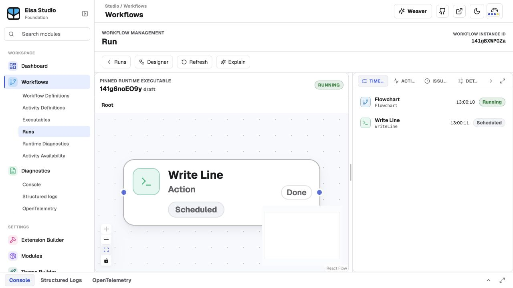
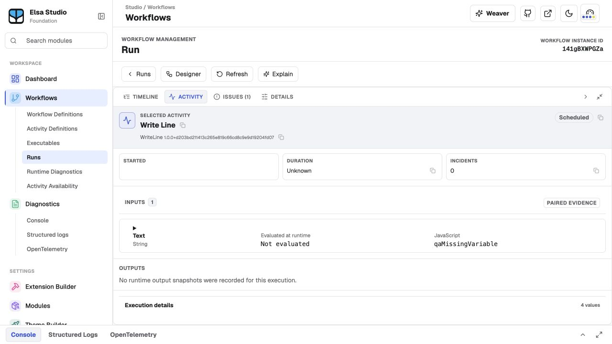
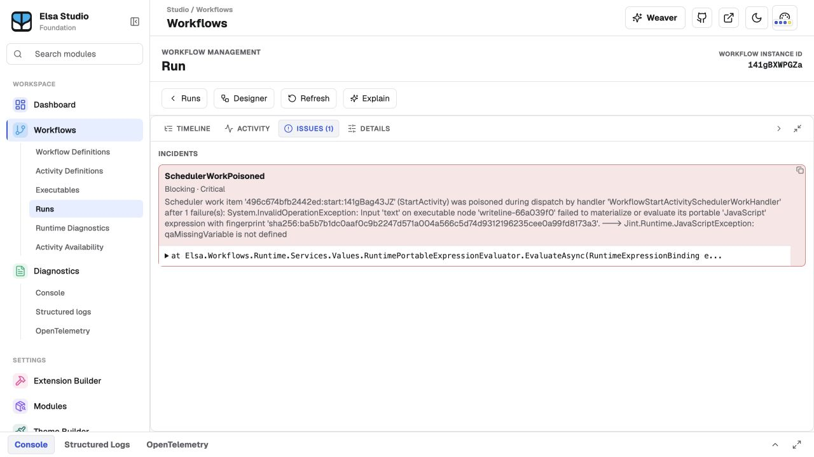
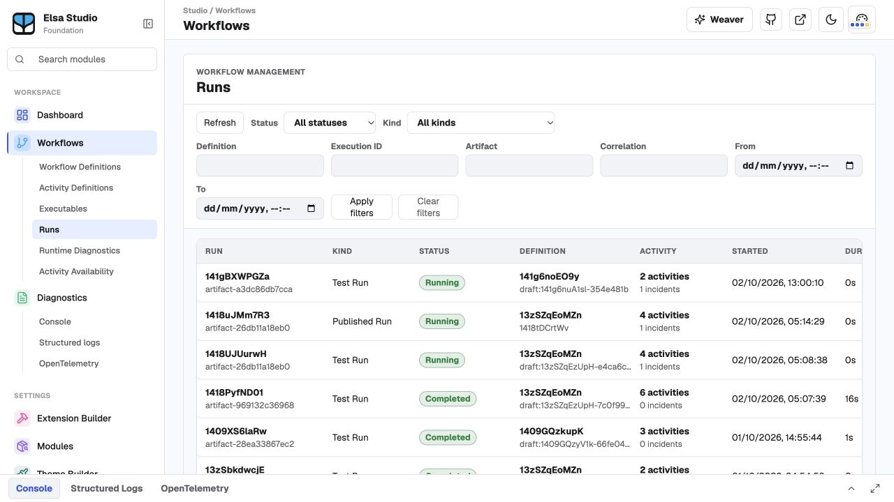

# Elsa Studio incident troubleshooting: QA and proposed plan

Archived before-state assessment, 2 October 2026. The user subsequently authorized program delivery; see [current acceptance evidence](acceptance.md). This paragraph describes the original QA pass: No application code changes, publishing, issue creation, or recovery actions performed.

The undefined-variable scenario reproduces. An incident is recorded, but the experience does not reliably tell the operator which activity needs attention or explain why a run still looks healthy. The first implementation priority should be trustworthy incident association; visual treatment and navigation should consume that evidence.

## Reproduction and scope

Tested the running Foundation Studio at https://localhost:7030 against Workbench at https://localhost:7243, using its documented local demo login. Created an isolated draft, **QA Incident Visibility 2026-10-02**, definition `141g6noEO9y`. Its Flowchart contains one Write Line activity, node `writeline-66a039f0`, whose Text input uses JavaScript `qaMissingVariable`. The identifier is undeclared. Design validation settled to “No validation errors.” Ran the draft through Studio's Run action without publishing.

Dispatch reported `DispatchAccepted · AcceptedButFaulted`; the resulting workflow instance is `141gBXWPGZa`. The Issues tab contains a `SchedulerWorkPoisoned` incident, severity Critical, status Blocking, ending in `Jint.Runtime.JavaScriptException: qaMissingVariable is not defined`.

Inspected an existing published incident-bearing run (`1418uJMm7R3`, undefined `variables`) and an existing completed control (`1418PyfND01`). Existing workflows were not edited. The QA draft and run remain available for review; the transient artifact advertised an expiry, so screenshots are the durable record.

The scope is the current Foundation UI, not a claim about released Elsa Studio 3.x. Running hosts use `--no-build`; current source HEADs were backend `6c3a9fe59f25c48cfef1e8fd8b8b742e674043ee` and Studio `69acb2ab6a517249cc3442adbcf93ff185c987b9`. Those refs identify inspected source, not attested build provenance. Browser observations are the acceptance evidence for this QA pass.

## Findings

| Priority | Observed behavior | User consequence | Expected experience |
|---|---|---|---|
| High | Workflow has one blocking incident; selected Write Line reports **0 incidents**, **Scheduled**, and input **Not evaluated**. | Activity-level evidence obscures the reason execution stopped. | Associate the failure with the exact execution, node, and input; distinguish failed evaluation from evaluation never attempted. |
| High | Runtime node has a gray border and Scheduled badge; selecting it adds only the blue selection outline. | The designer provides no visible indication of the failure. | A restrained danger border/accent, exclamation icon, and incident count, while keeping selection/focus distinct. |
| High | Runs list shows green **Running** and small gray **1 incidents**, alongside healthy green Completed rows. Faulted filter returns no matches. | Operators scanning for trouble can overlook blocked runs. | Keep lifecycle truthful, add an explicit attention/blocked badge, and filter by unresolved/blocking incidents independently of lifecycle. |
| Medium | Clicking a canvas node leaves Timeline selected. Clicking the timeline row opens Activity. Clicking this incident selects evidence but does not navigate to the node; it clears the previous node selection. Keyboard Enter produces the same result. | The path from visible issue to failing activity is weak. | Activate an incident cue to select the exact incident, reveal its node/scope, and open the incident panel. |
| Medium | Issues tab is neutral; at the 400px split-panel width its title/count are visually truncated. | The available incident entry point becomes harder to find. | A persistent visible count and icon, plus an always-visible run summary/action independent of panel state. |
| Medium | Saved details layout was maximized, hiding the canvas. Restoring it left the node off-screen until Fit View. | Opening an instance may not reveal the relevant activity at all. | Preserve layout preferences while providing “Show affected activity,” scope navigation, and framing when opening/focusing evidence. |
| Medium | Incident headline is `SchedulerWorkPoisoned`; body leads with work-item, handler, fingerprint, and wrapper exception. Root cause is near the end. | Users must decode runtime internals to understand a simple expression error. | Lead with activity/input and “qaMissingVariable is not defined”; disclose full technical evidence below. |
| Low, separate follow-up | Test-run feedback says green “Test run dispatched” and “Transient run accepted” despite AcceptedButFaulted. Authentication expiry later rendered “Authentication required” without an inline sign-in action; reload and sign-in restored access. Long workflow name also crowded/overflowed the authoring toolbar. | Success-looking feedback and unrelated session/layout friction interrupt diagnosis. | Distinguish dispatch acceptance from run outcome; provide a session recovery action and constrain toolbar text. |

The completed control shows successful activity statuses and a clear “No incidents recorded” empty state. Captured browser warning/error logs were empty at the checkpoints inspected; this does not prove all HTTP requests or backend logs were clean.

## Screenshots

Runtime canvas, after restoring the split layout and fitting the view: no error marker on the affected node.

Selected activity: zero incidents despite the workflow-level incident.

Recorded incident with the actual JavaScript exception.

Run list: blocking incident is subordinate to green Running.

Additional evidence is in `screenshots/`: expression setup, dispatch feedback, initial timeline, Faulted-filter empty result, healthy empty state, and authentication interruption.

## Source explanation verified by the root agent

1. `WorkflowStartActivitySchedulerWorkHandler` materializes inputs before completing the ActivityStarted transition. `RuntimePortableExpressionEvaluator` wraps an expression failure with the input name and node ID. The exception escapes the start handler before the normal invocation fault handling can associate it as an activity fault.
2. `PoisonedSchedulerWorkIncidentObserver` writes the scheduler incident with **null ActivityExecutionId and ExecutableNodeId**. The message contains a node ID, but the structured association does not. Its deliberate WaitForIntervention policy preserves the workflow lifecycle and leaves the activity state unchanged. This is documented in `docs/runtime-fault-behavior.md`, particularly “What it does not do.” Running therefore is not by itself proof of an incorrect lifecycle transition.
3. Studio's `applyRuntimeOverlays` associates incidents by structured executable node ID or activity execution ID. It already computes incident count and blocking state. The shared `WorkflowActivityNode` already renders an incident count and blocking-incident border treatment; Flowchart and Sequence reuse it. The scheduler incident cannot join the node through that path, so the existing cue is never activated. Parsing exception prose to extract an ID would be brittle and should not be the solution.
4. The list renders incident count as small text. Activity metadata counts its associated incident IDs. Incident selection stores the incident ID; with no structured association, it cannot select the failing node. There are also navigation gaps for correctly associated nested incidents to check during implementation.

Primary source locations:

- Backend: `src/essentials/Workflows/Runtime/Services/WorkHandlers/WorkflowStartActivitySchedulerWorkHandler.cs` (calls around 147/208; materialization around 364), `Services/Values/RuntimePortableExpressionEvaluator.cs` (88–91), `Services/Incidents/PoisonedSchedulerWorkIncidentObserver.cs` (incident construction around 143–164), and `src/essentials/Activities/Runtime/Services/WorkflowInvokeActivitySchedulerWorkHandler.cs`.
- Studio: `src/essentials/Elsa.Studio.Workflows/Client/src/workflowAdapter.ts` (`applyRuntimeOverlays`, 622 onward), `workflow-editor/graph.tsx` (19–79), `styles.css` (2114–2151), and `workflow-editor/WorkflowInstances.tsx` (list around 263; overlay 741; tab definitions 830; activity count 1088; incident list 1589 onward).

## Proposed implementation plan

**1. Establish structured failure evidence in Foundation.** Treat activity-input expression failure as a known, attributable failure. Carry workflow execution ID, activity execution ID, executable node ID, input name, expression type, and exception chain through durable incident/input-evaluation evidence. The scheduler poison model currently lacks the causal activity/node fields; extend that evidence from the actual scheduler work payload rather than decoding a message or work-item ID. Record attempted-but-failed evaluation distinctly from not attempted. Reuse existing recording/checkpoint mechanisms; preserve cancellation, leases, retry rules, atomicity, and incident strategies. Do not add a blanket catch that converts infrastructure failures into user expression failures.

I recommend preserving the scheduler-poison/WaitForIntervention behavior for the initial fix, while adding reliable association and explicit incident health. Routing known expression failures through the normal activity-fault/strategy path is a separate behavior decision to review if desired; it must preserve retry/checkpoint semantics. Truly unassociated engine incidents must remain run-level incidents with an honest explanation. Do not unconditionally force every incident-bearing workflow to Faulted.

**2. Refine the existing incident-health presentation in Studio.** Reuse the existing shared node overlay and border/count treatment. Derive active/blocking versus historical/resolved indicators consistently from status and association. Use the existing Studio semantic design tokens. For the failing node, keep a thin danger border or accent and add a small accessible exclamation/count action; avoid a solid red card, animations, or replacing the activity icon. Preserve a separate blue selection/focus treatment. Apply the same semantics to Flowchart, Sequence, BPMN where supported, timeline, input evidence, and activity metadata. A container with a nested incident should advertise an incident below without implying the container itself failed.

**3. Make triage visible at entry points.** Add a compact run-header notice, for example “1 blocking incident · Intervention required,” with “View incident.” Put an icon/count in a dedicated list health/incident cell and use correct singular/plural. Show lifecycle and incident health separately, e.g. Running plus Needs intervention. Keep count visible when tabs narrow or panels collapse/maximize. Add server-backed incident-health filtering if current list query lacks it; do not filter only the loaded page. Prefer definition display names when available, with IDs as secondary evidence.

**4. Connect the troubleshooting journey.** Clicking the node's incident marker selects the exact incident, opens Issues/Incidents, reveals nested scope, and frames the node. Normal activity selection opens Activity; when the activity has an active incident, follow the agreed rule to open Incidents automatically. Clicking an incident provides the inverse journey to its activity/execution/input. Use explicit “Show affected activity” and “View input” actions, accessible names, keyboard activation, and visible focus. Keep the pinned executed artifact for inspection; label navigation to the editable current definition distinctly.

**5. Improve incident reading and test-run feedback.** Show “Write Line · Text · JavaScript” followed by the useful exception message and incident status. Preserve full wrapper exceptions, stack trace, scheduler context, IDs, and copy actions in expandable technical details. For a run accepted with a blocking failure, show “Test run started with an incident” and a direct View incident action. Expression validation cannot guarantee runtime success; avoid presenting No validation errors as execution health.

**6. Verify the complete story before delivery.** Add a regression test for the real undefined-identifier path, exact association, failed input evidence, and chosen lifecycle/strategy behavior. Prove it fails before the fix or under a targeted mutation. Add focused Studio tests for cue rendering, incident selection, scope navigation, and health filtering. Rebuild the affected server and run relevant fault-handling and incident-query backend e2e suites; run affected unit projects, architecture/maps gates where required, and browser verification with before/after screenshots. Use local token-compliant CSS and appropriate affected frontend checks. Do not count this read-only QA pass as those future implementation gates passing.

## Acceptance scenarios for review

| Scenario | Required result |
|---|---|
| Undefined identifier in JS input | Run health clearly signals a blocking issue; exact activity has incident cue; Text shows evaluation failed; one action reaches root cause. |
| Healthy completed run | No danger indicators; incident empty state remains clear. |
| Continuing/nonblocking incident | Visible issue without falsely presenting whole workflow as stopped or faulted. |
| Pending retry | Distinguish retrying from unresolved terminal failure; avoid a false blocker. |
| Resolved/recovered incident | Historical evidence stays accessible; current danger cue clears according to incident status; no stale red border/count. |
| Repeated/looped activity | Correct execution occurrence selected; node summary can aggregate without losing execution-specific evidence. |
| Nested activity | Parent indicates contained issue; click reveals the correct scope and child. |
| Unassociated engine incident | Run-level warning with explanation; do not fabricate an activity association. |
| Panel maximized/collapsed, narrow window, dark/light themes | Incident count/action remains visible; cue fits theme; framing exposes the target. |
| Keyboard/screen reader | Icon has meaningful name/count; focus is visible; activation and navigation work without color dependence. |
| Refresh/reopen and incident resolution | Evidence, counts, selections, and health remain consistent after loading/refresh. |
| Insufficient permission or expired session | Explain unavailable evidence and provide an appropriate recovery route; do not show zero incidents as a substitute for failed loading. |

This QA did not exercise recovery/resolution, alternate incident strategies, pending retries, Sequence/BPMN failures, permission variants, or a full responsive/theme matrix. They are acceptance requirements for implementation, not claimed passes.

## Delivery boundary

Keep this as **none/free-flow**, a review draft outside the repositories. After plan agreement, route durable work through the applicable runtime-evidence/program bucket or explicitly retain free-flow, inspect existing issues/PRs, claim noncompeting scope, and use the repo's Spec Kit sequence. Deliver the backend association and Studio experience as coordinated work with final integration QA. Recovery UX changes and broad redesign are outside this first unit.

The root retained integration and QA in the current GPT-6 session; root model switching was unavailable. The source audit used `gpt-6-luna` with `xhigh`, the available Luna equivalent of the requested delegate preference. No application build or automated test suite was run for this inspection-only pass, and no generated maps were relied upon.
