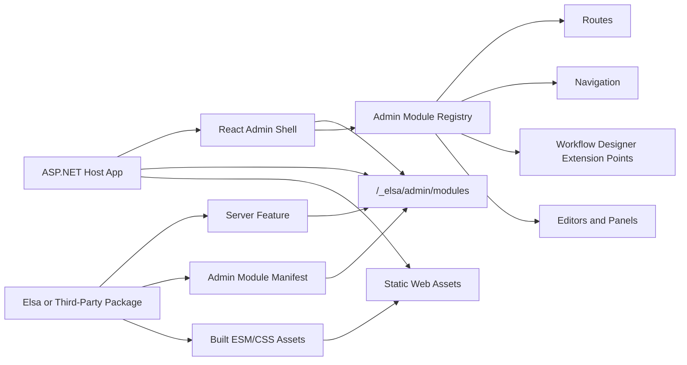

# React Admin Module Host Technical Design

Status: pre-spec technical design input. This is not a Speckit specification, implementation plan, or ratified architecture rule.

Program-goal state: `none/free-flow`. The design should move into a named program-goal bucket only if the admin host becomes a coordinated mid-term workstream.

## Purpose

Elsa needs a React-based modular admin application that can host first-party and third-party admin modules without forcing every host application to rebuild the admin shell.

The intended user is an ASP.NET host application that references Elsa packages, serves the admin React shell, and installs additional Elsa or third-party packages that contribute React admin capabilities. A package such as `Elsa.Workflows.Flowchart.Design` should be able to contribute designer UI to the host through a deliberate frontend extension contract.

This document captures enough technical shape to create a Speckit feature specification. It deliberately keeps names and package boundaries provisional where the spec must decide them.

## Proposed Outcome

Build an admin shell that owns the browser application lifecycle and loads admin modules discovered from the ASP.NET host at runtime.

The shell owns:

- Layout, route container, navigation chrome, authentication context, theme, notification surface, API client, localization context, and module lifecycle.
- A stable TypeScript admin SDK used by modules to register contributions.
- The manifest loader that asks the server which admin modules are installed.

Admin modules own:

- Their route contributions, navigation entries, screens, designer extensions, property editors, activity editors, panels, toolbar actions, and other named contributions.
- Their built JavaScript and CSS assets.
- Their compatibility declaration against the admin host and admin SDK.

The server owns:

- Discovery of installed admin module manifests from composed Elsa/CShells features.
- Serving the admin shell and module assets through ASP.NET static file mechanisms.
- Exposing a manifest endpoint that the React shell can read before module activation.

## Source-Of-Truth Placement

This belongs in `docs/reports/` until a Speckit unit exists. The report is a point-in-time design input, not a source of canonical terminology or gates.

If accepted:

- User-facing feature requirements belong in `specs/<NNN-react-admin-module-host>/spec.md`.
- Technical implementation details belong in that spec's `plan.md`.
- Stable extension-point terminology may need glossary entries only after names settle.
- Enforceable modularity rules belong in the constitutions only after architecture review and ratification.
- Generated maps should be refreshed only when project/package files are added or changed.

## Architecture Sketch



## Recommended First Slice

Use server-discovered ESM modules served as ASP.NET static web assets.

The first slice should support modules available when the ASP.NET application starts. Live installation, hot unload, and browser-side replacement of modules after startup should remain out of scope until the static asset and security model is proven.

Module Federation is a possible future implementation, but it should not be the default first slice. Native ESM-style remote entry modules plus an explicit Elsa admin SDK contract are easier to reason about, easier to package in NuGet packages, and less tied to a bundler-specific runtime.

## Server Package Shape

The spec should decide final package names, but a plausible shape is:

- `Elsa.Admin.Core`: server-side admin module manifest contracts and collection event.
- `Elsa.Admin.Api`: endpoint that returns the discovered admin module manifests.
- `Elsa.Admin.Web`: built React admin shell assets and ASP.NET integration.
- `Elsa.Workflows.Flowchart.Design`: first-party design feature that can also contribute an admin module manifest and static assets.
- Optional future split: `Elsa.Workflows.Flowchart.Design.Admin` if the frontend contribution needs to be independently installed from the server-side design feature.

The first spec should not require every Elsa feature to have a frontend module. Admin contribution is optional and discovered through a named contribution surface.

## Server Manifest Contribution

The server-side manifest collection should follow the existing Elsa modularity direction: one host-owned collection lifecycle and independent feature contributions.

Candidate server contract:

```csharp
public sealed record AdminModuleManifest(
    string Id,
    string DisplayName,
    string Version,
    string Entry,
    IReadOnlyCollection<string> Styles,
    string RequiredHostVersion,
    string RequiredSdkVersion,
    IReadOnlyCollection<string> Capabilities);
```

Candidate event:

```csharp
public sealed class OnAdminModuleManifestsCollecting : IEvent
{
    public ICollection<AdminModuleManifest> Manifests { get; } = new List<AdminModuleManifest>();
}
```

The API feature raises the collection event and returns a normalized response. Contributing features register handlers that add their manifest. This keeps the host lifecycle explicit and avoids making modules inherit from each other.

Candidate endpoint:

```http
GET /_elsa/admin/modules
```

Candidate response:

```json
{
  "hostVersion": "1.0.0",
  "sdkVersion": "1.0.0",
  "modules": [
    {
      "id": "Elsa.Workflows.Flowchart.Design",
      "displayName": "Flowchart Designer",
      "version": "1.0.0",
      "entry": "/_content/Elsa.Workflows.Flowchart.Design/admin/module.js",
      "styles": ["/_content/Elsa.Workflows.Flowchart.Design/admin/module.css"],
      "requiredHostVersion": "^1.0.0",
      "requiredSdkVersion": "^1.0.0",
      "capabilities": ["workflow-designer", "activity-editors"]
    }
  ]
}
```

## React Module Contract

The admin shell should expose a stable TypeScript package such as `@elsa-workflows/admin-sdk`. The package name is provisional and should be pinned by the spec.

Candidate module entry:

```ts
import type { ElsaAdminModuleApi } from "@elsa-workflows/admin-sdk";

export function register(api: ElsaAdminModuleApi): void {
  api.navigation.add({
    id: "flowchart-designer",
    label: "Workflows",
    route: "/workflows",
    order: 100
  });

  api.routes.add({
    id: "workflow-definitions",
    path: "/workflows",
    lazy: () => import("./WorkflowDefinitionsPage")
  });

  api.workflowDesigner.nodeRenderers.add({
    activityType: "Elsa.Flowchart",
    render: FlowchartNode
  });
}
```

Candidate SDK surface:

```ts
export interface ElsaAdminModuleApi {
  readonly host: ElsaAdminHostContext;
  readonly navigation: NavigationRegistry;
  readonly routes: RouteRegistry;
  readonly workflowDesigner: WorkflowDesignerRegistry;
  readonly activityEditors: ActivityEditorRegistry;
  readonly propertyEditors: PropertyEditorRegistry;
  readonly panels: PanelRegistry;
  readonly toolbarActions: ToolbarActionRegistry;
}
```

The SDK should expose registries and context services, not internal shell components. Extension points should be named, versioned, and documented.

## Frontend Loading Model

The shell boot sequence should be:

1. Load shell configuration from the server.
2. Fetch `/_elsa/admin/modules`.
3. Reject modules with incompatible host or SDK version ranges.
4. Load module styles.
5. Dynamically import each module entry.
6. Call `register(api)` inside an activation boundary.
7. Render the application once required modules are processed.
8. Surface failed optional modules in diagnostics without taking down the whole admin shell.

The spec should define whether module activation is serial or parallel. A conservative first slice can activate serially by manifest order, then optimize later.

## Shared Dependencies

Modules must not bundle incompatible copies of React, React DOM, the admin SDK, or the router runtime used by the shell.

The first implementation should choose one dependency-sharing mechanism:

- Import maps controlled by the admin shell.
- Vite library-mode externals plus a host-provided dependency resolver.
- A bundler-specific federation runtime.

The recommended first choice is import maps or a small host-provided dependency resolver, because it keeps the module format understandable to ASP.NET hosts and NuGet package authors.

The spec must pin:

- Supported React major version.
- Supported router library and version range.
- Whether modules may import UI primitives directly or must use SDK-provided components.
- Whether third-party modules may bring their own component libraries.

## Static Asset Serving

For NuGet-distributed modules, static web assets are the natural first target. A module package can place built assets under a predictable admin asset path and expose manifest entries that point to those files.

For dynamically loaded Nuplane packages, the first spec should not assume assets are automatically available to ASP.NET static files. A later slice can define a package asset file provider if runtime package loading becomes a requirement.

The first slice should support:

- Host application references module package.
- ASP.NET serves the admin shell and module assets after application startup.
- Manifest endpoint returns absolute or application-root-relative URLs.

The first slice should not require:

- Rebuilding the admin shell when a new module package is referenced.
- Browser-side discovery of modules without a server manifest.
- Loading modules from arbitrary remote origins.

## Security Model

Loading a JavaScript admin module is equivalent to trusting executable code. The first spec should treat installed admin modules like trusted server plugins.

Required safeguards:

- Module manifests are server-generated, not browser-supplied.
- Remote cross-origin module URLs are rejected by default.
- Host and SDK compatibility is checked before activation.
- Failed module loading is isolated and reported.
- The server can disable a module through configuration.

Future safeguards:

- Signed module manifests.
- Content Security Policy integration.
- Tenant- or role-aware module visibility.
- Administrative diagnostics for module source, version, and load failures.

## Styling And UI Boundaries

The shell should provide theme tokens and reusable UI primitives through the admin SDK or a documented package.

Modules should not depend on private shell DOM structure or global CSS class names. The first spec should require one of:

- CSS modules.
- Scoped class naming with package/module prefix.
- CSS-in-JS scoped to the module.

Shadow DOM can be considered for highly isolated third-party widgets, but should not be required for normal first-party modules because it complicates theme and accessibility behavior.

## Core Extension Points

The first spec should include a small set of official extension points rather than a broad, unstable surface.

Minimum useful set:

- Routes.
- Navigation items.
- Dashboard widgets or landing panels.
- Workflow designer node renderers.
- Workflow designer canvas/toolbox contributions.
- Activity editors.
- Property editors.
- Toolbar actions.
- Diagnostics entries for module load state.

Deferred extension points:

- Full page layout replacement.
- Authentication provider replacement.
- API client replacement.
- Theme engine replacement.
- Module-to-module service discovery.
- Hot unload cleanup hooks beyond basic activation failure handling.

## Versioning Rules

Every module manifest should declare:

- Module id.
- Module version.
- Required admin host version range.
- Required admin SDK version range.
- Optional capability flags.

The shell should refuse incompatible modules and expose a clear diagnostics record. Compatibility checks should happen before importing executable module code where possible.

The admin SDK should follow semver. Breaking SDK changes require a major version change.

## Example First-Party Module

`Elsa.Workflows.Flowchart.Design` can be the first proving module.

Server contribution:

- Registers design-side workflow/flowchart services as it normally would.
- Registers a handler for admin manifest collection.
- Serves built assets through static web assets.

Frontend contribution:

- Adds workflow-definition routes.
- Adds a workflow designer route or panel.
- Registers Flowchart-specific designer behavior.
- Registers activity/property editors needed by the designer.

The spec should decide whether this module is bundled with the base admin shell for the first delivery or loaded exactly like a third-party module. Loading it like a normal module is the better architectural proof.

## Speckit Seed

Suggested feature name: `react-admin-module-host`.

Suggested input:

```text
Build a React-based Elsa admin shell that discovers installed admin modules from the ASP.NET host, loads their built React assets at runtime, and lets first-party and third-party modules register routes, navigation, workflow designer extensions, editors, panels, and toolbar actions through a stable admin SDK.
```

Suggested scenarios:

1. Given an ASP.NET host has only the base Elsa admin package installed, when a user opens the admin app, then the shell loads and renders without contributed modules.
2. Given the host also references `Elsa.Workflows.Flowchart.Design`, when the admin shell starts, then it discovers the module manifest, imports the module entry, and displays the contributed workflow designer navigation and routes.
3. Given a third-party package contributes a compatible admin module, when the host serves the admin app, then the module registers its contributions without requiring the shell to be rebuilt.
4. Given a module declares an incompatible host or SDK version range, when manifests are loaded, then the shell refuses to import that module and reports the compatibility failure.
5. Given a module entry fails to load, when the shell activates modules, then the remaining compatible modules still activate and diagnostics identify the failed module.

Suggested functional requirements:

- **FR-001**: The admin shell MUST fetch installed admin module manifests from the ASP.NET host before activating contributed module UI.
- **FR-002**: The server MUST expose a manifest endpoint that returns module id, display name, version, entry URL, style URLs, required host version, required SDK version, and capability flags.
- **FR-003**: Server-side Elsa features MUST be able to contribute admin module manifests through a named host-owned contribution lifecycle.
- **FR-004**: The admin shell MUST dynamically import compatible module entries without requiring a shell rebuild.
- **FR-005**: Admin modules MUST register contributions through a stable TypeScript admin SDK instead of private shell internals.
- **FR-006**: The first SDK surface MUST support routes, navigation items, workflow designer extensions, activity editors, property editors, panels, toolbar actions, and diagnostics entries.
- **FR-007**: The admin shell MUST check host and SDK version compatibility before activating a module.
- **FR-008**: The admin shell MUST isolate module activation failures so one failed optional module does not prevent compatible modules from loading.
- **FR-009**: Module assets MUST be served from same-origin application paths by default.
- **FR-010**: The first implementation MUST support modules available at ASP.NET application startup.
- **FR-011**: The admin shell MUST provide a diagnostics view or diagnostics state that identifies loaded, skipped, incompatible, and failed modules.
- **FR-012**: Modules MUST NOT require direct references to private shell components or global mutable shell state.

Suggested non-goals:

- Hot installing, unloading, or replacing modules after the ASP.NET application has started.
- Loading modules from arbitrary remote origins.
- Replacing the admin shell authentication provider.
- Replacing the admin shell theme engine.
- Implementing all Elsa designer screens in the first slice.
- Supporting multiple React major versions in one admin shell.
- Supporting untrusted sandboxed third-party JavaScript.
- Creating a browser-only module discovery mechanism with no server manifest.

Suggested acceptance criteria:

- A host with no contributed modules can open the admin shell successfully.
- A first-party sample module contributes at least one navigation item and route through the SDK.
- A first-party workflow designer sample contribution proves at least one designer extension point.
- A module manifest contribution is produced by a server-side Elsa feature and returned by the manifest endpoint.
- A compatible module is loaded from a static web asset URL without rebuilding the shell.
- An incompatible module is skipped before activation and appears in diagnostics.
- A failed module import does not prevent another compatible module from activating.
- Tests cover manifest endpoint normalization and compatibility rejection.
- Frontend tests cover registry registration, dynamic import failure handling, and route/navigation contribution rendering.

## Plan Inputs For Speckit

Likely affected areas:

- New admin shell project or package location.
- New server-side admin manifest contracts.
- New admin API endpoint.
- Static web asset packaging for admin shell and module assets.
- TypeScript admin SDK package.
- First-party sample/proving module, preferably Flowchart Design if that package exists in the target workspace.
- Unit tests for server manifest collection.
- Frontend tests for registry behavior and loader failures.
- Integration or Playwright smoke test for a host with one contributed module.

Constitution and architecture checks:

- Preserve feature/module boundaries; frontend modules are contributions, not shell inheritance.
- Keep design-time UI contracts separate from runtime execution contracts.
- Avoid forcing heavy frontend or designer dependencies into packages that do not opt into admin UI.
- Keep third-party extensibility explicit through manifests and SDK extension points.
- Treat frontend asset loading as trusted installed code unless a later spec adds sandboxing.

Open questions for clarification:

- Should the first admin shell live in this repository or wait for the future `elsa-workspace` split?
- Should `Elsa.Workflows.Flowchart.Design` include admin assets directly, or should admin UI live in a sibling `.Admin` package?
- Which bundler and package manager should be standard for first-party modules?
- Should the shell use import maps, Vite externals, or Module Federation for shared dependencies?
- Which route library and UI component primitives are part of the stable SDK?
- Should module load order be purely manifest order, dependency graph order, or capability-based?
- Are modules allowed to contribute API endpoint metadata for generated clients, or should clients remain hand-authored per module?
- What minimum browser support does the admin shell target?

## Recommended First Spec Boundary

The first Speckit unit should prove the plugin contract end to end with one small module. It should not attempt to build the entire Elsa admin product.

Recommended first delivery:

- Base React shell.
- Server manifest endpoint.
- TypeScript admin SDK with registry APIs.
- Dynamic loader.
- Diagnostics state/view.
- One contributed module with route and navigation.
- One designer-oriented extension point if Flowchart Design is available.

Everything else should be follow-up work once the boundary is proven.
