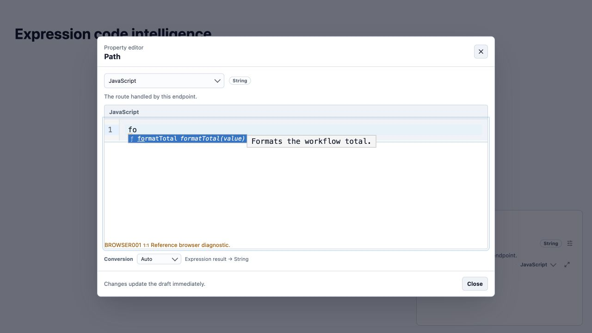
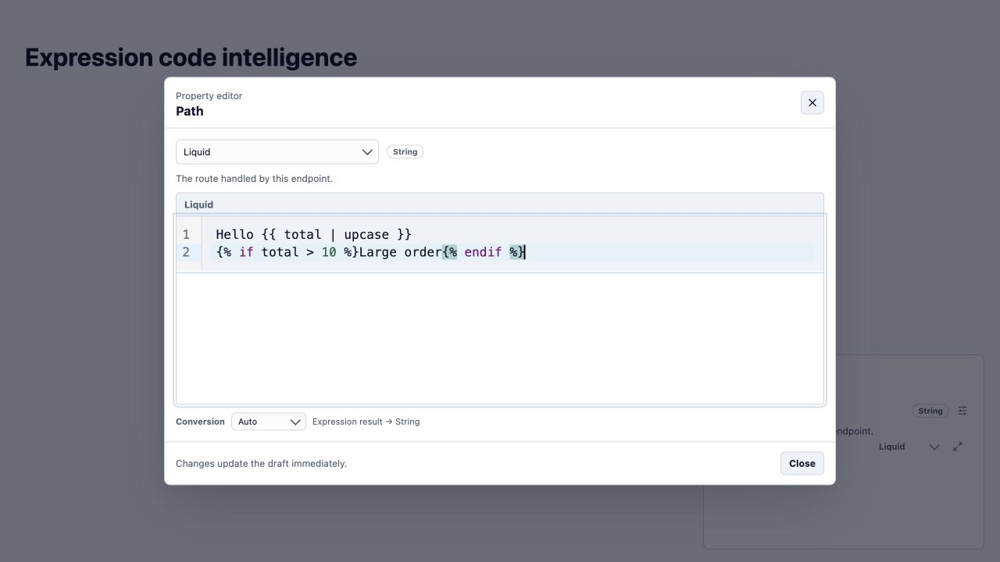

# Elsa Studio expression editing: assessment and delivery proposal

Date: 2 October 2026. Scope: Foundation Studio activity-input expression editing, with Foundation expression tooling. Original assessment state: `none/free-flow`. The product owner subsequently approved end-to-end implementation as [Program #2310](https://github.com/elsa-workflows/elsa-foundation/issues/2310). The active queue is the [program goal](../../program-goals/studio-expression-developer-experience.md); this report remains the investigation baseline.

## Recommendation

Keep CodeMirror 6 and complete the experience around it. The underlying editor and a considerable amount of code intelligence already exist. The immediate priority is proving that installed language editors load in the normal Studio composition and receive the correct backend context. Then deepen language intelligence and polish the interaction. A replacement with Monaco would not, by itself, resolve module loading, workflow scope, runtime compatibility, or Liquid semantics.

## Evidence and limits

The source audit used Studio checkout `/Users/sipke/Projects/Elsa/elsa-foundation-studio` at `69acb2ab6a517249cc3442adbcf93ff185c987b9` and the current Foundation checkout at `e4a699879791fb7eb2bc1c6874f772f4a7fe5355`. The Studio checkout has pre-existing untracked output directories; they were excluded from the audit and left untouched. Tracked source lives under `src/apps`, `src/essentials`, and `src/extensions`.

Computer use reached the authenticated local Studio at `http://localhost:7221`. Its separate worktree is at `d0258a1af90d21fb07aab956a8c00d14933c8849`. During the walkthrough the backend process on port 7211 stopped, and the workflow list reported `Failed to fetch`. Consequently this assessment does **not** establish that a real persisted workflow receives correct runtime-owned completions or diagnostics.

To try the interaction itself, I started the repository's existing browser fixture on port 4179 and operated the actual activity-property panel and language-editor components through computer use. Its symbols and diagnostic are synthetic. I observed JavaScript highlighting, a `formatTotal` completion menu with documentation, keyboard hover help, signature help, Liquid template highlighting, retained source across compact/expanded surfaces, multiline reopening, and an explicit unavailable-tooling message while the rich editor remained usable. The fixture diagnostic `BROWSER001` proves rendering only, not backend validation. I did not run the automated test suite or claim its historical results as current results.

## What is already present

| Capability | Current evidence | Practical conclusion |
|---|---|---|
| CodeMirror 6 | [Dependencies](https://github.com/elsa-workflows/elsa-foundation-studio/blob/69acb2ab6a517249cc3442adbcf93ff185c987b9/src/essentials/Elsa.Studio.CodeEditor/Client/package.json#L32) include autocomplete, lint, commands, state, view, JavaScript and Liquid packages. | No editor installation project is needed. |
| Syntax coloring and basic editing | [Engine](https://github.com/elsa-workflows/elsa-foundation-studio/blob/69acb2ab6a517249cc3442adbcf93ff185c987b9/src/essentials/Elsa.Studio.CodeEditor/Client/src/engines/CodeMirrorStudioCodeEditor.tsx#L207) installs highlighting, indentation, bracket matching and history; expanded mode adds gutters and folding. | Build on this substrate. |
| Completion, hover and signatures | [Intelligence bridge](https://github.com/elsa-workflows/elsa-foundation-studio/blob/69acb2ab6a517249cc3442adbcf93ff185c987b9/src/essentials/Elsa.Studio.CodeEditor/Client/src/engines/codeMirrorCodeIntelligence.ts#L25) and [tooling projection](https://github.com/elsa-workflows/elsa-foundation-studio/blob/69acb2ab6a517249cc3442adbcf93ff185c987b9/src/essentials/Elsa.Studio.CodeEditor/Client/src/toolingProjection.ts#L160). Observed in the fixture. | These are present, with limited depth. |
| Compact/expanded continuity | [Shared editor](https://github.com/elsa-workflows/elsa-foundation-studio/blob/69acb2ab6a517249cc3442adbcf93ff185c987b9/src/essentials/Elsa.Studio.CodeEditor/Client/src/StudioCodeEditor.tsx#L120) plus session-backed editor state. Source retention and multiline reopening were observed. | Preserve this behavior while improving presentation. |
| Extensible language ownership | JavaScript and Liquid each register inline/expanded editor Contributions and advertise capabilities. Workflows supplies language-neutral authoring context. | New languages should follow this contract. |
| Backend assistance | Foundation supplies context, symbols, completion, hover and validation through optional `expressions.tooling.v1` relations. | Deployed backend composition and metadata quality matter as much as the frontend. |
| Existing specifications and tests | Studio [spec 094](https://github.com/elsa-workflows/elsa-foundation-studio/blob/69acb2ab6a517249cc3442adbcf93ff185c987b9/specs/094-expression-code-intelligence/spec.md) and Foundation [spec 143](../../../specs/143-expression-code-intelligence/spec.md), with component/inspector/browser tests. | Reconcile and extend these; avoid a competing baseline implementation. |

A particularly important finding is [Studio PR #546](https://github.com/elsa-workflows/elsa-foundation-studio/pull/546), merged on 2 October at 10:38 UTC. Its description records that the JavaScript/Liquid editor assemblies were absent from the host's explicit assembly list and the features absent from its shell configuration. The editors therefore had never loaded in the default host. The PR fixes both. It explicitly records that a browser walkthrough of an actual workflow property was not performed. This is a source-supported explanation for a plain editing experience; it is not proof of which build the user previously encountered.

## The intended user experience

Selecting an installed text syntax should immediately produce a clearly recognizable code editor. Short expressions stay comfortable in the inspector. A larger editor opens through the expand action or multiline entry, keeps the cursor and undo history, and has enough stable space to work. The selected syntax, expected result type and validation state are easy to find without competing with the source.

While typing, the editor should suggest the language's real built-ins and the inputs, variables and outputs available **at this activity location**. A dot should reveal known members; an accessor should help with valid names; a function should show its signature, active parameter, return type and concise documentation. Suggestions should respect the expected result type without hiding otherwise valid expressions. Unknown dynamic object shapes should be described honestly.

Liquid deserves its own experience: `{{ ... }}` offers values and members; after `|`, offer filters; inside ``, offer valid tags and useful snippets. Filters and tags need argument information and examples. Registered extensions must match the host's actual Fluid configuration. JavaScript should never offer browser or Node APIs merely because the editor runs in a browser.

Errors should point to the relevant text and explain the problem. Drafts remain editable while incomplete. Missing tooling should leave syntax editing usable and explain which assistance is unavailable. Switching syntax must preserve source deliberately; it must not imply automatic translation. Reference and structured expression types retain their appropriate pickers/editors rather than being forced into code text areas.

## Gaps

| Priority | Gap | Evidence and user impact |
|---|---|---|
| P0 | Normal-host integration has not been proven here. | The default-host loading defect was fixed today by #546, while the real backend stopped during this walkthrough. Fixture tests bypass module discovery and cannot close this gap. |
| P1 | JavaScript completion is a metadata/name service, not a full language/type service. | The editor installs `autocompletion({ override: [completionSource] })`, replacing language-package completion sources. The projection resolves catalog/context symbols and known member paths. No general local-variable/type-inference service is integrated here. CodeMirror's JavaScript package itself supplies local-variable and snippet completion, so discarding that source deserves review. |
| P1 | Local JavaScript grammar is broader than runtime expression grammar. | [JavaScript language adapter](https://github.com/elsa-workflows/elsa-foundation-studio/blob/69acb2ab6a517249cc3442adbcf93ff185c987b9/src/essentials/Elsa.Studio.CodeEditor/Client/src/languages/javascriptCodeMirror.ts#L4) enables JSX and TypeScript. Foundation [provider](../../../src/essentials/Expressions/JavaScript/Services/JavaScriptExpressionToolingProvider.cs:174) parses a strict JavaScript expression. Local acceptance/coloring must not suggest that TypeScript, JSX or statement bodies can execute. |
| P1 | Validation depth is limited. | JavaScript provider validation parses source; Liquid provider validation calls `FluidParser.TryParse`. These routines do not establish general unknown-symbol/member, wrong-argument or expected-result-type diagnostics. The contract uses the word semantic, but that does not make type checking present. |
| P1 | Liquid assistance is not fully context-aware. | [Liquid provider](../../../src/essentials/Expressions/Liquid/Services/LiquidExpressionToolingProvider.cs:40) concatenates matching symbols, tags and filters using the current word prefix; it does not distinguish a filter location from a tag location. Its built-in catalog comes from fresh default `TemplateOptions`/`FluidParser` instances. Reconcile custom runtime filters/tags and add useful documentation. |
| P1 | Theme and preview polish are incomplete. | Highlighting uses `defaultHighlightStyle`; `theme` is exposed as a data attribute without a Studio syntax-color projection. [Styles](https://github.com/elsa-workflows/elsa-foundation-studio/blob/69acb2ab6a517249cc3442adbcf93ff185c987b9/src/essentials/Elsa.Studio.CodeEditor/Client/src/styles.css) style editor surfaces but not the completion/hover experience comprehensively. Unfocused compact previews render plain `<code>` text. Theme changes and readable light/dark/dim token contrast need real visual proof. |
| P2 | Signature help and formatting are basic or absent. | The signature projection picks the first signature; the UI displays a label/docs string with no active-parameter highlight or overload navigation. Both language Contributions advertise `formatting: false`. |
| P1 | The requirement needs an explicit standard for every installed syntax. | A language being evaluable does not prove that an editor adapter and tooling provider are composed. Existing Contributions/capabilities are the right seam, but adoption and normal-host acceptance need to be enforced. |

The official [CodeMirror JavaScript documentation](https://github.com/codemirror/lang-javascript) describes its local-variable/snippet completions and customizable completion sources. The official [Liquid package](https://github.com/codemirror/lang-liquid) provides template language support. These support retaining the engine, but neither package supplies Elsa's workflow/runtime semantics automatically.

## Proposed delivery sequence

### 1. Establish and protect the deployed baseline

Owner: Studio host and Workflows integration, coordinated with Foundation host composition.

Use the existing #546 change, not a second registration fix. Rebuild matching Studio/backend outputs in an isolated preview, create a disposable workflow with JavaScript and Liquid activity inputs, and verify the real module catalog, syntax picker, rich editor chunks, authoring-context relations and actual completion results. Include the currently supported workflow/activity-definition authoring surfaces. Add a normal-host regression scenario that removes an editor assembly/feature or backend capability and detects the resulting missing/degraded behavior.

Done when selecting JavaScript/Liquid in a real property yields coloring and meaningful location-scoped help in both surfaces, and unavailable modules/tooling have an actionable explanation. Record actual browser evidence and revisions.

### 2. Define syntax-support conformance and correct grammar alignment

Owner: public Studio editor contract and individual expression modules; Foundation remains the language/runtime authority.

Reconcile specs 094/143 with this new requirement. Describe what every installed text syntax must provide: coloring, completion, documented capabilities, expected-type context, diagnostics and graceful degradation. Keep non-text expression editors distinct. Align JavaScript local syntax and advertised APIs with the execution engine. Add language capability/readiness visibility so an installed runtime syntax cannot silently look like a bare text field.

Done when conformance cases cover independently composed languages, missing adapters, incompatible tooling, permissions, source preservation, incomplete expressions and runtime-unsupported syntax.

### 3. Deliver deeper JavaScript and Liquid assistance

Owner: language-editor modules plus corresponding Foundation tooling providers.

First restore/merge useful JavaScript local completions and snippets without overwriting authorized workflow symbols. Improve known member shapes, accessor-name completion, return types and documentation. Evaluate a bounded worker-based TypeScript language service for JavaScript inference with runtime-specific declaration files and no DOM/Node globals; this is a proposal to validate, not a claim that a dependency switch is necessary. Microsoft's [language-service documentation](https://github.com/microsoft/TypeScript/wiki/Using-the-Language-Service-API) describes separate completion, syntax and semantic operations, allowing help to be requested incrementally. Keep runtime publication validation authoritative.

Give Liquid its own parser-aware completion contexts, actual composed filter/tag metadata, argument help and insertion snippets. Improve diagnostics where a known shape proves a mistake; avoid treating unknown dynamic data as definitively invalid. Preserve revision checks, cancellation, permissions and the prohibition on evaluating user expressions for assistance.

Done when realistic JavaScript local variables/callbacks/member chains and Liquid interpolation/filter/tag examples get relevant help, known mistakes get precise diagnostics, and unsupported runtime APIs are absent. Prove both the frontend and backend metadata paths using real composition rather than only synthetic symbols.

### 4. Polish and verify the developer experience

Owner: shared CodeEditor presentation and language adapters.

Map syntax colors, gutters, selection, diagnostics, completion menus and help panels to the Studio design-token contract. Add readable highlighted compact previews without mounting a rich editor in every field. Keep expanded editor height and focus stable. Improve completion details, signature parameter highlighting, overload selection, keyboard shortcut discoverability and actionable diagnostics. Add explicit language-appropriate formatting with undo preservation; Liquid formatting must preserve meaningful template whitespace.

Done when light/dark/dim themes, narrow inspector widths, long expressions, multiline paste, expansion/collapse and keyboard/screen-reader flows are reviewed in real Studio. Acceptance includes source/cursor/undo continuity, no text mutation on syntax switch, no stale help after edits or authorization changes, and usable local editing during backend outages. Reuse existing tests and add normal-host proof rather than duplicating fixtures that only mirror the implementation.

## Implementation handoff boundary

Before implementation, adopt existing related work and claim any named issue scope under the repository rules. Select an owning program bucket if this becomes a durable coordinated initiative; otherwise explicitly retain `none/free-flow`. The changes belong principally in Studio with focused Foundation language-tooling extensions. Use the existing Speckit sequence for approved feature work. This investigation did not modify production source or assert a completed integration gate. Program bootstrap and execution ownership are recorded in the linked program goal and handoff.
