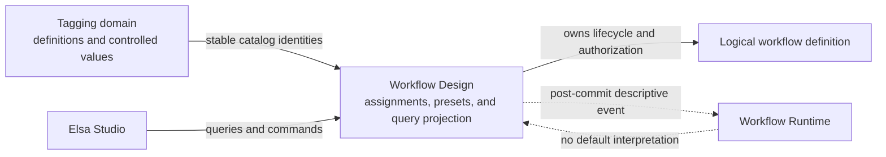

# Workflow Definition Tagging Design

Status: recommended design, ready for Speckit specification

Date: 2026-07-19

Program-goal state: `none/free-flow`

## Purpose

This report is the pre-specification handoff for tenant-scoped tagging in Elsa Server and Elsa
Studio. The first delivery targets workflow authors and logical workflow definitions. It combines
GitHub-like markers with Azure-like key/value tags so authors can classify, find, group, report on,
and safely bulk-edit workflow definitions.

Canonical terms are in the [Elsa glossary](../glossary/elsa.md). The durable ownership, identity,
and origin decisions are recorded in [ADR 0046](../adr/0046-tagging-owns-vocabulary-target-domains-own-assignments.md),
[ADR 0047](../adr/0047-tag-identity-value-semantics-and-lifecycle-are-stable.md), and
[ADR 0048](../adr/0048-tag-assignment-origins-own-assertions-without-precedence.md).

The design is consistent with the draft `WorkflowDefinitionState` scope policy: classification and
listing metadata stay outside authored state and executable artifacts. That constitution section
is still provisional, so it is supporting evidence rather than the ratification source for this
work.

## Scope

Version 1 includes:

- a tenant-scoped tag-definition catalog;
- marker, controlled-value, and free-text tags;
- single- and multiple-value cardinality;
- manual assignments to logical workflow definitions;
- server-side filtering, facets, paging, sorting, and grouping support;
- private and tenant-shared Studio view presets;
- explicit-selection bulk assign and remove operations;
- authorization, optimistic concurrency, audit facts, and post-commit change events.

Version 1 deliberately excludes:

- tags on workflow versions, drafts, activities, instances, executions, or other resources;
- runtime routing, scheduling, retention, authorization, deployment, or execution semantics;
- source-, policy-, system-, or automation-produced assignments;
- arbitrary Boolean filter expressions;
- substring or fuzzy matching of free-text tag values;
- bulk operations over an implicit "all matching" result set;
- hard deletion of tag definitions or controlled values.

Tags are descriptive metadata. If a future capability needs enforceable behavior, it must introduce
an explicit policy concept rather than teaching runtime components to interpret an ordinary tag.

## Domain boundaries

The dotted edge is intentionally non-semantic: runtime modules may observe a generic
post-commit event for cache or integration purposes, but Elsa Runtime does not change behavior
because a workflow definition has a tag.

## Tag catalog rules

A tag definition belongs to exactly one tenant. A host may provision a tenant-local definition in
the reserved `elsa.` namespace; version 1 does not introduce a global definition identity shared by
several tenants. Cross-tenant identities, assignments, suggestions, counts, and saved views never
mix.

The catalog enforces these invariants:

1. Opaque identity is stable; canonical key is tenant-unique and immutable.
2. Display name, description, and decorative color may change without rewriting assignments.
3. Value mode is `Marker`, `Controlled`, or `FreeText`.
4. Cardinality is `Single` or `Multiple`; marker tags are always single-valued.
5. Mode and cardinality become immutable when the first assignment exists.
6. A controlled assignment references the controlled value's identity.
7. Free-text comparison uses an application-produced normalized key while preserving display text.
8. Deprecated definitions and values remain readable and filterable. Existing assignments may be
   retained by an idempotent replacement, but a new target or new value assignment is rejected.
9. Replacing a semantic identity is an explicit migration, not a rename or hard delete.
10. Allowed target kinds are declared by the definition; version 1 accepts only logical workflow
    definitions.

The exact portable-key grammar and request-size limits belong in the feature specification.
Recommended defaults are lowercase ASCII keys of at most 64 characters and free-text display
values of at most 256 characters.

## Assignment and lifecycle rules

`WorkflowDefinitionTagAssignment` is owned by Workflow Design and points to the logical definition
identity. It does not live in `WorkflowDefinitionState`, a version record, or a runtime artifact.
Publishing, creating a draft, discarding a draft, and adding a version do not copy or change tags.

For the first version, every assertion has the single logical origin key `manual`; the user who
performed the command is audit data. The model already reserves origin kind and origin key so later
source reconciliation can contribute its own slice without overwriting author intent.

Soft deletion preserves assignments and permits them in audit and explicitly deleted-resource
queries. Studio must require restore before tag mutation. Restoring the definition restores the
same assignments. Permanent deletion removes the definition, its assignments, its assignment
revision head, and target-owned projections in one Workflow Design unit of work.

## Query semantics

The workflow-definition query accepts a bounded list of clauses keyed by stable tag-definition
identity:

| Operator | Meaning |
|---|---|
| `Exists` | The definition has any effective assignment for the tag. |
| `Missing` | The definition has no effective assignment for the tag. |
| `AnyOf` | At least one effective value equals a supplied value. |
| `AllOf` | Every supplied value is present; valid only for multiple-valued tags. |
| `NoneOf` | No effective value equals a supplied value; an absent tag therefore matches. |

Clauses for different tag definitions use `AND`. Values within one `AnyOf` or `NoneOf` clause use
`OR`. Combining `Exists` with `NoneOf` expresses "tagged, but not with these values." Version 1
does not accept arbitrary nested `AND`/`OR` trees.

Controlled filters carry controlled-value identities. Free-text filters carry normalized exact
values. Marker filters use only `Exists` and `Missing`. Invalid combinations fail validation
instead of being ignored.

A conflicting single-valued tag still `Exists`. `AnyOf` matches when any de-duplicated asserted
candidate matches, and `NoneOf` fails in that case. Grouping places the definition in a dedicated
`Conflicted` group rather than choosing one value or duplicating the row.

Results are filtered, counted, sorted, and paged on the server. Studio must not fetch all workflow
definitions and slice them locally. The response can include requested facet counts:

- Counts describe the full filtered result universe, not only the current page.
- A tag's facet is calculated without that tag's own active clause while retaining every other
  clause. This disjunctive behavior lets users see alternatives that would otherwise count zero.
- Controlled values use catalog order, then display name.
- Free-text values use a bounded prefix-suggestion query rather than unbounded enumeration.
- Grouping is supported for marker and single-valued tags only in version 1, with explicit
  `Untagged` and, when needed, `Conflicted` groups. This avoids duplicating one workflow definition
  into several groups or hiding an authority conflict.

The provider-neutral query contract sets maximum page size, clause count, values per clause, and
facet values returned. Groundwork implementations declare bounded routes and demonstrate that
provider work stays bounded independently of repository history.

## Commands and concurrency

The provider-neutral application surface should expose commands equivalent to:

- create, update presentation metadata, deprecate, and reactivate a tag definition;
- add, update presentation metadata, deprecate, and reactivate a controlled value;
- get a workflow definition's effective assignments, origin detail, conflicts, and tag-set revision;
- atomically replace the manual assertion slice for one workflow definition;
- bulk-add or bulk-remove explicit assignments for an explicit set of workflow-definition IDs;
- create, update, delete, and share a workflow-definition view preset.

HTTP can represent the tag-set revision as an `ETag` and require `If-Match` for replacement. A stale
revision returns a structured `409 Conflict` with the current revision and safe summary metadata;
the client reloads and lets the author reconcile. Add and remove commands are idempotent.

A bulk command has an idempotency key and a bounded explicit target-ID list. Each target mutation
is atomic, but the command is not one cross-target transaction. The response reports success,
authorization failure, validation failure, missing target, or concurrency conflict per target.
Studio previews the intended change and summarizes partial results.

Commands return revisions or operation receipts, not reconstructed listing views. Clients re-query
the authoritative read model after mutation.

## Authorization and audit

The recommended capability split is:

| Capability | Allows |
|---|---|
| `tagging.read` | Read the effective tenant catalog and presentation metadata. |
| `tagging.manage` | Create and manage definitions and controlled values. |
| `workflow-design.tags.assign` | Change the manual assertion slice on visible workflow definitions. |
| `workflow-design.views.share` | Publish or modify tenant-shared workflow-definition view presets. |

Workflow-definition read authorization remains a prerequisite for seeing its tags. A user with
ordinary workflow-definition read access may create private presets. Tagging never bypasses
target-domain authorization, and an assignment capability never permits changing assertions owned
by another origin.

Every catalog and assignment command records actor, tenant, timestamp, correlation identity,
origin, before/after semantic values, and optional idempotency identity. Audit records are
append-only. Sensitive business data should not be placed in tag values; tags are ordinary
classification metadata and inherit the visibility of their target.

## Events

After a successful commit, Workflow Design publishes a background
`WorkflowDefinitionTagsChanged`-equivalent event containing:

- tenant and workflow-definition identity;
- previous and new tag-set revisions;
- added and removed effective values;
- origin changes and conflict changes;
- actor, correlation identity, and idempotency identity.

The event is post-commit and informational. It is suitable for cache invalidation, search
projection updates, audit integrations, and future reporting. No built-in runtime subscriber gives
the event behavioral meaning.

## Studio interaction model

The workflow-definition list gains:

- compact tag chips on each row, with overflow summarized behind a popover;
- a tag filter builder using catalog names and controlled/free-text value suggestions;
- a single grouping selector with `Untagged` support;
- removable active-filter chips and a shareable URL representation;
- private-by-default saved views with explicit tenant sharing;
- selection-based bulk add and remove actions with preview and per-target results.

The definition details surface gains a tag editor that shows deprecation, read-only origins, and
conflict diagnostics. Marker tags toggle directly. Controlled values use a picker. Free-text tags
use an input with bounded existing-value suggestions but continue to permit new values.

A saved preset stores a schema version plus filter, grouping, sort, and column state using stable
identities. Missing or deprecated references produce a visible diagnostic and remain in the preset
until the author fixes them; Studio does not silently rewrite the view. Version 1 keeps this model
Workflow Design-specific rather than introducing a premature universal saved-view framework.

## Persistence and projection requirements

Core contracts describe tag definitions, controlled values, origin-owned assertions, a per-target
tag-set revision, presets, and query results without referencing Groundwork. The first-party durable
implementation uses Groundwork as required by ADR 0042.

The semantic storage model retains one record per origin-owned assertion even when several origins
collapse into one effective assignment. Tag definitions and controlled values remain independently
addressable and pageable. Workflow Design maintains an effective query projection capable of
bounded tag predicates, stable paging, total counts, and requested facets.

The implementation plan must choose and benchmark the Groundwork physical representation. It may
use document records, physical entity tables, or a deliberately denormalized projection as
Groundwork capabilities require. This report does not freeze that provider-level choice. It does
require:

- tenant enforcement in every key and route;
- application-produced normalized lookup values;
- uniqueness for tenant plus canonical tag key and controlled-value key;
- atomic single-target replacement of assertions, revision head, and projection;
- atomic permanent-delete cleanup with the workflow definition;
- deterministic paging and bounded `IN` cardinality;
- provider conformance across every supported Groundwork provider.

## Primary use cases

The first version must make these scenarios straightforward:

1. Mark definitions as `critical`, `customer-facing`, or `needs-review`.
2. Classify by controlled `environment`, `team`, `domain`, or `lifecycle` values.
3. Attach free-text values such as `cost-center=CC-1042` without catalog administration.
4. Find definitions matching several dimensions and see useful alternative facet counts.
5. Group a large list by one single-valued classification, including untagged definitions.
6. Save a personal operational view and optionally share it with the tenant.
7. Select visible definitions and add or remove one classification safely.
8. Rename presentation text without breaking assignments, filters, links, automation, or views.
9. Deprecate a classification while preserving history and existing filters.
10. Later reconcile source-declared tags without erasing manual classifications.

## Specification and rollout recommendation

The next work unit should run the official sequence:

1. `speckit-specify` for the version-1 user stories, requirements, failure modes, and measurable
   acceptance criteria;
2. `speckit-plan` for module/project placement, Groundwork manifest and projection design, API
   contracts, Studio integration, migration, and observability;
3. `speckit-tasks` with vertical slices;
4. `speckit-implement`.

Recommended vertical rollout:

1. catalog contracts, validation, authorization, and Groundwork persistence;
2. manual workflow-definition assignments, revision concurrency, audit, and cleanup;
3. server-side list query, facets, paging, and performance/provider conformance;
4. Studio chips, editor, filter builder, grouping, and bulk actions;
5. view presets and sharing;
6. future source reconciliation as a separate specification after version 1 proves the origin model.

The specification should turn the recommended default limits into explicit requirements and set
performance budgets using representative tenant, definition, assignment, and free-text
cardinalities. Other taggable resource kinds remain separate work units so their domain-specific
authorization and lifecycle rules receive independent review.
