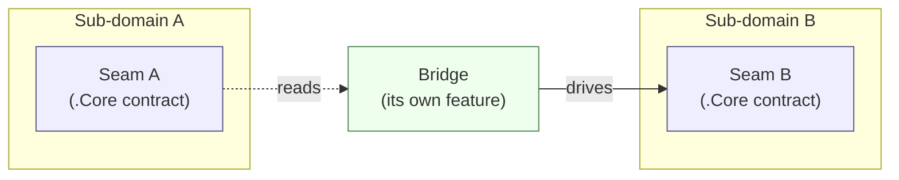
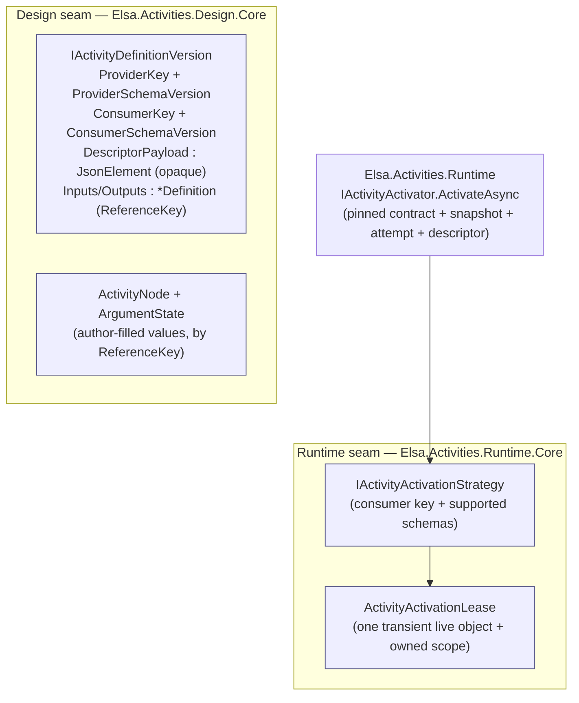
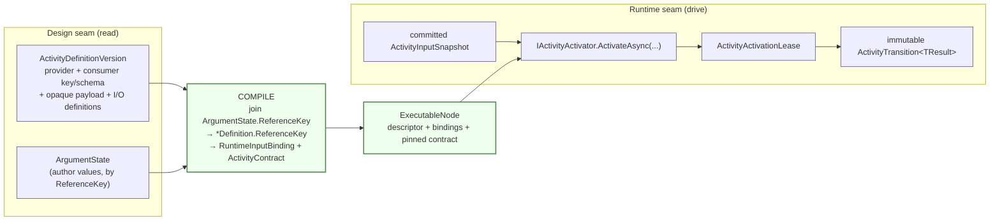
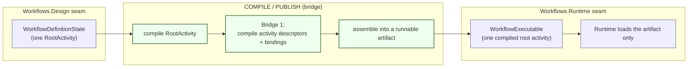

# Seams & bridges in the activities/workflows domain

> **Audience:** engineers and architects working in `elsa-foundation`.
> **Purpose:** make the load-bearing boundaries of the activities/workflows domain *visible* — so we
> can point at them, build against them, and watch them grow.
> **Knowledge role:** worked reference. Canonical short definitions live in
> [`docs/glossary/elsa.md`](glossary/elsa.md).

Most Elsa features are self-contained: a feature owns its contracts, its implementation, and its
persistence, and never reaches into a neighbour. The **activities/workflows** domain is the exception.
It is one domain with several sub-domains that genuinely have to meet — authoring, persistence, and
execution are different concerns with different lifecycles, and a workflow is worthless until they
connect. The art is letting them connect **without coupling**.

We do that with two ideas.

---

## 1. Seam vs. bridge

**A seam is a contract boundary.** It is the published surface of a sub-domain — the set of `.Core`
types another sub-domain is allowed to know about. A seam hides everything behind it: change the
implementation freely, the seam stays put. Seams are the *checkpoints* engineers navigate by.

**A bridge is the code that joins two seams.** It depends *down* on the `.Core` contracts of both
sides, reads from one, and drives the other. Crucially, a bridge is **neither** of the sub-domains it
connects — it is a third party that sits above both. That is what lets it touch both without making
either depend on the other.

The dependency arrows only ever point **into** the seams (down onto `.Core`). Neither seam points at
the other. That invariant is the whole game (see the [§E2.2 hard rule](#cross-references)).

---

## 2. The seam map

The domain splits into two co-equal sub-domains, each with its own seam:

| Sub-domain | Concern | Seam (the `.Core` surface) |
|---|---|---|
| **Design** | author & persist what an activity/workflow *is* | `IActivityDefinitionVersion` (stable provider and consumer key/schema pairs, opaque `DescriptorPayload`, `InputDefinition`/`OutputDefinition` keyed by `ReferenceKey`); `ActivityNode` + `ArgumentState` (author-filled values) |
| **Runtime** | activate & execute one invocation | `IActivityActivator` selects a Core-owned `IActivityActivationStrategy` by stable consumer key/schema; the strategy creates a transient activity and owned activation lease, after which the activator hydrates ordinary `[ActivityInput]` properties from the committed input snapshot when the strategy requests it |

A compiled runtime descriptor's stable `(ConsumerKey, SchemaVersion)` decides which activation
strategy owns it:

- `elsa.clr-activity`, schema `1` → the CLR consumer (`ClrActivityActivator`)
- `elsa.graph-activity`, schema `1` → the inline graph-composite consumer (`GraphActivityActivationStrategy`)

There is no workflow-definition activator. `ExecuteWorkflow` is an explicit separate-workflow operation;
reusable graph activities execute inside the current workflow execution.

---

## 3. Bridge 1 — Activity compilation and invocation *(the worked example)*

[`Elsa.Workflows.Publishing.Api`](../src/Elsa/Workflows/Publishing/Api) reads the authored contract and
compiles it into an executable node. Design tooling does not construct a live activity object.
Transient activation is reserved for a pinned runtime invocation attempt.

The bridge does three things, each touching exactly one seam:

1. **Read** the persisted version — the Design seam hands over stable provider/consumer identities and
   opaque payload plus the argument definitions. The compiler never deserializes the provider-owned
   descriptor payload.
2. **Compile** — join author `ArgumentState`s onto definitions by `ReferenceKey`, producing immutable
   runtime bindings and a pinned activity contract.
3. **Invoke** — the runtime materializes and commits an input snapshot, selects the owning activation
   strategy by consumer key/schema, hydrates plain activity properties once, and projects the returned
   immutable result. No workflow value travels through the live activity instance or its DI scope.

**Why this is legal.** `Elsa.Workflows.Publishing.Api` references only `Elsa.Activities.Design(.Persistence).Core`
and `Elsa.Activities.Runtime.Core` — the two seams. It references **neither** the Runtime
implementation (`Elsa.Activities.Runtime`) **nor** any `.Api`/Design feature. Because the bridge is a
third party, the Runtime sub-domain never has to know Design exists. The §E2.2 hard rule holds.

---

## 4. Bridge 2 — Workflow compile / publish *(root activity)*

The same shape recurs one level up. A workflow definition is authored as one root activity; to run
it, something must turn that authored root into one compiled root activity in a runnable artifact.
That something is the **compile/publish bridge** — `Elsa.Workflows.Publishing.Api` is its first
slice.

Note the nesting: **Bridge 2 uses Bridge 1.** Compiling a workflow means compiling the root activity
and any child activities exposed by activity-specific child slots. Flowchart edges, sequence
ordering, branch slots, loop bodies, and state transitions are activity-owned contract details; they
do not turn `WorkflowDefinitionState`, `ActivityNode`, `WorkflowExecutable`, or `ExecutableNode`
into generic composition containers.

At runtime the published `WorkflowExecutable` is the **only** thing the Workflows.Runtime seam needs;
the design-side documents are reachable by foreign key but are never required to execute (the
"artifact-only runtime", §E2.6.2). `WorkflowDefinitionState`, its read projections, and
`WorkflowExecutable` form the irreducible triplet of §E2.9 — authoring, reading, executing — and must
not be merged.

---

## 5. Why seams are checkpoints

Seams are where the domain will *expand*, and they tell you where:

- **Design inspection:** `construct/{activityId}` projects the persisted authored contract; it does not
  activate a runtime object.
- **Publish:** author values compile into typed bindings, contracts, descriptors, and immutable
  executable nodes.
- **Invoke:** a committed input snapshot activates one transient activity instance; immutable returned
  results become durable projections, variables, or downstream inputs according to compiled routing.

Through all of that, **the seams do not move.** `IActivityActivator`,
`IActivityActivationStrategy`, and `IActivityDefinitionVersion` remain the contracts whether one
activity is invoked or ten thousand are published. The bridge grows into a domain; the checkpoints
stay where they are.

---

## Cross-references

- **§E2.2** — *Workflows.Runtime MUST NOT depend on Workflows.Design.* The hard rule every bridge here
  preserves. (`.specify/memory/constitution.md`)
- **§E2.6.2** — *Artifact-only runtime.* The runtime depends only on the runnable artifact + the
  features that interpret it.
- **§E2.9** — *The architectural triplet.* `WorkflowDefinitionState` ↔ read projections ↔
  `WorkflowExecutable`, at three separate scopes.
- **Current value-flow design** — [`specs/095-value-flow-redesign/`](../specs/095-value-flow-redesign)
  and [ADR 0045](adr/0045-workflow-value-flow-uses-role-owned-bindings-and-immutable-invocation-records.md).
- **The worked bridge** — [`src/Elsa/Workflows/Publishing/Api/`](../src/Elsa/Workflows/Publishing/Api).
