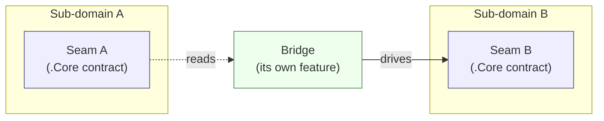
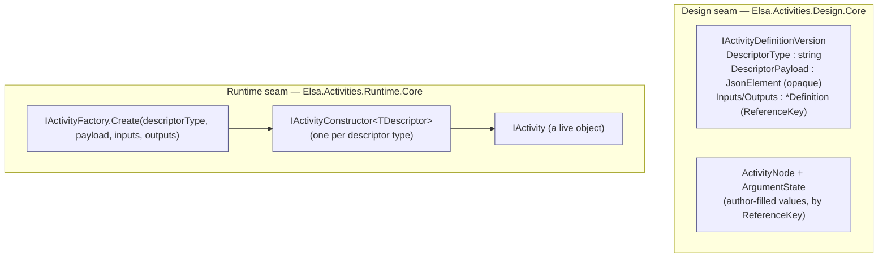
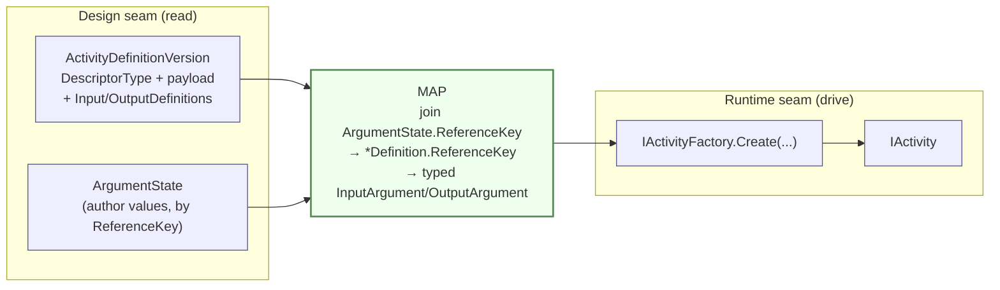
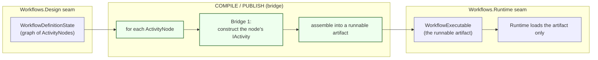

# Seams & bridges in the activities/workflows domain

> **Audience:** engineers and architects working in `elsa-foundation`.
> **Purpose:** make the load-bearing boundaries of the activities/workflows domain *visible* — so we
> can point at them, build against them, and watch them grow.
> **Knowledge role:** worked reference. Canonical short definitions live in
> [`docs/glossary/elsa.md`](glossary/elsa.md).

Most Elsa features are self-contained: a feature owns its contracts, its implementation, and its
persistence, and never reaches into a neighbour. The **activities/workflows** domain is the exception.
It is one domain with several sub-domains that genuinely have to meet — authoring, persistence, and
execution are different concerns with different lifecycles, and a workflow is worthless until they
connect. The art is letting them connect **without coupling**.

We do that with two ideas.

---

## 1. Seam vs. bridge

**A seam is a contract boundary.** It is the published surface of a sub-domain — the set of `.Core`
types another sub-domain is allowed to know about. A seam hides everything behind it: change the
implementation freely, the seam stays put. Seams are the *checkpoints* engineers navigate by.

**A bridge is the code that joins two seams.** It depends *down* on the `.Core` contracts of both
sides, reads from one, and drives the other. Crucially, a bridge is **neither** of the sub-domains it
connects — it is a third party that sits above both. That is what lets it touch both without making
either depend on the other.

The dependency arrows only ever point **into** the seams (down onto `.Core`). Neither seam points at
the other. That invariant is the whole game (see the [§E2.2 hard rule](#cross-references)).

---

## 2. The seam map

The domain splits into two co-equal sub-domains, each with its own seam:

| Sub-domain | Concern | Seam (the `.Core` surface) |
|---|---|---|
| **Design** | author & persist what an activity/workflow *is* | `IActivityDefinitionVersion` (`DescriptorType`, opaque `DescriptorPayload`, `InputDefinition`/`OutputDefinition` keyed by `ReferenceKey`); `ActivityNode` + `ArgumentState` (author-filled values) |
| **Runtime** | construct & execute a live object | `IActivityFactory` → `IActivityConstructor` → `IActivityConstructorRegistry`; the payload stays **opaque** until the owning constructor deserializes it |

A row's `DescriptorType` is the registry key that decides *which* constructor builds it:

- `Elsa.Primitives.Models.TypeInformation` → the **CLR** kind (`ClrActivityConstructor`)
- `Elsa.Workflows.Primitives.Models.WorkflowIdentity` → the **Workflow** kind (`WorkflowActivityConstructor`)

---

## 3. Bridge 1 — Activity construction *(the worked example)*

This is the bridge you can run today: [`Elsa.Workflows.Publishing.Api`](../src/Elsa.Workflows.Publishing.Api).
Its `construct/{activityId}` endpoint reads a persisted catalog row and produces a live `IActivity`.

The bridge does three things, each touching exactly one seam:

1. **Read** the persisted version — the Design seam hands over `(DescriptorType, opaque payload)` plus
   the argument definitions. The bridge never deserializes the payload itself.
2. **Map** — join author `ArgumentState`s onto argument definitions by `ReferenceKey`, producing the
   typed runtime argument bags. *(Today's construct-only slice leaves the value bags empty; mapping
   author **values** is exactly where this bridge grows — see §5.)*
3. **Drive** `IActivityFactory.Create(...)` — the Runtime seam dispatches on `DescriptorType` to the
   owning constructor and returns a whole `IActivity`.

**Why this is legal.** `Elsa.Workflows.Publishing.Api` references only `Elsa.Activities.Design(.Persistence).Core`
and `Elsa.Activities.Runtime.Core` — the two seams. It references **neither** the Runtime
implementation (`Elsa.Activities.Runtime`) **nor** any `.Api`/Design feature. Because the bridge is a
third party, the Runtime sub-domain never has to know Design exists. The §E2.2 hard rule holds.

---

## 4. Bridge 2 — Workflow compile / publish *(the future)*

The same shape recurs one level up. A workflow definition is authored as a graph of `ActivityNode`s;
to run it, something must turn that authored document into a runnable artifact. That something is the
**compile/publish bridge** — `Elsa.Workflows.Publishing.Api` is its first slice.

Note the nesting: **Bridge 2 uses Bridge 1.** Compiling a workflow means constructing each placed
activity — the inner loop *is* the activity-construction bridge. So the small `construct/{activityId}`
endpoint we ship today is literally the kernel of tomorrow's publish domain.

At runtime the published `WorkflowExecutable` is the **only** thing the Workflows.Runtime seam needs;
the design-side documents are reachable by foreign key but are never required to execute (the
"artifact-only runtime", §E2.6.2). `WorkflowDefinitionState`, its read projections, and
`WorkflowExecutable` form the irreducible triplet of §E2.9 — authoring, reading, executing — and must
not be merged.

---

## 5. Why seams are checkpoints

Seams are where the domain will *expand*, and they tell you where:

- **Today:** `construct/{activityId}` constructs one activity (construct-only; no value binding).
- **Next:** map author **values** — join `ArgumentState` onto typed arguments through the expression
  system. The `MAP` box in Bridge 1 fills in.
- **Then:** construct a whole graph — Bridge 1 inside a loop becomes Bridge 2, and the
  `Elsa.Workflows.Publishing.*` feature grows from one endpoint into a compile-and-publish sub-domain.

Through all of that, **the seams do not move.** `IActivityFactory` and `IActivityDefinitionVersion`
are the same contracts whether we construct one activity or publish ten thousand. The bridge grows
into a domain; the checkpoints stay where they are. That is what makes them worth marking.

---

## Cross-references

- **§E2.2** — *Workflows.Runtime MUST NOT depend on Workflows.Design.* The hard rule every bridge here
  preserves. (`.specify/memory/constitution.md`)
- **§E2.6.2** — *Artifact-only runtime.* The runtime depends only on the runnable artifact + the
  features that interpret it.
- **§E2.9** — *The architectural triplet.* `WorkflowDefinitionState` ↔ read projections ↔
  `WorkflowExecutable`, at three separate scopes.
- **Construction seam spec** — [`specs/006-activity-construction-seam/`](../specs/006-activity-construction-seam)
  (`spec.md`, `plan.md`, `quickstart.md`).
- **The worked bridge** — [`src/Elsa.Workflows.Publishing.Api/`](../src/Elsa.Workflows.Publishing.Api).
