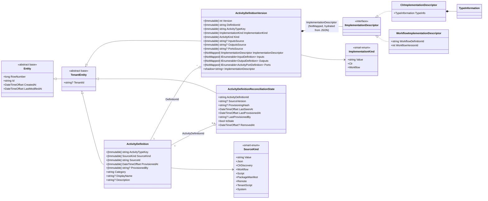

# Phase 1 — Data Model

Entity shape, relationships, indexes, and immutability rules for Unit B.

## Class diagram



## `Elsa.Primitives.Entities` reshape

### Entity *(abstract base, reshaped)*

| Property | Type | Notes |
|---|---|---|
| `RowNumber` | `long` | `[Immutable]`, identity-generated, unique-indexed per the existing pattern. Preserved. |
| `Id` | `string` | Primary key. Preserved. |
| `CreatedAt` | `DateTimeOffset` | `[Immutable]`. Auto-stamped by `ElsaDbContextBase.ApplyTimestamps`. Preserved. |
| `LastModifiedAt` | `DateTimeOffset` | Mutable. Auto-stamped. Preserved. |
| ~~`TenantId`~~ | ~~`string?`~~ | **REMOVED.** Moved to `TenantEntity`. |

### TenantEntity *(new abstract base)*

```csharp
public abstract class TenantEntity : Entity
{
    public string? TenantId { get; set; }
}
```

A `TenantId` index is registered centrally in `ElsaDbContextBase.OnModelCreating` via `ApplyTenantIdIndex` — mirrors the existing `ApplyRowNumberIndex` pattern. No per-entity EF Core configuration of the `TenantId` index.

## `Elsa.Activities.Design.Persistence.Core.Entities` reshape

### ActivityDefinition *(catalog parent — identity layer)*

| Property | Type | Notes |
|---|---|---|
| *(inherited)* `Id`, `RowNumber`, `CreatedAt`, `LastModifiedAt` | | from `Entity` |
| *(inherited)* `TenantId` | `string?` | from `TenantEntity` |
| `ActivityTypeKey` | `string` | `[Immutable]`. Stable logical identity (renamed from `UniqueName`). |
| `SourceKind` | `SourceKind` | `[Immutable]`. Smart-enum value-record; persisted as the wrapped `string Value`. |
| `SourceId` | `string` | `[Immutable]`. Source-side asset identity (e.g. assembly name for JSON, workflow definition id for workflow source). |
| `ProvisionedAt` | `DateTimeOffset` | `[Immutable]`. First-provisioning timestamp. |
| `ProvisionedBy` | `string?` | `[Immutable]`. Identity (user / machine / system) that produced this row. |
| `Category` | `string` | Mutable. Picker grouping. |
| `DisplayName` | `string?` | Mutable. UI label. |
| `Description` | `string?` | Mutable. UI description. |

**Removed:** `UniqueName` (renamed to `ActivityTypeKey`), `IsBrowsable` (removed entirely; picker visibility = catalog presence + `RemovedAt`).

**Indexes on `ActivityDefinition`:**
- **Unique composite** on `(SourceKind, SourceId, ActivityTypeKey)` — `UX_ActivityDefinition_SourceKind_SourceId_ActivityTypeKey`.
- **Non-unique lookup** on `(SourceKind, SourceId)` — `IX_ActivityDefinition_SourceKind_SourceId` — for the reconciler's "what did this source produce?" query and the stale-removal sweep.
- **`RowNumber` unique** (from `Entity`, auto-applied).
- **`TenantId` non-unique** (from `TenantEntity`, auto-applied by `ApplyTenantIdIndex`).

### ActivityDefinitionVersion *(catalog child — append-only, immutable)*

| Property | Type | Notes |
|---|---|---|
| *(inherited)* | | `Entity` + `TenantEntity` |
| `Version` | `int` | `[Immutable]`. |
| `DefinitionId` | `string` | `[Immutable]`. FK to `ActivityDefinition.Id`. |
| `ActivityTypeKey` | `string` | `[Immutable]`. Denormalised from parent for `(ActivityTypeKey, Version)` lookups without join. Set on insert; never updated. |
| `ImplementationKind` | `ImplementationKind` | `[Immutable]`. Smart-enum value-record. Drives kind-→-type resolution in the loading handler. |
| `Kind` | `ActivityKind` | `[Immutable]`. Existing closed enum (Action / Trigger / Job / Task) — unchanged. |
| `InputsSource`, `OutputsSource`, `PortsSource` | `string?` | `[Immutable]`. CLR string properties — existing JSON shadow-string pattern preserved (these stay as `*Source` properties; the descriptor uses a different pattern). |
| `ImplementationDescriptor` *(CLR property)* | `IImplementationDescriptor` | `[NotMapped]`. The rich projection. Hydrated by the loading handler from the EF shadow column `ImplementationDescriptor` + `ImplementationKind`; serialised back by the saving handler. |
| `ImplementationDescriptor` *(EF shadow column)* | `string?` | Immutable — declared `PropertySaveBehavior.Throw` in the EF Core configuration (no `[Immutable]` attribute since the shadow has no CLR property to decorate). Persisted JSON payload of the descriptor; accessed only via `EntityEntry.Property("ImplementationDescriptor").CurrentValue`. The shadow column shares the name of the `[NotMapped]` CLR property — EF treats `[NotMapped]` as invisible, so the shadow name does not collide. |
| `Inputs` / `Outputs` / `Ports` | `IEnumerable<InputDefinition>` / `OutputDefinition` / `ActivityPortDefinition` | `[NotMapped]`. Hydrated from `*Source` columns. The record types are sealed structurally-immutable records (`IArgumentDefinition` interface retired). |
| `Definition` | `ActivityDefinition?` | EF navigation. |

**Removed:** `TypeInfo` (was `TypeInformation`-typed property as primary identity binding; replaced by the descriptor mechanism).

**Indexes:**
- **Unique composite** on `(DefinitionId, Version)` — `UX_ActivityDefinitionVersion_DefinitionId_Version` (existing pattern preserved).
- **`RowNumber` unique** + **`TenantId` non-unique** (inherited via auto-registration).

### ActivityDefinitionReconciliationState *(new sibling — operational layer, 1:0..1 with ActivityDefinition)*

| Property | Type | Notes |
|---|---|---|
| *(inherited)* | | `Entity` + `TenantEntity` |
| `ActivityDefinitionId` | `string` | FK to `ActivityDefinition.Id`. Also the entity's natural key — could use it as PK; plan-stage decision: keep the surrogate `Id` from `Entity` for uniformity; FK to `ActivityDefinition.Id` is a separate field. |
| `SourceVersion` | `string?` | Most-recently-seen source-side version (e.g. workflow version id, assembly version). |
| `ProvisioningHash` | `string?` | Hash of the latest seen projection, computed by `IActivityDefinitionHasher`. |
| `LastSeenAt` | `DateTimeOffset` | Updated on each reconciliation pass that observes this row's source-side asset. |
| `LastProvisionedAt` | `DateTimeOffset` | Updated when the reconciler writes / updates the row's content. |
| `LastProvisionedBy` | `string?` | Identity that ran the most recent provisioning pass for this row. |
| `IsStale` | `bool` | True when the source-side asset has not been seen for a configurable duration (Unit F policy). |
| `RemovedAt` | `DateTimeOffset?` | Set by the reconciler when the source-side asset is gone. Picker filters on this. |

**Indexes:**
- **Unique** on `ActivityDefinitionId` — `UX_ActivityDefinitionReconciliationState_ActivityDefinitionId` (enforces 1:0..1).
- **Non-unique** on `IsStale` — `IX_ActivityDefinitionReconciliationState_IsStale` — for the reconciler's stale-removal sweep (per spec FR-014).
- Possibly **non-unique** on `LastSeenAt` for time-range queries (deferred — plan-stage decision based on Unit F's reconciliation policy needs).
- **`RowNumber` unique** + **`TenantId` non-unique** (inherited via auto-registration).

## `Elsa.Activities.Design.Core.Models` shape

### Smart-enum value-records

```csharp
public sealed record ImplementationKind(string Value)
{
    public static readonly ImplementationKind Clr = new("Clr");
    public static readonly ImplementationKind Workflow = new("Workflow");
}

public sealed record SourceKind(string Value)
{
    public static readonly SourceKind Json = new("Json");
    public static readonly SourceKind ClrDiscovery = new("ClrDiscovery");
    public static readonly SourceKind Workflow = new("Workflow");
    public static readonly SourceKind Script = new("Script");
    public static readonly SourceKind PackageManifest = new("PackageManifest");
    public static readonly SourceKind Remote = new("Remote");
    public static readonly SourceKind TenantScript = new("TenantScript");
    public static readonly SourceKind System = new("System");
}

public sealed record ExpressionType(string Value)
{
    public static readonly ExpressionType Literal = new("Literal");
    public static readonly ExpressionType JavaScript = new("JavaScript");
    public static readonly ExpressionType Liquid = new("Liquid");
}
```

EF Core mappings convert via `HasConversion(kind => kind.Value, value => new ImplementationKind(value))`.

### Descriptor types

```csharp
public interface IImplementationDescriptor { }

public sealed record ClrImplementationDescriptor(TypeInformation TypeInfo) : IImplementationDescriptor;

// Round-trip proof (Unit B-only; Workflow resolver lives in Unit G):
public sealed record WorkflowImplementationDescriptor(
    string WorkflowDefinitionId,
    int WorkflowVersionId
) : IImplementationDescriptor;
```

### Sealed records — definitions

```csharp
public sealed record InputDefinition(...);        // existing fields preserved; converted to record
public sealed record OutputDefinition(...);
public sealed record ActivityPortDefinition(...);
public sealed record ArgumentDefinition(...);      // base definition; InputDefinition / OutputDefinition may derive
```

**Existing `IArgumentDefinition` interface removed.** Consumers reference the records directly.

### Argument state hierarchy

```csharp
public record ArgumentState(string ReferenceKey, ArgumentValue Value);

public sealed record InputState(string ReferenceKey, ArgumentValue Value)
    : ArgumentState(ReferenceKey, Value);

public sealed record OutputState(string ReferenceKey, ArgumentValue Value)
    : ArgumentState(ReferenceKey, Value);

public sealed record ArgumentValue(object? Value, ExpressionType ExpressionType);
```

## Immutability summary

Enforced centrally via `[Immutable]` attribute + `ElsaDbContextBase.PreventImmutableChanges` (preserved from existing mechanism):

| Entity | Immutable fields |
|---|---|
| `Entity` (base) | `RowNumber`, `CreatedAt` |
| `ActivityDefinition` | `ActivityTypeKey`, `SourceKind`, `SourceId`, `ProvisionedAt`, `ProvisionedBy` |
| `ActivityDefinitionVersion` | `Version`, `DefinitionId`, `ActivityTypeKey`, `ImplementationKind`, `Kind`, `InputsSource`, `OutputsSource`, `PortsSource` (all via `[Immutable]` attribute); shadow column `ImplementationDescriptor` via explicit `PropertySaveBehavior.Throw` declaration in the EF Core configuration. |
| `ActivityDefinitionReconciliationState` | *(none — reconciliation state is mutable by design; rewritten each pass)* |

## Storage shapes — JSON columns

| Column | Shape | Hydration |
|---|---|---|
| `ImplementationDescriptor` *(EF shadow)* | JSON payload of the concrete descriptor type — no `$type` discriminator inside the JSON; the column-level `ImplementationKind` selects the deserialisation target. | Loading handler reads `ImplementationKind`; calls `IImplementationDescriptorRegistry.Resolve(kind)` (the explicit registry per §2.6.1 Registry + StartUp Task sub-pattern — see `contracts/IImplementationDescriptorRegistry.md`); reads the shadow string; calls `IPayloadSerializer.Deserialize(json, type)` (reflection-driven if API is generic-only); assigns the result to the `[NotMapped] ImplementationDescriptor` property. Saving handler does the inverse. |
| `InputsSource` / `OutputsSource` / `PortsSource` | JSON array of `InputDefinition` / `OutputDefinition` / `ActivityPortDefinition` records. | Existing pattern preserved (CLR `*Source` property + `[NotMapped]` rich projection — different from the new descriptor's shadow-column approach because these are existing). |

## Relationships

| From | To | Cardinality | FK |
|---|---|---|---|
| `ActivityDefinitionVersion` | `ActivityDefinition` | many : 1 | `DefinitionId` |
| `ActivityDefinitionReconciliationState` | `ActivityDefinition` | 0..1 : 1 | `ActivityDefinitionId` (UNIQUE) |

No cross-context FKs. `ActivitiesDesignDbContext` and `WorkflowsDesignDbContext` remain independent stores.
