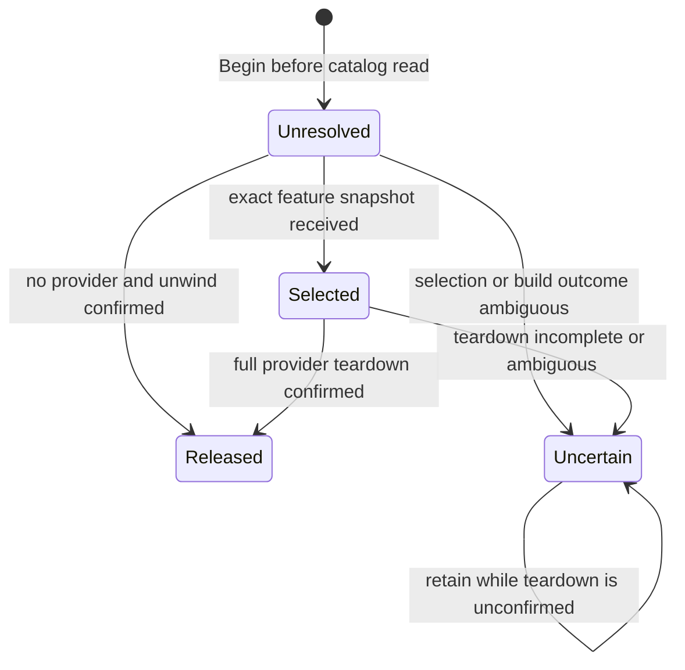

# Data Model: Package Generation Readability

This model describes in-memory host-lifetime evidence. It adds no persistence schema or externally serialized record.

## Entities

### Replaced package assembly

- **Identity**: the loaded `Assembly` object and the `AssemblyLoadContext` that contains it.
- **Replacement evidence**: Nuplane's active package catalog positively lists a loaded assembly with the same name while excluding this exact assembly; the assembly must be in a Nuplane-created context.
- **Validation**: missing or unreadable package evidence means no replacement is asserted. A default-context or non-Nuplane-context assembly is never retired.

### Candidate generation lease

- **Identity**: one CShells build generation/lease, associated with the immutable shell descriptor when that becomes available.
- **States**:
  - `Unresolved`: created before any feature-catalog read; counts all otherwise-retirable package contexts the unknown selection could name.
  - `Selected`: records the exact feature assemblies in that build's selected snapshot and counts their non-default load contexts. Disabled features and sibling assemblies sharing a context still count; unrelated scanned assemblies do not.
  - `Released`: reached only after confirmed full provider teardown, or after CShells confirms completion of the pre-provider build unwind.
  - `Uncertain`: a read/identity/teardown failure leaves the pin conservative; it cannot transition to released on failure alone.
- **Relationships**: many independent leases may be live at once. Releasing one lease changes only its contribution to the combined live-pin snapshot.

### Legacy lifecycle fallback pin

- **Identity**: immutable shell descriptor for a shell that has no build lease.
- **States**: absent → conservatively pinned on its first lifecycle notification → released only after its drain is confirmed complete.
- **Validation**: lifecycle callbacks for a descriptor already associated with a build lease cannot release that lease. Keep a build-owned identity marker after lease release through the descriptor's terminal lifecycle notification; late callbacks during that interval must not create a fallback pin. The fallback exists to preserve the public lifecycle facade and the existing no-initializer test objective.

### Root-owned participant adapter

- **Identity**: one public sealed adapter singleton per host, aliased through CShells' participant contract.
- **Lifetime**: registered-root DI disposal owns stopping/unsubscribing the optional catalog commit source and stopping the custom-catalog watch.
- **Registration order**: the root `IShellLifecycleSubscriber` factory first resolves the same adapter singleton, then returns the source's existing `BindTo(root)` facade. This ensures real participant discovery and the test `Bound(host)` helper both establish root ownership. The source facade must not resolve the adapter; direct legacy binding outside the registered root cannot start an owned notification subscription.

### Selected feature snapshot

- **Identity**: the exact committed or selected CShells snapshot passed to the build participant before feature construction.
- **Contents**: feature assemblies only; includes disabled descriptors and all feature assemblies whose load contexts are needed, without widening to every assembly scanned by Nuplane.
- **Validation**: if selection cannot be read, retain `Unresolved`/unknown accounting instead of substituting the catalog's newer current snapshot.

### Catalog commit evidence

- **Identity**: a committed snapshot or its monotonic generation identifier supplied after commit.
- **Lifecycle**: subscribe before initialization, reconcile after subscription, enqueue callbacks, unsubscribe at root shutdown.
- **Fallback**: a custom catalog without the optional commit capability remains conservatively observed by its bounded existing watcher; watcher stop belongs to the root adapter.

### Retired-set snapshot

- **Contents**: the complete set of replaced assemblies that are not pinned by the next-shell catalog or any live/legacy generation.
- **Transitions**: recomputed after Begin, exact selection, release, and committed catalog change. Set growth and shrinkage both change the readability report; an equal set is quiet.
- **Publication timing**: new retirement is published after affected provider teardown and never inside disposal; reintroduced constraints publish after commit without waiting for a still-live provider to finish; report work is asynchronous and coalesced.

## Lifecycle

A lease-managed lifecycle retains its descriptor ownership marker after the live lease is released through the terminal lifecycle notification, preventing a late callback from creating a fallback pin. A legacy fallback follows a separate lifecycle: first notification → conservative pin → confirmed drain → release. It is not a second release path for lease-managed generations. CShells does not automatically retry failed lease release; do not invent a later positive teardown callback. Unconfirmed teardown keeps the lease pinned for the host lifetime unless the runtime actually supplies the required confirmation.

## Invariants

- A snapshot is taken after asynchronous package/catalog reads and under the short shared pin-state gate.
- The gate is never held across I/O, report publication, or callback execution.
- A failed query cannot make a generation more readable.
- A failed provider teardown cannot release its pin.
- A report is republished only when the complete retired set changes, in either direction.
- The source object is shared, nondisposable, and not a build participant; the root adapter owns participant and notification lifetimes.
