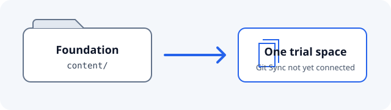

# Elsa 4 documentation sync trial

> **Trial fixture only.** This is a small, non-production sample for Foundation #2498. It has not been connected to GitBook or published. The GitBook trial is authorized; the production documentation generator and hosting choice remain open. The completed local [Docusaurus spike #2496](https://github.com/elsa-workflows/elsa-foundation/issues/2496) is retained as a fallback.

This folder tests a single GitBook space mapped to `tools/spikes/gitbook/content/` in the Foundation repository. It keeps its navigation, Markdown pages, and image together so their relative references can be checked in an isolated sync.

## Trial pages

- [Run the documented Foundation backend commands](./backend-source.md#documented-backend-commands)
- [Check Markdown rendering and local links](./markdown-rendering.md#generic-c-code-fence)

See the [operator protocol in GitHub](https://github.com/elsa-workflows/elsa-foundation/blob/claude/2498-gitbook-sync-spike/tools/spikes/gitbook/README.md) for the sync setup and evidence ledger.

## Source and editing

- Fixture source: [Foundation `tools/spikes/gitbook/content/`](https://github.com/elsa-workflows/elsa-foundation/tree/claude/2498-gitbook-sync-spike/tools/spikes/gitbook/content)
- Edit this page: [GitHub editor](https://github.com/elsa-workflows/elsa-foundation/edit/claude/2498-gitbook-sync-spike/tools/spikes/gitbook/content/README.md)
- Owning program and scope: [Foundation #2498](https://github.com/elsa-workflows/elsa-foundation/issues/2498)
